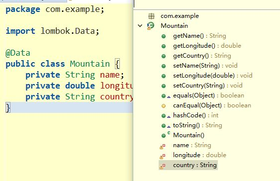
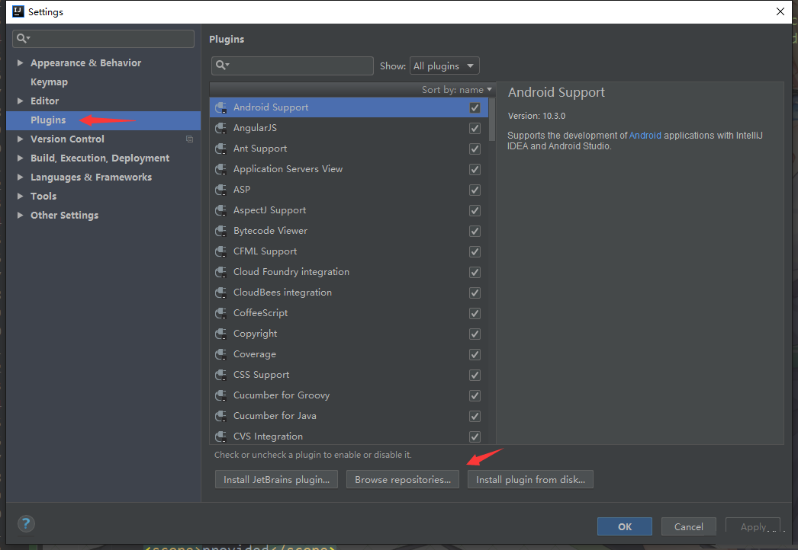
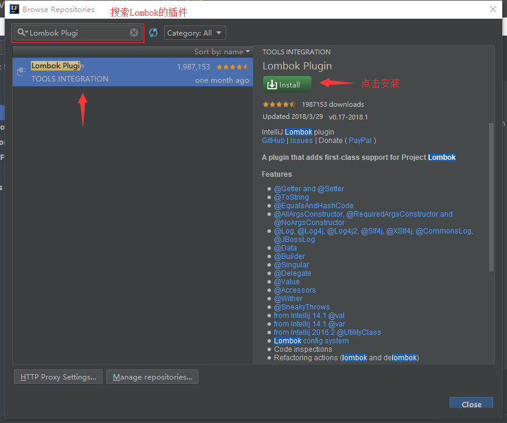
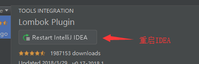

<!--title: Lombok 快速入门
description: Lombok是一个可以通过简单的注解形式来帮助我们简化消除一些必须有但显得很臃肿的Java代码的工具，通过使用对应的注解，可以在编译源码的时候生成对应的方法。简而言之，一句话就是：通过简单的注解来精简代码达到消除冗长代码的目的。
=top234=-->


## 1.Lombok简介

- Lombok取名自龙目岛（Pulau Lombok），龙目岛是印度尼西亚西努沙登加拉(Nusa Tenggara Barat)省岛屿，西隔龙目海峡面对巴厘岛，东隔阿拉斯(Alas)海峡面松巴哇(Sumbawa)岛，北濒爪哇海，南临印度洋。
- 在编程上，Lombok是一个可以通过简单的注解形式来帮助我们简化消除一些必须有但显得很臃肿的Java代码的工具，通过使用对应的注解，可以在编译源码的时候生成对应的方法。简而言之，一句话就是：通过简单的注解来精简代码达到消除冗长代码的目的。

## 2.Lombok优点

- 提高编码效率
- 使代码更简洁
- 消除冗长代码
- 避免修改字段名字时忘记修改方法名

注：IDE必须要支持Lombok，否则IDE会报错。

为什么说Lombok可以使代码更简洁、可以消除冗长代码呢？我们来拿lombok官网的一个例子来说：

```java
public class Mountain{
    private String name;
    private double longitude;
    private String country;
}
```

要使用这个对象，必须还要写一些getter和setter方法，可能还要写一个构造器、equals方法、或者hash方法。这些方法很冗长而且没有技术含量，我们叫它样板式代码。

lombok的主要作用是通过一些注解，消除样板式代码，像这样：

```java
@Data
public class Mountain{
    private String name;
    private double longitude;
    private String country;
}
```



如果觉得@Data这个注解有点简单粗暴的话，Lombok提供一些更精细的注解，比如@Getter、@Setter，(这两个是field注解)，@ToString，@AllArgsConstructor(这两个是类注解)。这些可能是最常见的用法,更详细的用法可以参考[Lombok feature]overview(<https://projectlombok.org/features/>)

**Lombok既是一个IDE插件，也是一个项目要依赖的jar包**。Lombok依赖jar包的原因是因为编译时要用它的注解,是插件的原因是它要在编译器编译时通过操作AST(抽象语法树)改变字节码生成。也就是说他可以改变java语法.。他不像spring的依赖注入或者hibernate的orm一样是运行时的特性，而是编译时的特性。

## 3.Lombok的使用

### 3.1 添加依赖

```xml
<dependency>
    <groupId>org.projectlombok</groupId>
    <artifactId>lombok</artifactId>
    <version>1.16.18</version>
</dependency>
```

### 3.2 IDEA安装Lombok插件

点击右上角的 File -> setting -> Plugins ：



搜索Lombok Plugin进行安装：



安装完成后，重启IDEA：



### 3.3 Lombok常用注解

Lombok 常用的注解：

|           注解           | 描述                                                         |
| :----------------------: | :----------------------------------------------------------- |
|    @Getter / @Setter     | 可以作用在类上和属性上，放在类上，会对所有的非静态(non-static)属性生成Getter/Setter方法，放在属性上，会对该属性生成Getter/Setter方法。并可以使用该注解中的AccessLevel属性来指定Getter/Setter方法的访问级别。 |
|        @ToString         | 生成toString方法，默认情况下，会输出类名、所有属性，属性会按照顺序输出，以逗号分割。可以使用该注解中的exclude属性来指定生成的toSpring方法不包含对象中的哪些字段，或者使用of属性来指定生成的toSpring方法只包含对象中的哪些字段 |
|    @EqualsAndHashCode    | 默认情况下，会使用所有非瞬态(non-transient)和非静态(non-static)字段来生成equals和hascode方法，也可以使用exclude或of属性。 |
|    @NoArgsConstructor    | 生成无参构造器                                               |
| @RequiredArgsConstructor | 会生成一个包含标识了@NonNull注解的变量的构造方法。生成的构造方法是private，如果想要对外提供使用的话，可以使用staticName选项生成一个static方法。 |
|   @AllArgsConstructor    | 生成全参构造器，当我们需要重载多个构造器的时候，Lombok就无能为力了。 |
|          @Slf4j          | 该注解是用来解决不用每次都写 `private final Logger logger = LoggerFactory.getLogger(XXX.class);` 这句代码的。使用的日志框架是LogBack |
|          @Log4j          | 该注解也是用来解决不用每次都写日志对象声明语句的，从字面上也可以看出，使用的日志框架是log4j |
|          @Data           | 该注解是 @ToString、@EqualsAndHashCode注解，和所有属性的@Getter注解, 以及所有non-final属性的@Setter注解的组合，通常情况下，我们使用这个注解就足够了。 |

- 以上只列出了部分常用注解，更多注解的使用方式，请参考 [官网关于注解的文档](https://projectlombok.org/features/index.html)

### 3.4使用Lombok时需要注意的点

- 在类需要序列化、反序列化时或者需要详细控制字段时，应该谨慎考虑是否要使用Lombok，因为在这种情况下容易出问题。例如：Jackson、Json 序列化
- 使用Lombok虽然能够省去手动创建setter和getter方法等繁琐事情，但是却降低了源代码文件的可读性和完整性，减低了阅读源代码的舒适度
- 使用@Slf4j还是@Log4j注解，需要根据实际项目中使用的日志框架来选择。
- Lombok并非处处适用，我们需要选择适合的地方使用Lombok，例如pojo是一个好地方，因为pojo很单纯 