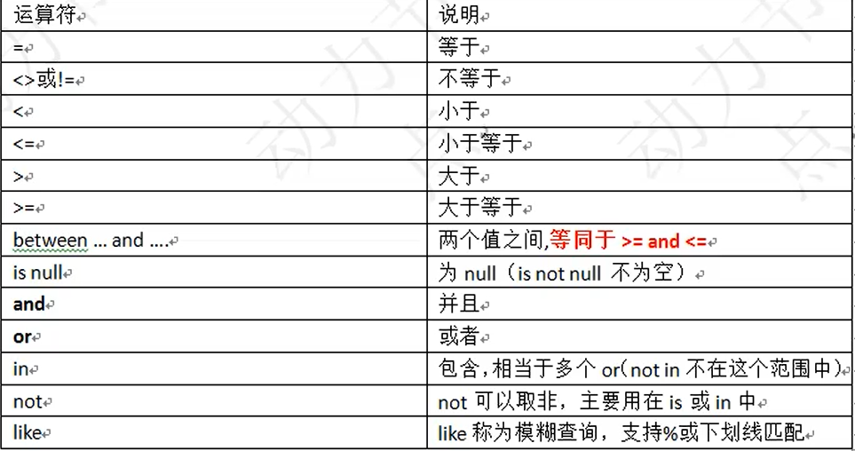
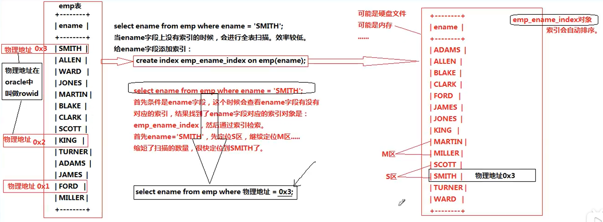

<!--title: MySQL 基础
description: MySQL 是最流行的[关系型数据库管理系统]之一，在 WEB 应用方面，MySQL是最好的[RDBMS](Relational Database Management System，关系数据库管理系统) 应用软件之一。
type: 笔记
firstPicture: http://static-blog.top234.top/image/1.png
status: 1
priority: 6
=top234=-->


```markdown
数据库（DataBase，DB）：指长期保存在计算机的存储设备上，按照一定规则组织起来，可以被各种用户或应用共享的数据集合。

数据库管理系统（DataBaseManagementSystem，DBMS）：指一种操作和管理数据库的大型软件，用于建立、使用和维护数据库，对数据库进行统一管理和控制，以保证数据库的安全性和完整性。用户通过数据库管理系统访问数据库中的数据。

RDBMS：指关系型数据库管理系统，全称 Relational Database Management System。

常见数据库管理系统：oracle mysql Db2 sqlSever mongoDB

SQL：StructureQueryLanguage（结构化查询语言），SQL被美国国家标准局（ANSI）确定为关系型数据库语言的美国标准，后来被国际化标准组织（ISO）采纳为关系数据库语言的国际标准

SQL 是一种标准化的语言，它允许你在数据库上执行操作，如创建项目，查询内容，更新内容，并删除条目等操作。

CRUD：Create（增） Retrieve（检索） Update（修改） Delete（删除）

sql脚本：当一个文件的扩展名为.spl，并且该文件中编写了大量的sql语句，我们称这样的文件为sql脚本。
```

### mysql相关命令

```mysql
1. show databases：查看有哪些数据库
2. create database dbname：创建一个名为dbname的数据库
3. use dbname：使用dbname数据库
4. select database()：查看当前使用的数据库
5. select version()：查看数据库版本
6. show tables：查看当前数据库中所有的表
7. show tables from dbname：查看dbname库中所有的表
8. show create table taname：查看taname表的创建语句
9. source dbname.sql（sql脚本文件名）：导入sql脚本
10. desc tablename：查看表结构
11. \c：结束一条语句
12. exit：退出mysql
13. explain sql语句：查看一条sql语句的执行计划
```

------------------------

### SQL语句的分类

1. **DQL（数据查询语言）：查询语句，凡是select语句都是DQL**

2. **DML（数据操作语言）：insert delete update，对表中的数据进行增删改**

3. **DDL（数据定义语言）：create drop alter，对表结构的增删改**

4. **TCL（事务控制语言）：commit提交事务，rollback回滚事务**

5. **DCL（权限控制语言）：grant授权、revoke撤销权限等**

   提示：任何一条sql语句以分号结尾，sql语句不区分大小写

-----------------------------------

### DQL
#### 1. 简单查询
- select 字段名1，字段名2，字段名，... from 表名；

- 字段可以参与数学运算：select ename, sal * 12 from emp；

- 给查询结果的列重命名，使用as关键字，as可省略：select ename, sal*12 as yearsal from emp

- 查询所有字段可使用*代替（在实际开发中不建议使用）：select * from emp; 

   注意：sql语句中字符串使用单引号括起来

#### 2. 条件查询

- select 字段列表 from 表名 where 条件；

- 执行顺序：from ——> where ——> select

- 条件：
   

- between..and..：条件必须左小右大，条件除了是数字还可以是字符串，条件是字符串时为左闭右开

- 模糊查询：_ 代表任意一个字符   %代表任意多个字符；转义字符：可使用\表示其原有含义

   注意：在数据库中null不是一个值，代表什么也没有，为空，null不是一个值，不能用等号进行衡量；在数据库中，有null参与的运算，最终结果一定是null

   注意：当运算符的优先级不确定时，使用小括号

#### 3. 排序（升序、降序）

- select 字段列表 from 表名 order by  排序字段 排序规则；
- 排序规则：asc：升序（默认为升序）desc：降序
  - select * from emp order by sal desc;  
  - select * from emp order by sal;
- 多字段排序，按照排序规则从前往后依次排序：select * from emp order by sal desc, ename asc;
- 按字段列表的顺序指定排序规则：select ename,sal from emp order by 2;（order by 后的数字为查询语句中字段的顺序，并非表中字段的实际顺序）
- where 和 order by 联合使用：
  - where必须在order by之前  select ename,sal from emp where sal>1800 order by 2,ename;
  - 执行顺序：from ——> where ——>  select ——> order by

#### 4. 分组函数

**所有的分组函数都是对”某一组“的数据进行操作的，分组函数也称为：多行处理函数**

**多行处理函数的特点：输入多行，输出一行**

- count：计数，count（*）：总记录条数，count（ename）：ename字段不为null的记录条数
- sum：求和
- avg：平均值
- max：最大值
- min：最小值
- 所有分组函数都会自动忽略null，不需要额外处理，： select count(comm) from emp; //4
- 分组函数不能直接出现在where子句中，因为分组函数必须在group by之后执行
- 分组函数可以组合使用： select count(*),sum(sal),avg(sal),max(sal),min(sal) from emp;

#### 5. 单行处理函数

- ifnull(参数1，参数2) 函数：参数1为字段名，当该字段的值为null时，使用参数2的值替换

#### 6. group by 和 having

- group by：按照某个字段或某些字段进行分组
- having：对分组之后的数据进行再次过滤
- 分组函数一般都会和group by 联合使用，分组函数都是在group by语句结束后才会执行的，当一条sql语句没有group by时，整张表的数据会自成一组
- 当一条sql语句中有group by时，select 后面只能跟分组函数以及参与分组的字段
- **distinct关键字**：用来去除重复记录（去除查询结果的重复记录），只能出现在所有字段的最前面， select distinct daynum  from video;  select count(distinct daynum)  from video;

#### 7. 连接查询

##### 7.1 连接查询的分类

###### 1. 根据语法出现的年代划分
  - SQL92（一些老的DBA可能还在使用这种语法。DBA：DataBase Administrator，数据库管理员）
  - SQL99（比较新的语法）
###### 2. 根据表的连接方式划分
- 内连接
	- 等值连接
	- 非等值连接
	- 自连接
- 外连接
	- 左外连接（左连接）
	- 右外连接（右连接）
- 全连接

##### 7.2 内连接

###### 1. 等值连接

```mysql
SQL92:（太老，不用了）
	select 
		e.ename,d.dname
	from
		emp e, dept d
	where
		e.deptno = d.deptno;
		
SQL99：（常用的）
	语法：
    ...
    	A
    join
    	B
    on
    	连接条件
    where
    	...

	// inner可以省略的，带着inner目的是可读性好一些。
	select 
		e.ename,d.dname
	from
		emp e
	inner join
		dept d
	on
		e.deptno = d.deptno;
		
SQL99语法结构更清晰一些：表的连接条件和后来的where条件分离了。
```

###### 2. 非等值连接

```mysql
select 
	e.ename,e.sal,s.grade
from
	emp e
inner join
	salgrade s
on
	e.sal 
between 
	s.losal 
and 
	s.hisal;
```

###### 3. 自连接

```mysql
特点：一张表看作两张表，自己连自己
select 
	a.ename as '员工名',b.ename as '领导名'
from
	emp a
inner join
	emp b
on
	a.mgr = b.empno;
```

##### 7.3 外连接

###### 1. 什么是外连接，和内连接有什么区别？

```markdown
内连接：
	假设A和B表进行连接，使用内连接的话，凡是A表和B表能够匹配上的记录查询出来，这就是内连接。
	AB两张表没有主副之分，两张表是平等的。

外连接：
	假设A和B表进行连接，使用外连接的话，AB两张表中有一张表是主表，一张表是副表，主要查询主表中
	的数据，捎带着查询副表，当副表中的数据没有和主表中的数据匹配上，副表自动模拟出NULL与之匹配。

外连接的分类：
	左外连接（左连接）：表示左边的这张表是主表。
	右外连接（右连接）：表示右边的这张表是主表。
	
	左连接有右连接的写法，右连接也会有对应的左连接的写法。

外连接的特点：
	主表的数据无条件的全部查询出来
```

###### 2. 左外连接

```mysql
select
	e.ename 员工,l.ename 直接领导 
from 
	emp e 
left outer join 
	emp l 
on 
	e.mgr = l.empno;
注：outer可省略
```

###### 3. 右外连接

```mysql
select 
	e.ename 员工,l.ename 直接领导 
from 
	emp l 
right outer join 
	emp e 
on 
	e.mgr = l.empno;
注：outer可省略
```

###### 4. 练习

```mysql
查询没有员工的部门：
select 
	d.* 
from 
	dept d 
left join 
	emp e 
on 
	e.deptno = d.deptno 
where 
	e.empno is null;
```

##### 7.4 多表连接查询

```mysql
语法：
....
	A	
join
	B
on
	...
join
	C
on
	...

表示：A表和B表先进行表连接，连接之后的结果继续和C表进行连接。

案例：
1. 找出每个员工的部门名称及工资等级
select 
	e.ename,d.dname,s.grade 
from 
	emp e 
join 
	dept d 
on 
	e.deptno=d.deptno 
join 
	salgrade s 
on 
	e.sal between s.losal and s.hisal;
	
2. 找出每个员工的部门名称、工资等级及上级领导
select 
	e.ename,d.dname,s.grade,l.ename
from 
	emp e 
join 
	dept d 
on 
	e.deptno=d.deptno 
join 
	salgrade s 
on 
	e.sal between s.losal and s.hisal
left join 
	emp l
on 
	e.mgr =l.empno;
```

#### 8. 子查询

##### 8.1 什么是子查询？子查询都可以出现在哪里？

```mysql
1. select语句当中嵌套select语句，被嵌套的select语句是子查询。

2. 子查询可以出现在哪里？
select
    ..(select).
from
    ..(select).
where
    ..(select).
```

##### 8.2 where子句中使用子查询

```mysql
案例：找出高于平均薪资的员工信息
select * from emp where sal > (select avg(sal) from emp);
```

##### 8.3 from后面嵌套子查询

```MySQL
案例：
1. 找出每个部门平均薪水的等级
select 
	t.*,s.grade
from
	(select deptno,avg(sal) as avgsal from emp group by deptno) t
join
	salgrade s
on
	t.avgsal between s.losal and s.hisal;
	
2. 找出每个部门薪水等级的平均值
select 
	e.deptno,avg(s.grade)
from 
	emp e 
join 
	salgrade s 
on 
	e.sal between s.losal and s.hisal
group by
	e.deptno;
```

##### 8.4 在select后面嵌套子查询

```mysql
案例：找出每个员工所在的部门名称，要求显示员工名和部门名
select 
	e.ename,d.dname
from
	emp e
join
	dept d
on
	e.deptno = d.deptno;

select 
	e.ename,(select d.dname from dept d where e.deptno = d.deptno) as dname 
from 
	emp e;
```

##### 8.5 union （可以将查询结果集相加）

```mysql 
案例：找出工作岗位是SALESMAN和MANAGER的员工
方式一：
select 
	ename,job 
from 
	emp 
where 
	job = 'MANAGER' 
or 
	job = 'SALESMAN';
	
方式二：
select 
	ename,job 
from 
	emp 
where 
	job 
in
	('MANAGER','SALESMAN');
	
方式三：（union）
select ename,job from emp where job = 'MANAGER'
union
select ename,job from emp where job = 'SALESMAN';
注意：被合并结果集的列必须完全相同
```

#### 9. 分页查询 limit

```
limit是mysql特有的，其他数据库中没有，不通用。（Oracle中有一个相同的机制，叫做rownum）
```

##### 9.1 语法机制：

```mysql
limit startIndex, length
	startIndex表示起始位置，从0开始，0表示第一条数据。
	length表示取几个

案例：取出工资前5名的员工（思路：降序取前5个）
	select ename,sal from emp order by sal desc;
取前5个：
	select ename,sal from emp order by sal desc limit 0, 5;
	select ename,sal from emp order by sal desc limit 5;
	注意：limit number 等效于 limit 0，number
```

##### 9.2 limit总是在最后才会执行

```mysql
sql语句执行顺序：
from ——> where ——> group by ——> having ——> select ——> order by ——> limit
------------------
select			5
	...
from			1
	...		
where			2
	...	
group by		3
	...
having			4
	...
order by		6
	...
limit			7
	...;
```

##### 9.3 通用的分页公式

```java
pageSize：每页显示的记录条数
pageNo：第几页

第pageNo页：(pageNo - 1) * pageSize, pageSize

java代码{
	int pageNo = 2; // 页码是2
	int pageSize = 10; // 每页显示10条
	
	limit (pageNo - 1) * pageSize, pageSize
}
```

---------------------------

### DML

#### 1. insert

```mysql
1. 语法格式：
	insert into 表名(字段名1,字段名2,字段名3,....) values(值1,值2,值3,....);
	要求：字段的数量和值的数量相同，并且数据类型要对应相同。

注意：
    当一条insert语句执行成功之后，表格当中必然会多一行记录。
    即使多的这一行记录当中某些字段是NULL，后期也没有办法再执行insert语句插入数据了，只能使用update进行更新。
    
2. 字段可以省略不写，但是后面的value对数量和顺序都有要求。
	insert into t_student values(1,'jack','0','gaosan2ban','1986-10-23');
	
3. 一次插入多行数据
	insert into t_student
		(no,name,sex,classno,birth) 
	values
		(3,'rose','1','gaosi2ban','1952-12-14'),
		(4,'laotie','1','gaosi2ban','1955-12-14');

4. 将查询结果插入到一张表中
	insert into emp2 select empno, ename from emp;
	注意：查询结果需要与被插入表的字段完全对应；也可指定字段：
	insert into test(empno,ename) select empno, ename from emp；
	
5. 在数据新增时未给定值的字段，会自动插入其字段的默认值
```

#### 2. update

```mysql
语法格式：
	update 表名 set 字段名1=值1,字段名2=值2... where 条件;

	注意：没有条件整张表数据全部更新。
```

#### 3. delete

```mysql
语法格式：
	delete from 表名 where 条件;
	
	注意：没有条件会全部删除。
	
删除所有记录：
	delete from 表名;
	
怎么删除大表中的数据？（表截断，重点）
	truncate table 表名; // 表被截断，不可回滚。永久丢失。
```

----------------------------------

### DDL

#### 1. MySQL中字段的数据类型

```mysql
int		整数型(java中的int)
bigint	长整型(java中的long)
float	浮点型(java中的float double)
char	定长字符串(String)
varchar	可变长字符串(StringBuffer/StringBuilder)
date	日期类型 （对应Java中的java.sql.Date类型）
BLOB	二进制大对象（存储图片、视频等流媒体信息） Binary Large OBject （对应java中的Object）
CLOB	字符大对象（存储较大文本，比如，可以存储4G的字符串。） Character Large OBject（对应java中的Object）
text	文本类型
time	时间类型，格式为：hh:mm:ss
timestamp	时间戳类型 yyyy-MM-dd hh:mm:ss 会自动赋值
datetime	日期时间类型 yyyy-MM-dd hh:mm:ss
......
```

##### 1.1 char和varchar怎么选择？

```
在实际的开发中，当某个字段中的数据长度不发生改变的时候，是定长的，例如：性别、生日等都是采用char。
当一个字段的数据长度不确定，例如：简介、姓名等都是采用varchar。
```

#### 2. create

```mysql
建表语句的语法格式：
create table 表名(
	字段名1 数据类型,
	字段名2 数据类型,
	字段名3 数据类型,
	....
);
表名在数据库当中一般建议以t_或者tbl_开始
```

##### 2.1 表的复制

```mysql
create table 表名 as select语句;
将查询结果当做表创建出来。
create table emp2 select empno,ename from emp;
```

#### 3. drop

```mysql
drop table if exists t_student; // 当这个表存在的话删除

drop table 表名; // 这个通用。
drop table if exists 表名; // oracle不支持这种写法。
```

#### 4. alter

```mysql
增加一个image列：ALTER TABLE employee ADD image blob;
修改job列，使其长度为60：ALTER TABLE employee MODIFY job varchar(60);
删除image列,一次只能删一列：ALTER TABLE employee DROP image;
修改表名为user：RENAME TABLE employee TO user;
查看表的创建语句：SHOW CREATE TABLE user;
修改表的字符集为gbk：ALTER TABLE user CHARACTER SET gbk;
列名name修改为username，并重新指定数据类型：ALTER TABLE user CHANGE name username varchar(100);
```

#### 5. mysql中关于库的操作（mysql命令）

```mysql
创建：CREATE DATABASE语句用于创建新的数据库：
	CREATE DATABASE mydb1;
	CREATE DATABASE mydb2 character SET GBK;
	CREATE DATABASE mydb3 character SET GBK COLLATE gbk_chinese_ci;
			
查看：
	SHOW DATABASES; 查看当前数据库服务器中的所有数据库
	Show CREATE DATABASE mydb2; 查看mydb2数据库的定义信息
	
修改：修改数据库的字符集
	ALTER DATABASE mydb2 character SET utf8;

删除：
	DROP DATABASE mydb3;
			
查看当前使用的数据库：Select database();
切换数据库：USE mydb2;
```

----------------------------------------

### 约束(Constraint)

#### 1. 什么是约束？常见的约束有哪些呢？

```mysql
1. 在创建表的时候，可以给表的字段添加相应的约束，添加约束的目的是为了保证表中数据的合法性、有效性、完整性。
	
2. 数据的完整性
	作用：保证用户输入的数据保存到数据库中是正确的。
	实体完整性：
		实体：即表中的一行(一条记录)代表一个实体（entity）
		作用：标识每一行数据不重复
	域完整性：
		作用：限制此单元格的数据正确，不对照此列的其它单元格比较
	引用完整性（参照完整性）
	
3. 常见的约束有哪些呢？
	非空约束(not null)：约束的字段不能为NULL
	唯一约束(unique)：约束的字段不能重复
	主键约束(primary key)：约束的字段既不能为NULL，也不能重复（简称PK）
	外键约束(foreign key)：...（简称FK）
	检查约束(check)：注意Oracle数据库有check约束，但是mysql没有，目前mysql不支持该约束。
```

#### 2. 非空约束 not null

```mysql
被约束字段不能为null

drop table if exists t_user;
create table t_user(
	id int,
	username varchar(255) not null,
	password varchar(255)
);
```

#### 3. 唯一性约束 unique

```mysql
唯一约束修饰的字段具有唯一性，不能重复。但可以为NULL。

列级约束：给某一列添加unique
drop table if exists t_user;
create table t_user(
	id int,
	username varchar(255) unique  // 列级约束
);
		
表级约束：给两个列或者多个列添加unique
drop table if exists t_user;
create table t_user(
	id int, 
	usercode varchar(255),
	username varchar(255),
	unique(usercode,username) // 多个字段联合起来添加1个约束unique 【表级约束】
);

注意：not null约束只有列级约束。没有表级约束。

```

#### 4. 主键约束 primary key

```MySQL
1.主键约束的特点：不能为NULL，也不能重复。
    drop table if exists t_user;
    create table t_user(
        id int primary key,  // 列级约束
        username varchar(255),
        email varchar(255)
    );
		
2.主键相关的术语：
    主键约束 : primary key
    主键字段 : id字段添加primary key之后，id叫做主键字段
	主键值 : id字段中的每一个值都是主键值。
	
3.主键的作用：
	表的设计三范式中有要求，第一范式就要求任何一张表都应该有主键。
	主键的作用：主键值是这行记录在这张表当中的唯一标识。（就像一个人的身份证号码一样。）
	
4.主键的分类:
	根据主键字段的字段数量来划分：
		单一主键（推荐的，常用的。）
		复合主键(多个字段联合起来添加一个主键约束)（复合主键不建议使用，因为复合主键违背三范式。）
	根据主键性质来划分：
		自然主键：主键值最好就是一个和业务没有任何关系的自然数。（这种方式是推荐的）
		业务主键：主键值和系统的业务挂钩，例如：拿着银行卡的卡号做主键，拿着身份证号码作为主键。（不推荐用）
	注意：最好不要拿着和业务挂钩的字段作为主键。因为以后的业务一旦发生改变的时候，主键值可能也需要随着发生变化，但有的时候没有办法变化，因为变化可能会导致主键值重复。
	
5.一张表的主键约束只能有1个。（必须记住）

6.使用表级约束方式定义主键：
	drop table if exists t_user;
	create table t_user(
    	id int,
    	username varchar(255),
    	primary key(id)
    );
		
7.以下内容是演示以下复合主键，不需要掌握：
    drop table if exists t_user;
    create table t_user(
    	id int,
    	username varchar(255),
    	password varchar(255),
    	primary key(id,username)
    );

8.mysql提供主键值自增：（非常重要。）
	drop table if exists t_user;
	create table t_user(
    	id int primary key auto_increment, // id字段自动维护一个自增的数字，从1开始，以1递增。
        username varchar(255)
    );

提示:Oracle当中也提供了一个自增机制，叫做：序列（sequence）对象。

```

#### 5. 外键约束 foreign key

```mysql
1.关于外键约束的相关术语：
	外键约束: foreign key
	外键字段：添加有外键约束的字段
	外键值：外键字段中的每一个值。

2.顺序要求：
	删除数据的时候，先删除子表，再删除父表。
	添加数据的时候，先添加父表，在添加子表。
	创建表的时候，先创建父表，再创建子表。
	删除表的时候，先删除子表，在删除父表。

3.使用：
	drop table if exists t_student;
	drop table if exists t_class;

	create table t_class(
    	cno int,
        cname varchar(255),
        primary key(cno)
    );

	create table t_student(
    	sno int,
        sname varchar(255),
		classno int,
        primary key(sno),
        foreign key(classno) references t_class(cno)
	);

4.外键值可以为NULL。
	
5.外键字段引用其他表的某个字段的时候，被引用的字段必须是主键吗？
	注意：被引用的字段不一定是主键，但至少具有unique约束。
```

-----

### 存储引擎

```mysql
1.完整的建表语句
	CREATE TABLE `t_x` (
	  `id` int(11) DEFAULT NULL
	) ENGINE=InnoDB DEFAULT CHARSET=utf8;

	注意：在MySQL当中，凡是标识符是可以使用飘号括起来的。最好别用，不通用。

	建表的时候可以指定存储引擎，也可以指定字符集。

	mysql默认使用的存储引擎是InnoDB方式。
	默认采用的字符集是UTF8
	
2.什么是存储引擎呢
	存储引擎这个名字只有在mysql中存在。（Oracle中有对应的机制，但是不叫做存储引擎。Oracle中没有特殊的名字，就是“表的存储方式”）

	mysql支持很多存储引擎，每一个存储引擎都对应了一种不同的存储方式。
	每一个存储引擎都有自己的优缺点，需要在合适的时机选择合适的存储引擎。
	
3.查看当前mysql支持的存储引擎
	show engines \G

4.常见的存储引擎

		Engine: MyISAM
		Support: YES
		Comment: MyISAM storage engine
		Transactions: NO
		XA: NO
		Savepoints: NO
			
		MyISAM这种存储引擎不支持事务。
		MyISAM是mysql最常用的存储引擎，但是这种引擎不是默认的。
		MyISAM采用三个文件组织一张表：
			xxx.frm（存储格式的文件）
			xxx.MYD（存储表中数据的文件）
			xxx.MYI（存储表中索引的文件）
		优点：可被压缩，节省存储空间。并且可以转换为只读表，提高检索效率。
		缺点：不支持事务。

------------------------------------------------------------------------

		Engine: InnoDB（默认）
		Support: DEFAULT
		Comment: Supports transactions, row-level locking, and foreign keys
		Transactions: YES
		XA: YES
		Savepoints: YES
				
		优点：支持事务、行级锁、外键等。这种存储引擎数据的安全得到保障。
			
		表的结构存储在xxx.frm文件中
		数据存储在tablespace这样的表空间中（逻辑概念），无法被压缩，无法转换成只读。
		这种InnoDB存储引擎在MySQL数据库崩溃之后提供自动恢复机制。
		InnoDB支持级联删除和级联更新。（不推荐使用联级）
		
------------------------------------------------------------------------

		Engine: MEMORY
		Support: YES
		Comment: Hash based, stored in memory, useful for temporary tables
		Transactions: NO
		XA: NO
		Savepoints: NO
			
		缺点：不支持事务。数据容易丢失。因为所有数据和索引都是存储在内存当中的。
		优点：查询速度最快。
		以前叫做HEPA引擎。
```

--------------------------------------------

### 事务（Transaction）

#### 1. 什么是事务

```mysql
1.一个事务是一个完整的业务逻辑单元，不可再分。

	比如：银行账户转账，从A账户向B账户转账10000.需要执行两条update语句：
	update t_act set balance = balance - 10000 where actno = 'act-001';
	update t_act set balance = balance + 10000 where actno = 'act-002';
		
	以上两条DML语句必须同时成功，或者同时失败，不允许出现一条成功，一条失败。

	要想保证以上的两条DML语句同时成功或者同时失败，那么就需要使用数据库的“事务机制”。

2.和事务相关的语句只有：DML语句。（insert delete update）
	为什么？因为它们这三个语句都是和数据库表当中的“数据”相关的。
	事务的存在是为了保证数据的完整性，安全性。
	
3.当所有的业务都能使用1条DML语句搞定时，不需要事务。
	但实际情况不是这样的，通常一个“事儿（事务【业务】）”需要多条DML语句共同联合完成。
	
```

#### 2. 事务的四大特性 ACID

```MySQL
A: 原子性：事务是最小的工作单元，不可再分。
C: 一致性：事务必须保证多条DML语句同时成功或者同时失败。
I：隔离性：事务A与事务B之间具有隔离。
D：持久性：持久性说的是最终数据必须持久化到硬盘文件中，事务才算成功的结束。
```

#### 3. 事务的隔离级别

```mysql
事务隔离性存在隔离级别，理论上隔离级别包括4个：
第一级别：读未提交（read uncommitted）
	对方事务还没有提交，我们当前事务可以读取到对方未提交的数据。
	读未提交存在脏读（Dirty Read）现象：表示读到了脏的数据。
	
第二级别：读已提交（read committed）
	对方事务提交之后的数据我方可以读取到。
	这种隔离级别解决了: 脏读现象没有了。
	读已提交存在的问题是：不可重复读。
	
第三级别：可重复读（repeatable read）
	这种隔离级别解决了：不可重复读问题。
	这种隔离级别存在的问题是：读取到的数据是幻象。
	
第四级别：序列化读/串行化读（serializable） 
	解决了所有问题。
	效率低。需要事务排队。
			
oracle数据库默认的隔离级别是：读已提交。
mysql数据库默认的隔离级别是：可重复读。
```

#### 4. 事务的使用

```mysql
1.mysql事务默认情况下是自动提交的。（自动提交：只要执行任意一条DML语句则提交一次。）

2.开启事务，关闭自动提交：
	start transaction;
		
3.事务提交
	commit；
	
4.事务回顾
	rollback;
	
5.查看mysql当前的事务隔离级别
	show variables like 'tx_isolation';
    或
    show variables like 'transaction_isolation';
		
6.设置事务的隔离级别
	第1级别：读未提交
		set global transaction isolation level read uncommitted;
	第2级别：读已提交
		set global transaction isolation level read committed;
	第3级别：可重复读
		set global transaction isolation level repeatable read;
	第4级别：序列化读
    	set global transaction isolation level serializable;
    	
7.mysql远程登录
	mysql -h192.168.151.18 -P3306 -uusername -ppassword
```

------------------------------------

### 索引

```mysql
1.什么是索引？有什么用？
	索引就相当于一本书的目录，通过目录可以快速的找到对应的资源。
	在数据库方面，查询一张表的时候有两种检索方式：
		第一种方式：全表扫描
		第二种方式：根据索引检索（效率很高）

	索引为什么可以提高检索效率呢？
		其实最根本的原理是缩小了扫描的范围。
		
	索引虽然可以提高检索效率，但是不能随意的添加索引，因为索引也是数据库当中的对象，也需要数据库不断的维护。是有维护成本的。
	比如，表中的数据经常被修改，这样就不适合添加索引，因为数据一旦修改，索引需要重新排序，进行维护。

	添加索引是给某一个字段，或者说某些字段添加索引。

	select ename,sal from emp where ename = 'SMITH';
	当ename字段上没有添加索引的时候，以上sql语句会进行全表扫描，扫描ename字段中所有的值。
	当ename字段上添加索引的时候，以上sql语句会根据索引扫描，快速定位。
	
2.怎么创建索引对象？怎么删除索引对象？
	创建索引对象：
		create index 索引名称 on 表名(字段名);
	删除索引对象：
		drop index 索引名称 on 表名;

3.什么时候考虑给字段添加索引？（满足什么条件）
	数据量庞大。（根据客户的需求，根据线上的环境）
	该字段很少的DML操作。（因为字段进行修改操作，索引也需要维护）
	该字段经常出现在where子句中。（经常根据哪个字段查询）
	
4.注意：主键和具有unique约束的字段自动会添加索引。
	根据主键查询效率较高。尽量根据主键检索。
	
5.查看sql语句的执行计划：
	mysql> explain select ename,sal from emp where sal = 5000;
	
6.索引底层采用的数据结构是：B Tree
	
7.索引的实现原理
	通过B Tree缩小扫描范围，底层索引进行了排序，分区，索引会携带数据在表中的“物理地址”，最终通过索引检索到数据之后，获取到关联的物理地址，通过物理地址定位表中的数据，效率是最高的。
	select ename from emp where ename = 'SMITH';
	通过索引转换为：
	select ename from emp where 物理地址 = 0x3;

8.索引的分类
	单一索引：给单个字段添加索引
	复合索引: 给多个字段联合起来添加1个索引
	主键索引：主键上会自动添加索引
	唯一索引：有unique约束的字段上会自动添加索引
	....
	
9.索引什么时候会失效
	select ename from emp where ename like '%A%';
	模糊查询的时候，第一个通配符使用的是%，这个时候索引是失效的。

```



----------------------------------------

### 视图(view)

```mysql
1.什么是视图？
	站在不同的角度去看到数据。（同一张表的数据，通过不同的角度去看待）。
	
2.怎么创建视图？怎么删除视图？
	create view myview as select empno,ename from emp;
	drop view myview;
	注意：只有DQL语句才能以视图对象的方式创建出来。
	
3.对视图进行增删改查，会影响到原表数据。（通过视图影响原表数据的，不是直接操作的原表）
	可以对视图进行CRUD操作。
	
4.视图的作用？
	视图可以隐藏表的实现细节。保密级别较高的系统，数据库只对外提供相关的视图，java程序员只对视图对象进行CRUD。
```

-------------------

### DBA命令

```mysql
1.将数据库当中的数据导出
	在操作系统的命令窗口中执行：（导出整个库）
	mysqldump study>I:\study.sql -uroot -ppass
		
	在操作系统命令窗口中执行：（导出指定数据库当中的指定表）
	mysqldump study video>I:\study.sql -uroot –ppassword

2.导入数据
	create database study;
	use study;
	source I:\study.sql
```

-----------------------

### 数据库设计三范式

```mysql
第一范式：任何一张表都应该有主键，并且每一个字段原子性不可再分。

第二范式：建立在第一范式的基础之上，所有非主键字段完全依赖主键，不能产生部分依赖。
	
第三范式：建立在第二范式的基础之上，所有非主键字段直接依赖主键，不能产生传递依赖。
	
--------------------------------------------------------------------

数据库表设计：
	多对多？三张表，关系表两个外键。
	一对多？两张表，多的表加外键。
	一对一怎么设计？
		方案一：主键共享
		方案二：外键唯一
			
提醒：在实际的开发中，以满足客户的需求为主，有的时候会拿冗余换执行速度。
```


-----------------------------

参考资料：

1. <https://www.bilibili.com/video/BV1fx411X7BD>