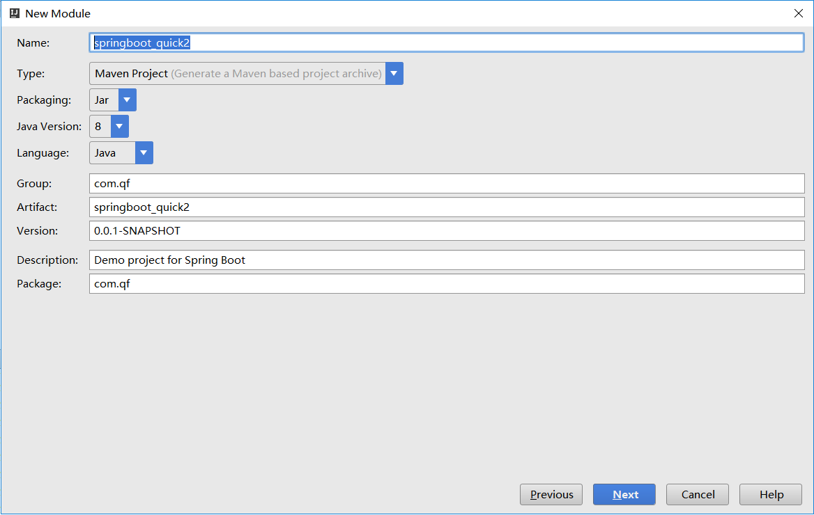
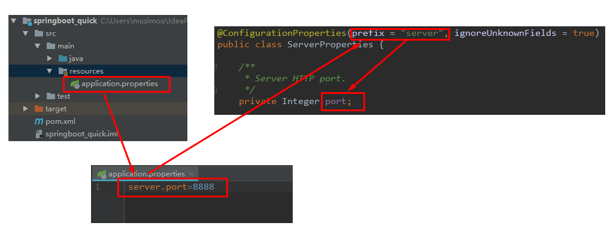

<!--title: SpringBoot 基础
description: SpringBoot不是对Spring功能上的增强，而是提供了一种快速使用Spring的方式
type: 笔记
firstPicture: http://static-blog.top234.top/image/1.png
status: 1
priority: 6
=top234=-->


# 一、SpringBoot简介

## 1.1 原有Spring优缺点分析

### 1.1.1 Spring的优点分析

Spring是Java企业版（Java Enterprise Edition，JEE，也称J2EE）的轻量级代替品。无需开发重量级的Enterprise JavaBean（EJB），Spring为企业级Java开发提供了一种相对简单的方法，通过依赖注入和面向切面编程，用简单的Java对象（Plain Old Java Object，POJO）实现了EJB的功能。

### 1.1.2 Spring的缺点分析

虽然Spring的组件代码是轻量级的，但它的配置却是重量级的。一开始，Spring用XML配置，而且是很多XML配      置。Spring  2.5引入了基于注解的组件扫描，这消除了大量针对应用程序自身组件的显式XML配置。Spring  3.0引入了基于Java的配置，这是一种类型安全的可重构配置方式，可以代替XML。

所有这些配置都代表了开发时的损耗。因为在思考Spring特性配置和解决业务问题之间需要进行思维切换，所以编   写配置挤占了编写应用程序逻辑的时间。和所有框架一样，Spring实用，但与此同时它要求的回报也不少。

除此之外，项目的依赖管理也是一件耗时耗力的事情。在环境搭建时，需要分析要导入哪些库的坐标，而且还需要   分析导入与之有依赖关系的其他库的坐标，一旦选错了依赖的版本，随之而来的不兼容问题就会严重阻碍项目的开   发进度。

## 1.2 SpringBoot的概述

### 1.2.1 SpringBoot解决上述Spring的缺点

SpringBoot对上述Spring的缺点进行的改善和优化，基于**约定优于配置**的思想，可以让开发人员不必在配置与逻辑业务之间进行思维的切换，全身心的投入到逻辑业务的代码编写中，从而大大提高了开发的效率，一定程度上缩短了项目周期。

### 1.2.2 SpringBoot的特点

为基于Spring的开发提供更快的入门体验

开箱即用，没有代码生成，也无需XML配置。同时也可以修改默认值来满足特定的需求

提供了一些大型项目中常见的非功能性特性，如嵌入式服务器、安全、指标，健康检测、外部配置等

**SpringBoot不是对Spring功能上的增强，而是提供了一种快速使用Spring的方式**

### 1.2.3 SpringBoot的核心功能

起步依赖：

起步依赖本质上是一个Maven项目对象模型（Project Object Model，POM），定义了对其他库的传递依赖，这些东西加在一起即支持某项功能。

简单的说，起步依赖就是将具备某种功能的坐标打包到一起，并提供一些默认的功能。 

自动配置：

Spring Boot的自动配置是一个运行时（更准确地说，是应用程序启动时）的过程，考虑了众多因素，才决定Spring配置应该用哪个，不该用哪个。该过程是Spring自动完成的。

注意：起步依赖和自动配置的原理剖析会在第三章《SpringBoot原理分析》进行详细讲解


# 二、SpringBoot快速入门

## 2.1 代码实现

### 2.1.1 创建Maven工程

使用idea工具创建一个maven工程，该工程为普通的java工程即可


### 2.1.2 添加SpringBoot的起步依赖

SpringBoot要求，项目要继承SpringBoot的起步依赖spring-boot-starter-parent

```xml
<!--所有的springboot工程都必须继承spring-boot-starter-parent-->
<parent>
    <groupId>org.springframework.boot</groupId>
    <artifactId>spring-boot-starter-parent</artifactId>
    <version>2.0.1.RELEASE</version>
</parent>
```

SpringBoot要集成SpringMVC进行Controller的开发，所以项目要导入web的启动依赖  

```xml
<dependencies>
    <dependency>
        <groupId>org.springframework.boot</groupId>
        <artifactId>spring-boot-starter-web</artifactId>
    </dependency>
</dependencies>
```

### 2.1.3 编写SpringBoot引导类

要通过SpringBoot提供的引导类起步SpringBoot才可以进行访问

```java
import org.springframework.boot.SpringApplication;
import org.springframework.boot.autoconfigure.SpringBootApplication;

@SpringBootApplication
public class MySpringBootApplication {
    public static void main(String[] args) {
        
        SpringApplication.run(MySpringBootApplication.class,args);
    }
}

```

### 2.1.4 编写Controller

在引导类MySpringBootApplication同级包或者子级包中创建HelloController

```java
import org.springframework.stereotype.Controller;
import org.springframework.web.bind.annotation.RequestMapping;
import org.springframework.web.bind.annotation.ResponseBody;

@Controller
public class HelloController {

    @RequestMapping("/quick")
    @ResponseBody
    public String quick(){
        return "Hello,Spring Boot";
    }
}
```

### 2.1.5 测试

```shell
运行MySpringBootApplication类的main方法:

...........
2019-06-03 16:57:14.680  INFO 12412 --- [  restartedMain] o.s.b.w.embedded.tomcat.TomcatWebServer  : Tomcat started on port(s): 8080 (http) with context path ''
2019-06-03 16:57:14.683  INFO 12412 --- [  restartedMain] com.MySpringBootApplication              : Started MySpringBootApplication in 3.164 seconds (JVM running for 3.567)

```

通过日志发现，Tomcat started on port(s): 8080 (http) with context path '' tomcat已经启动，端口监听8080，web应用的虚拟工程名称为空


打开浏览器访问

url地址为：http://localhost:8080/quick

## 2.2 快速入门解析

### 2.2.2S pringBoot代码解析

@SpringBootApplication：标注SpringBoot的启动类，该注解具备多种功能（后面详细剖析） SpringApplication.run(MySpringBootApplication.class) 代表运行SpringBoot的启动类，参数为SpringBoot 启动类的字节码对象

### 2.2.3S pringBoot工程热部署（spring-boot-devtools）

我们在开发中反复修改类、页面等资源，每次修改后都是需要重新启动才生效，这样每次启动都很麻烦，浪费了大   量的时间，我们可以在修改代码后不重启就能生效，在pom.xml  中添加如下配置就可以实现这样的功能，我们称之为热部署。

```xml
<dependency>
    <groupId>org.springframework.boot</groupId>
    <artifactId>spring-boot-devtools</artifactId>
</dependency>
```

**devtools工具会在代码编译后自动进行部署：**

Intellij  IEDA默认情况下不会自动编译，需要对IDEA进行自动编译的设置，如下：(也在修改代码后手动编译：build project，快捷键：Ctrl+F9)


然后 Shift+Ctrl+Alt+/，选择Registry


### 2.2.4使用idea快速创建SpringBoot项目


 


通过idea快速创建的SpringBoot项目的pom.xml中已经导入了我们选择的web的起步依赖的坐标

# 三、SpringBoot原理分析

### 3.1.1 分析spring-boot-starter-parent

spring-boot-starter-parent的pom.xml配置如下（只摘抄了部分重点配置）： 

```xml
  <modelVersion>4.0.0</modelVersion>
  <parent>
    <groupId>org.springframework.boot</groupId>
    <artifactId>spring-boot-dependencies</artifactId>
    <version>2.4.4</version>
  </parent>
  
  <properties>
    <java.version>1.8</java.version>
    <resource.delimiter>@</resource.delimiter>
    <maven.compiler.source>${java.version}</maven.compiler.source>
    <maven.compiler.target>${java.version}</maven.compiler.target>
    <project.build.sourceEncoding>UTF-8</project.build.sourceEncoding>
    <project.reporting.outputEncoding>UTF-8</project.reporting.outputEncoding>
  </properties>
  <url>https://spring.io/projects/spring-boot</url>
  <licenses>
    <license>
      <name>Apache License, Version 2.0</name>
      <url>https://www.apache.org/licenses/LICENSE-2.0</url>
    </license>
  </licenses>
  <developers>
    <developer>
      <name>Pivotal</name>
      <email>info@pivotal.io</email>
      <organization>Pivotal Software, Inc.</organization>
      <organizationUrl>https://www.spring.io</organizationUrl>
    </developer>
  </developers>
  <scm>
    <url>https://github.com/spring-projects/spring-boot</url>
  </scm>
  <build>
    <resources>
      <resource>
        <directory>${basedir}/src/main/resources</directory>
        <filtering>true</filtering>
        <includes>
          <include>**/application*.yml</include>
          <include>**/application*.yaml</include>
          <include>**/application*.properties</include>
        </includes>
      </resource>
      <resource>
        <directory>${basedir}/src/main/resources</directory>
        <excludes>
          <exclude>**/application*.yml</exclude>
          <exclude>**/application*.yaml</exclude>
          <exclude>**/application*.properties</exclude>
        </excludes>
      </resource>
    </resources>
  </build>
</project>
```

spring-boot-starter-parent的父工程spring-boot-starter-dependencies的pom.xml配置如下（只摘抄了部分重点配置）：

```xml
<properties>
    <activemq.version>5.15.3</activemq.version>
    <antlr2.version>2.7.7</antlr2.version>
    <appengine-sdk.version>1.9.63</appengine-sdk.version>
    <artemis.version>2.4.0</artemis.version>
    <aspectj.version>1.8.13</aspectj.version>
    <assertj.version>3.9.1</assertj.version>
    <atomikos.version>4.0.6</atomikos.version>
    <bitronix.version>2.1.4</bitronix.version>
    <build-helper-maven-plugin.version>3.0.0</build-helper-maven-plugin.version>
    <byte-buddy.version>1.7.11</byte-buddy.version>
    ... ... ...
</properties>
<dependencyManagement>
    <dependencies>
        <dependency>
            <groupId>org.springframework.boot</groupId>
            <artifactId>spring-boot</artifactId>
            <version>2.0.1.RELEASE</version>
        </dependency>
        <dependency>
            <groupId>org.springframework.boot</groupId>
            <artifactId>spring-boot-test</artifactId>
            <version>2.0.1.RELEASE</version>
        </dependency>
        ... ... ...
    </dependencies>
</dependencyManagement>
<build>
    <pluginManagement>
        <plugins>
            <plugin>
                <groupId>org.jetbrains.kotlin</groupId>
                <artifactId>kotlin-maven-plugin</artifactId>
                <version>${kotlin.version}</version>
            </plugin>
            <plugin>
                <groupId>org.jooq</groupId>
                <artifactId>jooq-codegen-maven</artifactId>
                <version>${jooq.version}</version>
            </plugin>
            <plugin>
                <groupId>org.springframework.boot</groupId>
                <artifactId>spring-boot-maven-plugin</artifactId>
                <version>2.0.1.RELEASE</version>
            </plugin>
            ... ... ...
        </plugins>
    </pluginManagement>
</build>
```

从上面的spring-boot-starter-dependencies的pom.xml中我们可以发现，一部分坐标的版本、依赖管理、插件管理已经定义好，我们的SpringBoot工程继承spring-boot-starter-parent后已经具备版本锁定等配置了。

所以起步依赖的作用就是进行依赖的传递。

### 3.1.2 分析spring-boot-starter-web

spring-boot-starter-web的pom.xml配置如下（只摘抄了部分重点配置）：

```xml
<?xml version="1.0" encoding="UTF-8"?>
<project xsi:schemaLocation="http://maven.apache.org/POM/4.0.0
http://maven.apache.org/xsd/maven-4.0.0.xsd"
xmlns="http://maven.apache.org/POM/4.0.0"
xmlns:xsi="http://www.w3.org/2001/XMLSchema-instance">
<modelVersion>4.0.0</modelVersion>
    <parent>
        <groupId>org.springframework.boot</groupId>
        <artifactId>spring-boot-starters</artifactId>
        <version>2.0.1.RELEASE</version>
    </parent>
    <groupId>org.springframework.boot</groupId>
    <artifactId>spring-boot-starter-web</artifactId>
    <version>2.0.1.RELEASE</version>
    <name>Spring Boot Web Starter</name>
    <dependencies>
        <dependency>
            <groupId>org.springframework.boot</groupId>
            <artifactId>spring-boot-starter</artifactId>
            <version>2.0.1.RELEASE</version>
            <scope>compile</scope>
        </dependency>
        <dependency>
            <groupId>org.springframework.boot</groupId>
            <artifactId>spring-boot-starter-json</artifactId>
            <version>2.0.1.RELEASE</version>
            <scope>compile</scope>
        </dependency>
        <dependency>
            <groupId>org.springframework.boot</groupId>
            <artifactId>spring-boot-starter-tomcat</artifactId>
            <version>2.0.1.RELEASE</version>
            <scope>compile</scope>
        </dependency>
        <dependency>
            <groupId>org.hibernate.validator</groupId>
            <artifactId>hibernate-validator</artifactId>
            <version>6.0.9.Final</version>
            <scope>compile</scope>
        </dependency>
        <dependency>
        <groupId>org.springframework</groupId>
            <artifactId>spring-web</artifactId>
            <version>5.0.5.RELEASE</version>
            <scope>compile</scope>
        </dependency>
        <dependency>
            <groupId>org.springframework</groupId>
            <artifactId>spring-webmvc</artifactId>
            <version>5.0.5.RELEASE</version>
            <scope>compile</scope>
        </dependency>
    </dependencies>
</project>
```

从上面的spring-boot-starter-web的pom.xml中我们可以发现，spring-boot-starter-web就是将web开发要使用的spring-web、spring-webmvc等坐标进行了“打包”，这样我们的工程只要引入spring-boot-starter-web起步依赖的坐标就可以进行web开发了，同样体现了依赖传递的作用。

## 3.2 自动配置原理解析

启动类MySpringBootApplication上的注解@SpringBootApplication

```java
@SpringBootApplication
public class MySpringBootApplication {
    public static void main(String[] args) {
        SpringApplication.run(MySpringBootApplication.class);
    }
}
```

注解@SpringBootApplication的源码

```java
@Target(ElementType.TYPE)
@Retention(RetentionPolicy.RUNTIME)
@Documented
@Inherited
@SpringBootConfiguration
@EnableAutoConfiguration
@ComponentScan(excludeFilters = {
@Filter(type = FilterType.CUSTOM, classes = TypeExcludeFilter.class),
@Filter(type = FilterType.CUSTOM, classes =
AutoConfigurationExcludeFilter.class) })
public @interface SpringBootApplication {
        /**
        * Exclude specific auto-configuration classes such that they will never be
        applied.
        * @return the classes to exclude
        */
        @AliasFor(annotation = EnableAutoConfiguration.class)
        Class<?>[] exclude() default {};
        ... ... ...
}
```

其中：

@SpringBootConfiguration：等同与@Configuration，既标注该类是Spring的一个配置类@EnableAutoConfiguration：SpringBoot自动配置功能开启

注解@EnableAutoConfiguration

```java
package org.springframework.boot.autoconfigure;

import java.lang.annotation.Documented;
import java.lang.annotation.ElementType;
import java.lang.annotation.Inherited;
import java.lang.annotation.Retention;
import java.lang.annotation.RetentionPolicy;
import java.lang.annotation.Target;
import org.springframework.boot.autoconfigure.AutoConfigurationImportSelector;
import org.springframework.boot.autoconfigure.AutoConfigurationPackage;
import org.springframework.context.annotation.Import;

@Target({ElementType.TYPE})
@Retention(RetentionPolicy.RUNTIME)
@Documented
@Inherited
@AutoConfigurationPackage
@Import({AutoConfigurationImportSelector.class})
public @interface EnableAutoConfiguration {
    String ENABLED_OVERRIDE_PROPERTY = "spring.boot.enableautoconfiguration";

    Class<?>[] exclude() default {};

    String[] excludeName() default {};
}
```

其中，@Import(AutoConfifigurationImportSelector.class) 导入了AutoConfigurationImportSelector类 

AutoConfigurationImportSelector类的源码 ：

```java
public String[] selectImports(AnnotationMetadata annotationMetadata) {
        ... ... ...
        List<String> configurations = getCandidateConfigurations(annotationMetadata,
        attributes);
        configurations = removeDuplicates(configurations);
        Set<String> exclusions = getExclusions(annotationMetadata, attributes);
        checkExcludedClasses(configurations, exclusions);
        configurations.removeAll(exclusions);
        configurations = filter(configurations, autoConfigurationMetadata);
        fireAutoConfigurationImportEvents(configurations, exclusions);
        return StringUtils.toStringArray(configurations);
}
protected List<String> getCandidateConfigurations(AnnotationMetadata metadata,
        AnnotationAttributes attributes) {
        List<String> configurations = SpringFactoriesLoader.loadFactoryNames(
        getSpringFactoriesLoaderFactoryClass(), getBeanClassLoader());
        return configurations;
}
```

其中，SpringFactoriesLoader.loadFactoryNames 方法的作用就是从META-INF/spring.factories文件中读取指定类对应的类名称列表

spring.factories 文件中有关自动配置的配置信息如下：

```java
... ... ...
org.springframework.boot.autoconfigure.web.reactive.function.client.WebClientAutoConf
iguration,\
org.springframework.boot.autoconfigure.web.servlet.DispatcherServletAutoConfiguration
,\
org.springframework.boot.autoconfigure.web.servlet.ServletWebServerFactoryAutoConfigu
ration,\
org.springframework.boot.autoconfigure.web.servlet.error.ErrorMvcAutoConfiguration,\
org.springframework.boot.autoconfigure.web.servlet.HttpEncodingAutoConfiguration,\
org.springframework.boot.autoconfigure.web.servlet.MultipartAutoConfiguration,\
... ... ... 
```

上面配置文件存在大量的以Configuration为结尾的类名称，这些类就是存有自动配置信息的类，而

SpringApplication在获取这些类名后再加载

我们以ServletWebServerFactoryAutoConfiguration为例来分析源码：

```java
@Configuration
@AutoConfigureOrder(Ordered.HIGHEST_PRECEDENCE)
@ConditionalOnClass(ServletRequest.class)
@ConditionalOnWebApplication(type = Type.SERVLET)
@EnableConfigurationProperties(ServerProperties.class)
@Import({ ServletWebServerFactoryAutoConfiguration.BeanPostProcessorsRegistrar.class,
        ServletWebServerFactoryConfiguration.EmbeddedTomcat.class,
        ServletWebServerFactoryConfiguration.EmbeddedJetty.class,
        ServletWebServerFactoryConfiguration.EmbeddedUndertow.class })
    public class ServletWebServerFactoryAutoConfiguration {
    ... ... ...
    }
```

其中，@EnableConfigurationProperties(ServerProperties.class) 代表加载ServerProperties服务器配置属性类

进入ServerProperties.class源码如下：

```java
@ConfigurationProperties(prefix = "server", ignoreUnknownFields = true)
public class ServerProperties {
    
    /**
    * Server HTTP port.
    */
    private Integer port;
   
   	/**
    * Network address to which the server should bind.
    */
    private InetAddress address;
    
    ... ... ...
}
```

其中，prefix = "server" 表示SpringBoot配置文件中的前缀，SpringBoot会将配置文件中以server开始的属性映射到该类的字段中。映射关系如下：

 

# 四、SpringBoot的配置文件

## 4.1 SpringBoot配置文件类型

### 4.1.1 SpringBoot配置文件类型和作用

SpringBoot是基于约定的，很多配置都有默认值，但如果想使用自己的配置替换默认配置，可以使用**application.properties**或者**application.yml（application.yaml）**进行配置。

SpringBoot默认会从Resources目录下加载application.properties或application.yml（application.yaml）文件

### 4.1.2 application.yml配置文件

#### 4.1.2.1 yml配置文件简介

YML文件格式是YAML (YAML Aint  Markup Language)编写的文件格式，YAML是一种直观的能够被电脑识别的的数据数据序列化格式，并且容易被人类阅读，容易和脚本语言交互的，可以被支持YAML库的不同的编程语言程序导入，比如： C/C++, Ruby, Python, Java, Perl, C#, PHP等。YML文件是以数据为核心的，比传统的xml方式更加简洁。

YML文件的扩展名可以使用.yml或者.yaml。

#### 4.1.2.2 yml配置文件的语法

##### **4.1.2.2.1** 配置普通数据

语法： key: value 

示例代码： 

```yml
name: haohao
```

**注意：value之前有一个空格**

##### 4.1.2.2.2 配置对象数据语法：

语法： 

key: 

​	key1: value1 

​	key2: value2 

或者： 

key: {key1: value1,key2: value2} 

示例代码：

```yml
person:
    name: haohao
    age: 31
    addr: beijing
    
#或者
person: {name: haohao,age: 31,addr: beijing}
```

 注意：key1前面的空格个数不限定，在yml语法中，相同缩进代表同一个级别

##### 4.1.2.2.2 配置Map数据

##### 与配置对象的语法相同

##### 4.1.2.2.3 配置数组（List、Set）数据语法：

key:

​	\- value1

​	\- value2

或者：

key: [value1,value2]

示例代码：

```yml
my:
  city:
    - beijing
    - tianjin
    - shanghai
    - chongqing
#或者
my:
   city: [beijing,tianjin,shanghai,chongqing]
#集合中的元素是对象形式
student:
   -name: zhangsan
    age: 18
   	score: 100
   -name: lisi
    age: 28
    score: 88
   -name: wangwu
    age: 38
    score: 90
```

 注意：value1与之间的 - 之间存在一个空格

### 4.1.3 SpringBoot配置信息的查询

上面提及过，SpringBoot的配置文件，主要的目的就是对配置信息进行修改的，但在配置时的key从哪里去查询    呢？我们可以查阅SpringBoot的官方文档

[文档URL：https://docs.spring.io/spring-boot/docs/2.0.1.RELEASE/reference/htmlsingle/#common-application- properties](https://docs.spring.io/spring-boot/docs/2.0.1.RELEASE/reference/htmlsingle/#common-application-properties)

常用的配置摘抄如下：

```properties
# QUARTZ SCHEDULER (QuartzProperties)
spring.quartz.jdbc.initialize-schema=embedded # Database schema initialization mode.
spring.quartz.jdbc.schema=classpath:org/quartz/impl/jdbcjobstore/tables_@@platform@@.
sql # Path to the SQL file to use to initialize the database schema.
spring.quartz.job-store-type=memory # Quartz job store type.
spring.quartz.properties.*= # Additional Quartz Scheduler properties.
# ----------------------------------------
# WEB PROPERTIES
# ----------------------------------------
# EMBEDDED SERVER CONFIGURATION (ServerProperties)
server.port=8080 # Server HTTP port.
server.servlet.context-path= # Context path of the application.
server.servlet.path=/ # Path of the main dispatcher servlet.
# HTTP encoding (HttpEncodingProperties)
spring.http.encoding.charset=UTF-8 # Charset of HTTP requests and responses. Added to
the "Content-Type" header if not set explicitly.
# JACKSON (JacksonProperties)
spring.jackson.date-format= # Date format string or a fully-qualified date format
class name. For instance, `yyyy-MM-dd HH:mm:ss`.
# SPRING MVC (WebMvcProperties)
spring.mvc.servlet.load-on-startup=-1 # Load on startup priority of the dispatcher
servlet.
spring.mvc.static-path-pattern=/** # Path pattern used for static resources.
spring.mvc.view.prefix= # Spring MVC view prefix.
spring.mvc.view.suffix= # Spring MVC view suffix.
# DATASOURCE (DataSourceAutoConfiguration & DataSourceProperties)
spring.datasource.driver-class-name= # Fully qualified name of the JDBC driver. Autodetected based on the URL by default.
spring.datasource.password= # Login password of the database.
spring.datasource.url= # JDBC URL of the database.
spring.datasource.username= # Login username of the database.
# JEST (Elasticsearch HTTP client) (JestProperties)
spring.elasticsearch.jest.password= # Login password.
spring.elasticsearch.jest.proxy.host= # Proxy host the HTTP client should use.
spring.elasticsearch.jest.proxy.port= # Proxy port the HTTP client should use.
spring.elasticsearch.jest.read-timeout=3s # Read timeout.
spring.elasticsearch.jest.username= # Login username.
```

我们可以通过配置application.poperties 或者 application.yml 来修改SpringBoot的默认配置例如：

application.properties文件

```properties
# 项目端口号
server.port=8888
# 项目访问路径
server.servlet.context-path=demo
```

application.yml文件

```yml
server:
	port: 8888
	servlet:
		context-path: /demo
```

## 4.2 配置文件与配置类的属性映射方式

### 4.2.1 使用注解@Value映射

我们可以通过@Value注解将配置文件中的值映射到一个Spring管理的Bean的字段上 例如：

application.properties配置如下：

```properties
person.name=zhangsan
person.age=18 
```

或者，application.yml配置如下：

```yml
person:
    name: zhangsan
    age: 18
```

实体Bean代码如下：

```java
@Controller
public class QuickStartController {

    @Value("${person.name}")
    private String name;
    @Value("${person.age}")
    private Integer age;
    
    @RequestMapping("/quick")
    @ResponseBody
    public String quick(){
    return "springboot 访问成功! name="+name+",age="+age;
    }
} 
```

### 4.2.2 使用注解@ConfigurationProperties映射

通过注解@ConfigurationProperties(prefix="配置文件中的key的前缀")可以将配置文件中的配置自动与实体进行映射

application.properties配置如下：

```properties
person:
    name: zhangsan
    age: 18
```

或者，application.yml配置如下：

```yml
person:
    name: zhangsan
    age: 18
```

实体Bean代码如下：

```java
@Controller
@ConfigurationProperties(prefix = "person")
public class QuickStartController {

    private String name;
    private Integer age;
    
    @RequestMapping("/quick")
    @ResponseBody
    public String quick(){
    	return "springboot 访问成功! name="+name+",age="+age;
	}
	public void setName(String name) {
		this.name = name;
	}
	public void setAge(Integer age) {
		this.age = age;
	}
}
```

**注意:** 使用@ConfigurationProperties方式可以进行配置文件与实体字段的自动映射，但被映射字段必须提供set方法，而使用@Value注解修饰的字段不需要提供set方法
