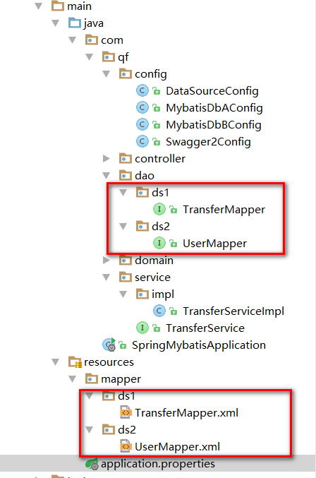
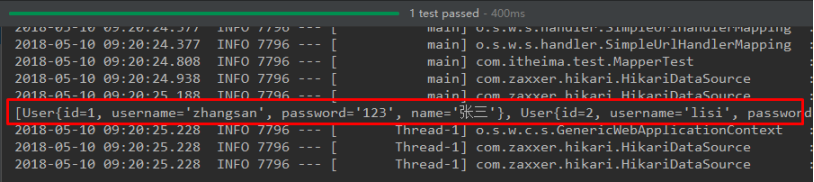
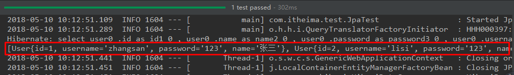
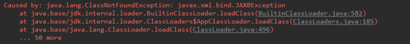
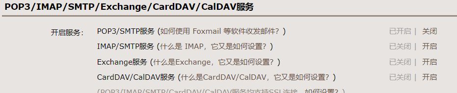
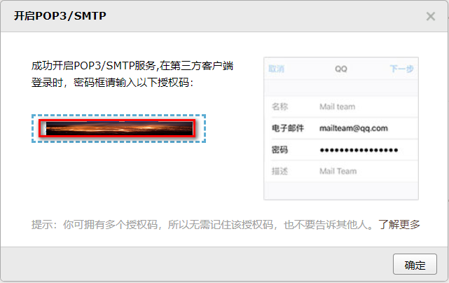

<!--title: SpringBoot整合其他技术
description: SpringBoot整合 Mybatis | Junit | Spring Data Jpa | Redis | Mail | Thymeleaf
firstPicture: http://static-blog.top234.top/image/1.png
status: 1
priority: 6
=top234=-->


## 1 SpringBoot整合Mybatis

### 1.1 添加Mybatis的起步依赖

```xml
<!--mybatis起步依赖-->
<dependency>
    <groupId>org.mybatis.spring.boot</groupId>
    <artifactId>mybatis-spring-boot-starter</artifactId>
    <version>1.1.1</version>
</dependency>
```

### 1.2 添加数据库驱动坐标 

```xml
<!-- MySQL连接驱动 -->
<dependency>
    <groupId>mysql</groupId>
    <artifactId>mysql-connector-java</artifactId>
</dependency>
```

### 1.3 添加数据库连接信息

在application.properties中添加数据库的连接信息

```properties
#DB Configuration:
spring.datasource.driverClassName=com.mysql.jdbc.Driver
spring.datasource.url=jdbc:mysql://127.0.0.1:3306/test？useUnicode=true&characterEncoding=utf8
spring.datasource.username=root
spring.datasource.password=password
```

### 1.4 创建user表

在test数据库中创建user表

```MySQL
-- ----------------------------
-- Table structure for `user`
-- ----------------------------
DROP TABLE IF EXISTS `user`;
CREATE TABLE `user` (
`id` int(11) NOT NULL AUTO_INCREMENT,
`username` varchar(50) DEFAULT NULL,
`password` varchar(50) DEFAULT NULL,
`name` varchar(50) DEFAULT NULL,
PRIMARY KEY (`id`)
) ENGINE=InnoDB AUTO_INCREMENT=10 DEFAULT CHARSET=utf8;
-- ----------------------------
-- Records of user
-- ----------------------------
INSERT INTO `user` VALUES ('1', 'zhangsan', '123', '张三');
INSERT INTO `user` VALUES ('2', 'lisi', '123', '李四');
```

### 1.5 创建实体Bean

```Java
public class User {
    // 主键
    private Long id;
    // 用户名
    private String username;
    // 密码
    private String password;
    // 姓名
    private String name;
    //此处省略getter和setter方法 .. ..
}
```

### 1.6 编写Mapper

```Java
@Mapper
public interface UserMapper {
	public List<User> queryUserList();
}
```

**注意：**@Mapper注解标记该类是一个mybatis的mapper接口，可以被spring boot自动扫描到spring上下文中

### 1.7 配置Mapper映射文件

在src\main\resources\mapper路径下加入UserMapper.xml配置文件：

```xml
<?xml version="1.0" encoding="utf-8" ?>
<!DOCTYPE mapper PUBLIC "-//mybatis.org//DTD Mapper 3.0//EN"
"http://mybatis.org/dtd/mybatis-3-mapper.dtd" >
<mapper namespace="top.top234.dao.UserMapper">
    <select id="queryUserList" resultType="user">
    	select * from user
    </select>
</mapper>
```

### 1.8 在application.properties中添加mybatis的信息

```properties
#spring集成Mybatis环境
#pojo别名扫描包
mybatis.type-aliases-package=com.qf.domain
#加载Mybatis映射文件
mybatis.mapper-locations=classpath:mapper/*Mapper.xml
```

### 1.9 编写测试Controller

```java
@Controller
public class MapperController {
    
    @Autowired
    private UserMapper userMapper;
   
    @RequestMapping("/queryUser")
    @ResponseBody
    public List<User> queryUser(){
    List<User> users = userMapper.queryUserList();
    return users;
    }
}
```

### 1.10 测试


### 1.11 事务管理

单个数据源的情况只需要在service层中加入注解@Transactional 就可以实现事务的管理

### 1.12 多数据源

在实际的开发中，有可能我们在一个项目中需要去查询两个不同的数据库，那么就需要我们来配置多数据源，如何在springboot中配置多数据源

#### 1.12.1 导入依赖

```xml
<dependency>
    <groupId>org.mybatis.spring.boot</groupId>
    <artifactId>mybatis-spring-boot-starter</artifactId>
    <version>1.1.1</version>
</dependency>

<dependency>
    <groupId>mysql</groupId>
    <artifactId>mysql-connector-java</artifactId>
</dependency>
```

#### 1.12.2 配置文件

```properties
#DB1 Configuration:
spring.datasource.account.driverClassName=com.mysql.jdbc.Driver
spring.datasource.account.jdbc-url=jdbc:mysql://127.0.0.1:3306/account&useUnicode=true&characterEncoding=utf-8?useSSL=false
spring.datasource.account.username=root
spring.datasource.account.password=59852369

#DB2 Configuration:
spring.datasource.test.driverClassName=com.mysql.jdbc.Driver
spring.datasource.test.jdbc-url=jdbc:mysql://127.0.0.1:3306/test&useUnicode=true&characterEncoding=utf-8?useSSL=false
spring.datasource.test.username=root
spring.datasource.test.password=59852369
```

可以看到，我们在配置文件中配置两个数据库，库名是不同的

#### 1.12.3 修改启动类

```java
@SpringBootApplication(exclude = {DataSourceAutoConfiguration.class})
public class SpringMybatisApplication {
    public static void main(String[] args) {
        SpringApplication.run(SpringMybatisApplication.class);
    }
}
```

其中重点是 **exclude = {DataSourceAutoConfiguration.class}** 表示我们启动的时候排除自动读取数据源，因为有多个数据源，因此改为手动添加

#### 1.12.4 配置DataSource

```java
@Configuration
public class DataSourceConfig {
    @Bean(name = "ds1")
    @Primary
    @ConfigurationProperties(prefix = "spring.datasource.account") // application.properteis中对应属性的前缀
    public DataSource dataSource1() {
        return DataSourceBuilder.create().build();
    }

    @Bean(name = "ds2")
    @ConfigurationProperties(prefix = "spring.datasource.test") // application.properteis中对应属性的前缀
    public DataSource dataSource2() {
        return DataSourceBuilder.create().build();
    }
}
```

在datasource中配置两个数据库的信息，并且交给springboot来管理

#### 1.12.5 第一个连接配置

```java
@Configuration
@MapperScan(basePackages = {"com.qf.dao.ds1"}, sqlSessionFactoryRef = "sqlSessionFactory1")//配置当前数据源生效的包，根据包分别访问不同的数据源
public class MybatisDbAConfig {
    @Autowired
    @Qualifier("ds1")
    private DataSource ds1;

    @Bean
    @Primary
    public SqlSessionFactory sqlSessionFactory1() throws Exception {
        SqlSessionFactoryBean factoryBean = new SqlSessionFactoryBean();
        factoryBean.setDataSource(ds1); // 使用ds1数据源, 连接account库
        factoryBean.setMapperLocations(new PathMatchingResourcePatternResolver().getResources("classpath:mapper/ds1/*.xml"));
        return factoryBean.getObject();

    }
	
    @Bean
    @Primary
    public SqlSessionTemplate sqlSessionTemplate1() throws Exception {
        SqlSessionTemplate template = new SqlSessionTemplate(sqlSessionFactory1()); // 使用上面配置的Factory
        return template;
    }
	/**
	*配置事务
	*/
    @Bean(name = "Ds1TranscationManager")
    @Primary
    public DataSourceTransactionManager master1TransactionManager(@Qualifier("ds1") DataSource dataSource) {
        return new DataSourceTransactionManager(dataSource);
    }
}
```

#### 1.12.6 第二个连接配置

```java
@Configuration
@MapperScan(basePackages = {"com.qf.dao.ds2"}, sqlSessionFactoryRef = "sqlSessionFactory2")
public class MybatisDbBConfig {
    @Autowired
    @Qualifier("ds2")
    private DataSource ds2;

    @Bean
    public SqlSessionFactory sqlSessionFactory2() throws Exception {
        SqlSessionFactoryBean factoryBean = new SqlSessionFactoryBean();
        factoryBean.setDataSource(ds2);// 使用ds2数据源, 连接test库
        factoryBean.setMapperLocations(new PathMatchingResourcePatternResolver().getResources("classpath:mapper/ds2/*.xml"));
        return factoryBean.getObject();

    }

    @Bean
    public SqlSessionTemplate sqlSessionTemplate2() throws Exception {
        SqlSessionTemplate template = new SqlSessionTemplate(sqlSessionFactory2());
        return template;
    }

    @Bean(name = "Ds2TranscationManager")
    public DataSourceTransactionManager master1TransactionManager(@Qualifier("ds2") DataSource dataSource) {
        return new DataSourceTransactionManager(dataSource);
    }
}
```

#### 1.12.7 整体的项目结构



根据不同的包，去连接不同的数据库执行

#### 1.12.8 多数据源下的事务管理

使用多数据源后发现，我们的注解@Transcation注解已经失效了，所以我们需要去改变下

```java
@Transactional(value = "Ds1TranscationManager", rollbackFor = { Exception.class })
```

在需要事务管理的类上加上该注解，标明我们需要使用哪个事务来进行管理，**value = "Ds1TranscationManager"** 在我们的第一个连接中已经配置了事务管理，我们只需要告诉spring我们要来使用他就可以进行事务的管理了

## 2 SpringBoot整合Junit

### 2.1 添加Juni的起步依赖

```xml
<!--junit的起步依赖-->
<dependency>
    <groupId>org.springframework.boot</groupId>
    <artifactId>spring-boot-starter-test</artifactId>
    <scope>test</scope>
</dependency>
```

### 2.2 编写测试类

```java
package com.qf.test;

import com.qf.MySpringBootApplication;
import com.qf.domain.User;
import com.qf.mapper.UserMapper;
import org.junit.Test;
import org.junit.runner.RunWith;
import org.springframework.beans.factory.annotation.Autowired;
import org.springframework.boot.test.context.SpringBootTest;
import org.springframework.test.context.junit4.SpringRunner;
import java.util.List;

@RunWith(SpringRunner.class)
@SpringBootTest(classes = MySpringBootApplication.class)
public class MapperTest {

    @Autowired
    private UserMapper userMapper;
    
    @Test
    public void test() {
    List<User> users = userMapper.queryUserList();
    	System.out.println(users);
	}
}
```

其中，

SpringRunner继承自SpringJUnit4ClassRunner，使用哪一个Spring提供的测试引擎都可以

```java
public final class SpringRunner extends SpringJUnit4ClassRunner
```

@SpringBootTest的属性指定的是引导类的字节码对象

### 2.3 控制台打印信息



## 3 SpringBoot整合Spring Data JPA

### JPA注解介绍：

1. **@Entity** ：修饰实体类，指明该类将映射到指定的数据表，例如：Customer 类默认的数据表名为 customer

2. **@Table** ：当实体类与映射的数据库表名不同名时需要使用 @Table 注解，该注解与 @Entity 注解并列使用，使用其 **name 属性**指明数据库的表名

3. **@Id** ：标识该属性为**主键**，**一般标注在该属性的 getter 方法上**

4. **@GeneratedValue** ：标注**主键的生成策略**，通过其 **strategy 属性**。通常与 @Id 注解一起使用。默认情况下 JPA 会自动选择一个最适合底层数据库的主键生成策略，MySQL 默认为 AUTO，常用策略有：

   > IDENTITY：采用数据库ID自增长的方式来自增主键字段，Oracle 不支持这种方式；
   >  **AUTO**： **JPA自动选择合适的策略，是默认选项；**
   >  SEQUENCE：通过序列产生主键，通过 @SequenceGenerator 注解指定序列名，MySql 不支持这种方式
   >  TABLE：通过表产生主键，框架借由表模拟序列产生主键，使用该策略可以使应用更易于数据库移植

5. **@Basic** ：用于**没有任何标注的 getXxx() 方法**，默认即为 @Basic，所以若一个 getter 方法无任何注解，可以使用 @Basic 注解，也可以不使用

6. **@Column** ：当**实体的属性与其映射的数据表的列不同名时使用**，一般用于 getter 方法上。其 **name 属性用来指明此属性在数据表中对应的列名**；**unique 属性**指明**是否为唯一约束**；**nullable 属性**用来**指明是否可以为空，false 为不能为空**；**length 属性**指明**此列的长度**。

7. **@Transient** ：**标注此注解后在创建数据表的时候将会忽略该属性**  Customer 类并没有 info 这个属性，所以数据库中也不应该有 info 这个字段

8. **@Temporal** ：向数据库**映射日期（Date）属性时用来调整映射的精度**。Date 类型的数据有 DATE, TIME, 和 TIMESTAMP 三种精度(即单纯的日期,时间,或者两者兼备).

   Birth 属性应该使用 DATE 类型(生日只具体到日即可，如：2015-10-22)，而 CreateTime 应该使用 TIMESTAMP 类型(创建时间应该具体到秒，如：2017-10-11 22:39:13)

### 3.1 添加Spring Data JPA的起步依赖

```xml
<!-- springBoot JPA的起步依赖 -->
<dependency>
    <groupId>org.springframework.boot</groupId>
    <artifactId>spring-boot-starter-data-jpa</artifactId>
</dependency>
```

### 3.2 添加数据库驱动依赖

```xml
<!-- MySQL连接驱动 -->
<dependency>
    <groupId>mysql</groupId>
    <artifactId>mysql-connector-java</artifactId>
</dependency>
```

### 3.3 在application.properties中配置数据库和jpa的相关属性

```properties
#DB Configuration:
spring.datasource.driverClassName=com.mysql.jdbc.Driver
spring.datasource.url=jdbc:mysql://127.0.0.1:3306/test?useUnicode=true&characterEncoding=utf8
spring.datasource.username=root
spring.datasource.password=password

#JPA Configuration:
spring.jpa.database=MySQL
#打印SQL
spring.jpa.show-sql=true
#自动生成表
spring.jpa.generate-ddl=true
#自动更新字段
spring.jpa.hibernate.ddl-auto=update
spring.jpa.hibernate.naming_strategy=org.hibernate.cfg.ImprovedNamingStrategy
```

### 3.4 创建并配置实体

```java
@Entity
public class User {
    // 主键
    @Id
    @GeneratedValue(strategy = GenerationType.IDENTITY)
    private Long id;
    // 用户名
    private String username;
    // 密码
    private String password;
    // 姓名
    private String name;
    //此处省略setter和getter方法... ...
}
```

### 3.5 编写UserRepository

```java
public interface UserRepository extends JpaRepository<User,Long>{
	public List<User> findAll();
}
```

### 3.6 编写测试类

```java
@RunWith(SpringRunner.class)
@SpringBootTest(classes=MySpringBootApplication.class)
public class JpaTest {

    @Autowired
    private UserRepository userRepository;
    
    @Test
    public void test(){
    	List<User> users = userRepository.findAll();
    	System.out.println(users);
    }
}
```

### 3.7 控制台打印信息



注意：如果是jdk9，执行报错如下：



原因：jdk缺少相应的jar

解决方案：手动导入对应的maven坐标，如下：

```xml
<!--jdk9需要导入如下坐标-->
<dependency>
    <groupId>javax.xml.bind</groupId>
    <artifactId>jaxb-api</artifactId>
    <version>2.3.0</version>
</dependency>
```

## 4 SpringBoot整合Redis

### 4.1添加redis的起步依赖

```xml
<dependency>
    <groupId>org.springframework.boot</groupId>
    <artifactId>spring-boot-starter-web</artifactId>
</dependency>

<dependency>
    <groupId>org.springframework.boot</groupId>
    <artifactId>spring-boot-starter-test</artifactId>
    <scope>test</scope>
</dependency>

<!-- 配置使用redis启动器 -->
<dependency>
    <groupId>org.springframework.boot</groupId>
    <artifactId>spring-boot-starter-data-redis</artifactId>
</dependency>
```

### 4.2 配置redis的连接信息

```properties
#Redis
spring.redis.host=127.0.0.1
spring.redis.port=6379
```

### 4.3 配置RedisConnectionFactory

```java
@Configuration
@ConditionalOnClass(RedisOperations.class)
@EnableConfigurationProperties(RedisProperties.class)
public class RedisConfig {

    @Bean
    @ConditionalOnMissingBean(name = "redisTemplate")
    public RedisTemplate<Object, Object> redisTemplate(
            RedisConnectionFactory redisConnectionFactory) {
        RedisTemplate<Object, Object> template = new RedisTemplate<>();
        //使用fastjson序列化
        Jackson2JsonRedisSerializer fastJsonRedisSerializer = new Jackson2JsonRedisSerializer (Object.class);
        // value值的序列化采用fastJsonRedisSerializer
        template.setValueSerializer(fastJsonRedisSerializer);
        template.setHashValueSerializer(fastJsonRedisSerializer);
        // key的序列化采用StringRedisSerializer
        template.setKeySerializer(new StringRedisSerializer());
        template.setHashKeySerializer(new StringRedisSerializer());
        template.setConnectionFactory(redisConnectionFactory);
        return template;
    }

    @Bean
    @ConditionalOnMissingBean(StringRedisTemplate.class)
    public StringRedisTemplate stringRedisTemplate(
            RedisConnectionFactory redisConnectionFactory) {
        StringRedisTemplate template = new StringRedisTemplate();
        template.setConnectionFactory(redisConnectionFactory);
        return template;
    }
}
```

### 4.4 配置RedisUtils

```java
package com.qf;

import org.springframework.beans.factory.annotation.Autowired;
import org.springframework.data.redis.core.RedisTemplate;
import org.springframework.data.redis.core.ZSetOperations;
import org.springframework.stereotype.Component;
import org.springframework.util.CollectionUtils;

import java.util.List;
import java.util.Map;
import java.util.Set;
import java.util.concurrent.TimeUnit;

@Component
public class RedisUtils {
    @Autowired
    private RedisTemplate redisTemplate;

    public void setRedisTemplate(RedisTemplate<String, Object> redisTemplate) {
        this.redisTemplate = redisTemplate;
    }
    //=============================common============================
    /**
     * 指定缓存失效时间
     * @param key 键
     * @param time 时间(秒)
     * @return
     */
    public boolean expire(String key,long time){
        try {
            if(time>0){
                redisTemplate.expire(key, time, TimeUnit.SECONDS);
            }
            return true;
        } catch (Exception e) {
            e.printStackTrace();
            return false;
        }
    }

    /**
     * 根据key 获取过期时间
     * @param key 键 不能为null
     * @return 时间(秒) 返回0代表为永久有效
     */
    public long getExpire(String key){
        return redisTemplate.getExpire(key,TimeUnit.SECONDS);
    }

    /**
     * 判断key是否存在
     * @param key 键
     * @return true 存在 false不存在
     */
    public boolean hasKey(String key){
        try {
            return redisTemplate.hasKey(key);
        } catch (Exception e) {
            e.printStackTrace();
            return false;
        }
    }

    /**
     * 删除缓存
     * @param key 可以传一个值 或多个
     */
    @SuppressWarnings("unchecked")
    public void del(String ... key){
        if(key!=null&&key.length>0){
            if(key.length==1){
                redisTemplate.delete(key[0]);
            }else{
                redisTemplate.delete(CollectionUtils.arrayToList(key));
            }
        }
    }

    //============================String=============================
    /**
     * 普通缓存获取
     * @param key 键
     * @return 值
     */
    public Object get(String key){
        return key==null?null:redisTemplate.opsForValue().get(key);
    }

    /**
     * 普通缓存放入
     * @param key 键
     * @param value 值
     * @return true成功 false失败
     */
    public boolean set(String key,Object value) {
        try {
            redisTemplate.opsForValue().set(key, value);
            return true;
        } catch (Exception e) {
            e.printStackTrace();
            return false;
        }

    }

    /**
     * 普通缓存放入并设置时间
     * @param key 键
     * @param value 值
     * @param time 时间(秒) time要大于0 如果time小于等于0 将设置无限期
     * @return true成功 false 失败
     */
    public boolean set(String key,Object value,long time){
        try {
            if(time>0){
                redisTemplate.opsForValue().set(key, value, time, TimeUnit.SECONDS);
            }else{
                set(key, value);
            }
            return true;
        } catch (Exception e) {
            e.printStackTrace();
            return false;
        }
    }

    /**
     * 递增
     * @param key 键
     * @param by 要增加几(大于0)
     * @return
     */
    public long incr(String key, long delta){
        if(delta<0){
            throw new RuntimeException("递增因子必须大于0");
        }
        return redisTemplate.opsForValue().increment(key, delta);
    }

    /**
     * 递减
     * @param key 键
     * @param by 要减少几(小于0)
     * @return
     */
    public long decr(String key, long delta){
        if(delta<0){
            throw new RuntimeException("递减因子必须大于0");
        }
        return redisTemplate.opsForValue().increment(key, -delta);
    }

    //================================Map=================================
    /**
     * HashGet
     * @param key 键 不能为null
     * @param item 项 不能为null
     * @return 值
     */
    public Object hget(String key,String item){
        return redisTemplate.opsForHash().get(key, item);
    }

    /**
     * 获取hashKey对应的所有键值
     * @param key 键
     * @return 对应的多个键值
     */
    public Map<Object,Object> hmget(String key){
        return redisTemplate.opsForHash().entries(key);
    }

    /**
     * HashSet
     * @param key 键
     * @param map 对应多个键值
     * @return true 成功 false 失败
     */
    public boolean hmset(String key, Map<String,Object> map){
        try {
            redisTemplate.opsForHash().putAll(key, map);
            return true;
        } catch (Exception e) {
            e.printStackTrace();
            return false;
        }
    }

    /**
     * HashSet 并设置时间
     * @param key 键
     * @param map 对应多个键值
     * @param time 时间(秒)
     * @return true成功 false失败
     */
    public boolean hmset(String key, Map<String,Object> map, long time){
        try {
            redisTemplate.opsForHash().putAll(key, map);
            if(time>0){
                expire(key, time);
            }
            return true;
        } catch (Exception e) {
            e.printStackTrace();
            return false;
        }
    }

    /**
     * 向一张hash表中放入数据,如果不存在将创建
     * @param key 键
     * @param item 项
     * @param value 值
     * @return true 成功 false失败
     */
    public boolean hset(String key,String item,Object value) {
        try {
            redisTemplate.opsForHash().put(key, item, value);
            return true;
        } catch (Exception e) {
            e.printStackTrace();
            return false;
        }
    }

    /**
     * 向一张hash表中放入数据,如果不存在将创建
     * @param key 键
     * @param item 项
     * @param value 值
     * @param time 时间(秒)  注意:如果已存在的hash表有时间,这里将会替换原有的时间
     * @return true 成功 false失败
     */
    public boolean hset(String key,String item,Object value,long time) {
        try {
            redisTemplate.opsForHash().put(key, item, value);
            if(time>0){
                expire(key, time);
            }
            return true;
        } catch (Exception e) {
            e.printStackTrace();
            return false;
        }
    }

    /**
     * 删除hash表中的值
     * @param key 键 不能为null
     * @param item 项 可以使多个 不能为null
     */
    public void hdel(String key, Object... item){
        redisTemplate.opsForHash().delete(key,item);
    }

    /**
     * 判断hash表中是否有该项的值
     * @param key 键 不能为null
     * @param item 项 不能为null
     * @return true 存在 false不存在
     */
    public boolean hHasKey(String key, String item){
        return redisTemplate.opsForHash().hasKey(key, item);
    }

    /**
     * hash递增 如果不存在,就会创建一个 并把新增后的值返回
     * @param key 键
     * @param item 项
     * @param by 要增加几(大于0)
     * @return
     */
    public double hincr(String key, String item,double by){
        return redisTemplate.opsForHash().increment(key, item, by);
    }

    /**
     * hash递减
     * @param key 键
     * @param item 项
     * @param by 要减少记(小于0)
     * @return
     */
    public double hdecr(String key, String item,double by){
        return redisTemplate.opsForHash().increment(key, item,-by);
    }

    //============================set=============================
    /**
     * 根据key获取Set中的所有值
     * @param key 键
     * @return
     */
    public Set<Object> sGet(String key){
        try {
            return redisTemplate.opsForSet().members(key);
        } catch (Exception e) {
            e.printStackTrace();
            return null;
        }
    }

    /**
     * 根据value从一个set中查询,是否存在
     * @param key 键
     * @param value 值
     * @return true 存在 false不存在
     */
    public boolean sHasKey(String key,Object value){
        try {
            return redisTemplate.opsForSet().isMember(key, value);
        } catch (Exception e) {
            e.printStackTrace();
            return false;
        }
    }

    /**
     * 将数据放入set缓存
     * @param key 键
     * @param values 值 可以是多个
     * @return 成功个数
     */
    public long sSet(String key, Object...values) {
        try {
            return redisTemplate.opsForSet().add(key, values);
        } catch (Exception e) {
            e.printStackTrace();
            return 0;
        }
    }

    /**
     * 将set数据放入缓存
     * @param key 键
     * @param time 时间(秒)
     * @param values 值 可以是多个
     * @return 成功个数
     */
    public long sSetAndTime(String key,long time,Object...values) {
        try {
            Long count = redisTemplate.opsForSet().add(key, values);
            if(time>0) expire(key, time);
            return count;
        } catch (Exception e) {
            e.printStackTrace();
            return 0;
        }
    }

    /**
     * 获取set缓存的长度
     * @param key 键
     * @return
     */
    public long sGetSetSize(String key){
        try {
            return redisTemplate.opsForSet().size(key);
        } catch (Exception e) {
            e.printStackTrace();
            return 0;
        }
    }

    /**
     * 移除值为value的
     * @param key 键
     * @param values 值 可以是多个
     * @return 移除的个数
     */
    public long setRemove(String key, Object ...values) {
        try {
            Long count = redisTemplate.opsForSet().remove(key, values);
            return count;
        } catch (Exception e) {
            e.printStackTrace();
            return 0;
        }
    }
    //===============================list=================================

    /**
     * 获取list缓存的内容
     * @param key 键
     * @param start 开始
     * @param end 结束  0 到 -1代表所有值
     * @return
     */
    public List<Object> lGet(String key, long start, long end){
        try {
            return redisTemplate.opsForList().range(key, start, end);
        } catch (Exception e) {
            e.printStackTrace();
            return null;
        }
    }

    /**
     * 获取list缓存的长度
     * @param key 键
     * @return
     */
    public long lGetListSize(String key){
        try {
            return redisTemplate.opsForList().size(key);
        } catch (Exception e) {
            e.printStackTrace();
            return 0;
        }
    }

    /**
     * 通过索引 获取list中的值
     * @param key 键
     * @param index 索引  index>=0时， 0 表头，1 第二个元素，依次类推；index<0时，-1，表尾，-2倒数第二个元素，依次类推
     * @return
     */
    public Object lGetIndex(String key,long index){
        try {
            return redisTemplate.opsForList().index(key, index);
        } catch (Exception e) {
            e.printStackTrace();
            return null;
        }
    }

    /**
     * 将list放入缓存
     * @param key 键
     * @param value 值
     * @param time 时间(秒)
     * @return
     */
    public boolean lSet(String key, Object value) {
        try {
            redisTemplate.opsForList().rightPush(key, value);
            return true;
        } catch (Exception e) {
            e.printStackTrace();
            return false;
        }
    }

    /**
     * 将list放入缓存
     * @param key 键
     * @param value 值
     * @param time 时间(秒)
     * @return
     */
    public boolean lSet(String key, Object value, long time) {
        try {
            redisTemplate.opsForList().rightPush(key, value);
            if (time > 0) expire(key, time);
            return true;
        } catch (Exception e) {
            e.printStackTrace();
            return false;
        }
    }

    /**
     * 将list放入缓存
     * @param key 键
     * @param value 值
     * @param time 时间(秒)
     * @return
     */
    public boolean lSet(String key, List<Object> value) {
        try {
            redisTemplate.opsForList().rightPushAll(key, value);
            return true;
        } catch (Exception e) {
            e.printStackTrace();
            return false;
        }
    }

    /**
     * 将list放入缓存
     * @param key 键
     * @param value 值
     * @param time 时间(秒)
     * @return
     */
    public boolean lSet(String key, List<Object> value, long time) {
        try {
            redisTemplate.opsForList().rightPushAll(key, value);
            if (time > 0) expire(key, time);
            return true;
        } catch (Exception e) {
            e.printStackTrace();
            return false;
        }
    }

    /**
     * 根据索引修改list中的某条数据
     * @param key 键
     * @param index 索引
     * @param value 值
     * @return
     */
    public boolean lUpdateIndex(String key, long index,Object value) {
        try {
            redisTemplate.opsForList().set(key, index, value);
            return true;
        } catch (Exception e) {
            e.printStackTrace();
            return false;
        }
    }

    /**
     * 移除N个值为value
     * @param key 键
     * @param count 移除多少个
     * @param value 值
     * @return 移除的个数
     */
    public long lRemove(String key,long count,Object value) {
        try {
            Long remove = redisTemplate.opsForList().remove(key, count, value);
            return remove;
        } catch (Exception e) {
            e.printStackTrace();
            return 0;
        }
    }
    //=========================Zset 有序不重复集合====================================

    /**
     * 添加一个元素, zset与set最大的区别就是每个元素都有一个score，因此有个排序的辅助功能;  zadd
     *
     * @param key
     * @param value
     * @param score
     */
    public boolean ZSet(String key, String value, double score) {

        try {
            redisTemplate.opsForZSet().add(key, value, score);
            return true;
        } catch (Exception e) {
            e.printStackTrace();
            return false;
        }

    }
    /**
     * 删除元素 zrem
     *
     * @param key
     * @param value
     */
    public boolean ZRemove(String key, String value) {
        try {
            redisTemplate.opsForZSet().remove(key, value);
            return true;
        }catch (Exception e){
            e.printStackTrace();
            return false;
        }
    }

    /**
     * score的增加or减少 zincrby
     *
     * @param key
     * @param value
     * @param score
     */
    public Double ZIncrScore(String key, String value, double score) {
        return redisTemplate.opsForZSet().incrementScore(key, value, score);
    }
    /**
     * 查询value对应的score   zscore
     *
     * @param key
     * @param value
     * @return
     */
    public Double ZScore(String key, String value) {
        return  redisTemplate.opsForZSet().score(key, value);
    }

    /**
     * 判断value在zset中的排名  zrank
     *
     * @param key
     * @param value
     * @return
     */
    public Long ZRank(String key, String value) {
        return redisTemplate.opsForZSet().rank(key, value);
    }

    /**
     * 查询集合中指定顺序的值， 0 -1 表示获取全部的集合内容  zrange
     *
     * 返回有序的集合，score小的在前面
     *
     * @param key
     * @param start
     * @param end
     * @return
     */
    public Set<String> ZRange(String key, int start, int end) {
        return redisTemplate.opsForZSet().range(key, start, end);
    }

    /**
     * 查询集合中指定顺序的值和score，0, -1 表示获取全部的集合内容
     *
     * @param key
     * @param start
     * @param end
     * @return
     */
    public Set<ZSetOperations.TypedTuple<String>> ZRangeWithScore(String key, int start, int end) {
        return redisTemplate.opsForZSet().rangeWithScores(key, start, end);
    }

    /**
     * 查询集合中指定顺序的值  zrevrange
     *
     * 返回有序的集合中，score大的在前面
     *
     * @param key
     * @param start
     * @param end
     * @return
     */
    public Set<String> ZRevRange(String key, int start, int end) {
        return redisTemplate.opsForZSet().reverseRange(key, start, end);
    }

    /**
     * 根据score的值，来获取满足条件的集合  zrangebyscore
     *
     * @param key
     * @param min
     * @param max
     * @return
     */
    public Set<String> ZSortRange(String key, int min, int max) {
        return redisTemplate.opsForZSet().rangeByScore(key, min, max);
    }

}
```

### 4.5 注入RedisTemplate测试redis操作

```java
package com.qf;

import org.junit.Test;
import org.junit.runner.RunWith;
import org.springframework.beans.factory.annotation.Autowired;
import org.springframework.boot.test.context.SpringBootTest;
import org.springframework.data.redis.core.RedisTemplate;
import org.springframework.test.context.junit4.SpringRunner;

import java.util.ArrayList;
import java.util.List;
import java.util.Map;
import java.util.Set;

@RunWith(SpringRunner.class)
@SpringBootTest
public class redistTest {
    @Autowired
    private RedisTemplate<String, String> redisTemplate;
    @Autowired
    private RedisUtils redisUtils;

    @Test
    public void testString (){
        redisTemplate.opsForValue().set("username","zhangsan");
        String username = redisTemplate.opsForValue().get("username");
        System.out.println(username);

    }

    //hash 测试
    @Test
    public void testHash(){

        boolean hset = redisUtils.hset("user", "name", "张三");
        if (hset){
            Object user = redisUtils.hasKey("user");
            Map<Object, Object> user1 = redisUtils.hmget("user");
            System.out.println(user1);
        }
    }
    //测试List
    @Test
    public void testList(){
        List list = new ArrayList<>();
        list.add("aaaa");
        list.add("bbbb");
        list.add("cccc");
        list.add("dddd");
        list.add("eeee");
        boolean list1 = redisUtils.lSet("list", list);

        if (list1){
            List<Object> list2 = redisUtils.lGet("list", 0, -1);
            for (Object string:
                    list2) {
                System.out.println(string);
            }
        }
    }
    //测试Set
    @Test
    public void testSet(){
        long set = redisUtils.sSet("set", 123, 123, 123, 123, 456);

        boolean set2 = redisUtils.hasKey("set");
        if (set2){
            Set<Object> set1 = redisUtils.sGet("set");
            for (Object val:
                 set1) {
                System.out.println(val);
            }

        }
    }
    //测试ZSet
    @Test
    public void testZset(){

            redisUtils.ZSet("person","cccc",12);
            redisUtils.ZSet("person","dddd",13);
            redisUtils.ZSet("person","aaaa",10);
            redisUtils.ZSet("person","bbbb",11);

        //scope从小到大排列
        Set<String> person = redisUtils.ZRange("person", 0, -1);

        for (Object val:
                person) {
            System.out.println(val);
        }
        //scope从大到小排列
        Set<String> person1 = redisUtils.ZRevRange("person", 0, -1);
        for (Object val:
                person1) {
            System.out.println(val);
        }
    }
}
```

## 5	SpringBoot整合quartz 定时任务

### 5.1 启动类启用定时

```java
@SpringBootApplication
@EnableScheduling //启动类启用定时
public class MySpringBootApplication {
    public static void main(String[] args) {
        SpringApplication.run(MySpringBootApplication.class);
    }
}
```

### 5.2 创建定时任务实现类

#### 5.2.1 定时任务1

```java
package com.qf.Scheduler;

import org.springframework.scheduling.annotation.Scheduled;
import org.springframework.stereotype.Component;

@Component
public class SchedulerTask {

    private int count=0;

    @Scheduled(cron="*/6 * * * * ?")
    private void process() {
        System.out.println("this is scheduler task runing  " + (count++));
    }
}
```

#### 5.2.2 定时任务2

```java
@Component
public class Scheduler2Task {    
    private static final SimpleDateFormat dateFormat = new SimpleDateFormat("HH:mm:ss");    

    @Scheduled(fixedRate = 6000)    
    public void reportCurrentTime() {
        System.out.println("现在时间：" + dateFormat.format(new Date()));
    }
}
```

#### 5.2.3 结果如下

```shell
this is scheduler task runing  2
现在时间：13:11:01
this is scheduler task runing  3
现在时间：13:11:07
this is scheduler task runing  4
现在时间：13:11:13
this is scheduler task runing  5
现在时间：13:11:19
this is scheduler task runing  6
现在时间：13:11:25
```

### 5.3 参数说明

```java
@Scheduled 参数可以接受两种定时的设置，一种是我们常用的cron="*/6 * * * * ?",一种是 fixedRate = 6000，两种都表示每隔六秒打印一下内容。
```

​	fixedRate 说明

- `@Scheduled(fixedRate = 6000)` ：上一次开始执行时间点之后6秒再执行
- `@Scheduled(fixedDelay = 6000)` ：上一次执行完毕时间点之后6秒再执行
- `@Scheduled(initialDelay=1000, fixedRate=6000)` ：第一次延迟1秒后执行，之后按fixedRate的规则每6秒执行一次

## 6	SpringBoot 整合mail邮件

### 6.1 添加mail的起步依赖

```xml
<dependency>
    <groupId>org.springframework.boot</groupId>
    <artifactId>spring-boot-starter-mail</artifactId>
</dependency>
<dependency>
    <groupId>org.springframework.boot</groupId>
    <artifactId>spring-boot-starter-freemarker</artifactId>
</dependency>
```

### 6.2 获取QQ邮箱授权码

QQ邮箱->设置->账户->POP3/SMTP服务:开启服务后会获得QQ的授权码.





### 6.3 Mail配置文件

#### 6.3.1 qq邮箱的配置

```properties
# JavaMailSender 邮件发送的配置
spring.mail.host=smtp.qq.com
spring.mail.username=用户qq邮箱
# QQ邮箱的授权码
spring.mail.password=qq邮箱授权码
spring.mail.properties.mail.smtp.auth=true
spring.mail.properties.mail.smtp.starttls.enable=true
spring.mail.properties.mail.smtp.starttls.required=true
spring.mail.default-encoding=UTF-8
```

#### 6.3.2 163邮箱配置

```properties
spring.mail.host=smtp.163.com
spring.mail.username=用户163邮箱
spring.mail.password=邮箱密码
spring.mail.properties.mail.smtp.auth=true
spring.mail.properties.mail.smtp.starttls.enable=true
spring.mail.properties.mail.smtp.starttls.required=true
spring.mail.default-encoding=UTF-8
```

### 6.4 实现过程

#### 6.4.1 配置文件

```yml
spring:
  #邮箱配置
  mail:
    host: smtp.qq.com
    username: 541109497@qq.com
    #QQ邮箱的授权码
    password: 自己申请
    default-encoding: UTF-8
    properties:
      mail:
        smtp:
          auth: true
          starttls:
            enable: true
            required: true
#设置一个邮件发送人
lance:
  mail:
    sender: 541109497@qq.com
```

#### 6.4.2 实体bean

```java
/**
 * @author mhb(mhb)
 * @function  发送邮件-封装接受者信息
 */
@Data
public class MailBean implements Serializable {
    private String recipient;   //邮件接收人
    private String subject; //邮件主题
    private String content; //邮件内容
}
```

#### 6.4.3 发送简单格式的邮件

```java
@RunWith(SpringRunner.class)
@SpringBootTest(classes =QuartzSpringBootApplication.class )
public class client {
	
    @Value("${spring.mail.username}")
    private String MAIL_SENDER;
    @Autowired
    private JavaMailSender javaMailSender;
    private static final Logger LOG = LoggerFactory.getLogger(Logger.class);
	
	//发送简单的邮件
	@Test
	public void contextLoads() {

		MailBean mailBean = new MailBean();
		mailBean.setContent("测试1111");
		mailBean.setRecipient("miao_18035739505@163.com");
		mailBean.setSubject("测试邮件");

		try {
			SimpleMailMessage simpleMailMessage = new SimpleMailMessage();
			//邮件发送人
			simpleMailMessage.setFrom(MAIL_SENDER);
			//邮件接收人
			simpleMailMessage.setTo(mailBean.getRecipient());
			//邮件主题
			simpleMailMessage.setSubject(mailBean.getSubject());
			//邮件内容
			simpleMailMessage.setText(mailBean.getContent());
			javaMailSender.send(simpleMailMessage);
		} catch (Exception e) {
			LOG.error("邮件发送失败", e.getMessage());
		}
	}
}
```

#### 6.4.4 发送html格式的邮件

```java
//发送html格式的邮件
	@Test
	public void sendHTMLMail() {
		MailBean mailBean = new MailBean();
		mailBean.setContent("测试html格式的邮件");
		mailBean.setRecipient("miao_18035739505@163.com");
		mailBean.setSubject("测试html格式的邮件");
		MimeMessage mimeMailMessage = null;
		try {
			mimeMailMessage = javaMailSender.createMimeMessage();
			MimeMessageHelper mimeMessageHelper = new MimeMessageHelper(mimeMailMessage, true);
			mimeMessageHelper.setFrom(MAIL_SENDER);
			mimeMessageHelper.setTo(mailBean.getRecipient());
			mimeMessageHelper.setSubject(mailBean.getSubject());
			StringBuilder sb = new StringBuilder();
			sb.append("<h1>SpirngBoot测试邮件HTML</h1>")
					.append("\"<p style='color:#F00'>你是真的太棒了！</p>")
					.append("<p style='text-align:right'>右对齐</p>");
			mimeMessageHelper.setText(sb.toString(), true);
			javaMailSender.send(mimeMailMessage);
		} catch (Exception e) {
			LOG.error("邮件发送失败", e.getMessage());
		}
	}
```

#### 6.4.5 发送带附件格式的邮件

```java
//发送带附件格式的邮件
	@Test
	public void sendAttachmentMail() {
		MailBean mailBean = new MailBean();
		mailBean.setContent("测试附件格式的邮件");
		mailBean.setRecipient("miao_18035739505@163.com");
		mailBean.setSubject("测试附件格式的邮件");
		MimeMessage mimeMailMessage = null;
		try {
			mimeMailMessage = javaMailSender.createMimeMessage();
			MimeMessageHelper mimeMessageHelper = new MimeMessageHelper(mimeMailMessage, true);
			mimeMessageHelper.setFrom(MAIL_SENDER);
			mimeMessageHelper.setTo(mailBean.getRecipient());
			mimeMessageHelper.setSubject(mailBean.getSubject());
			mimeMessageHelper.setText(mailBean.getContent());
			//文件路径
			FileSystemResource file = new FileSystemResource(new File("src/main/resources/static/image/mail.jpg"));
			mimeMessageHelper.addAttachment("mail.jpg", file);

			javaMailSender.send(mimeMailMessage);
		} catch (Exception e) {
			LOG.error("邮件发送失败", e.getMessage());
		}
	}
```

#### 6.4.6 发送基于thymeleaf模板的邮件

1）pom中导入thymeleaf的包

```xml
<dependency>
    <groupId>org.springframework.boot</groupId>
    <artifactId>spring-boot-starter-thymeleaf</artifactId>
</dependency>
```

2）在resorces/templates下创建emailTemplate.html

```html
<!DOCTYPE html>
<html lang="zh" xmlns:th="http://www.thymeleaf.org">
<head>
    <meta charset="UTF-8"/>
    <title>Title</title>
</head>
<body>
您好,这是验证邮件,请点击下面的链接完成验证,<br/>
<a href="#" th:href="@{http://www.qinfeng.com/{id}(id=${id}) }">激活账号</a>
</body>
</html>
```

3）解析模板并发送

```java
@Test
public void sendTemplateMail() {
    //创建邮件正文
    Context context = new Context();
    context.setVariable("id", "006");
    String emailContent = templateEngine.process("emailTemplate", context);

    MimeMessage mimeMailMessage = null;
    try {
        mimeMailMessage = javaMailSender.createMimeMessage();
        MimeMessageHelper mimeMessageHelper = new MimeMessageHelper(mimeMailMessage, true);
        mimeMessageHelper.setFrom(MAIL_SENDER);
        mimeMessageHelper.setTo("miao_18035739505@163.com");
        mimeMessageHelper.setSubject("测试thymyleaf");
        /* StringBuilder sb = new StringBuilder();
            sb.append(emailContent);*/

        mimeMessageHelper.setText(emailContent,true);
        javaMailSender.send(mimeMailMessage);
    } catch (Exception e) {
        LOG.error("邮件发送失败", e.getMessage());
    }
}
```

## 7	SpringBoot 整合 thymeleaf静态化模板

### 7.1 添加Thymeleaf依赖

```xml
<dependency>
    <groupId>org.springframework.boot</groupId>
    <artifactId>spring-boot-starter-thymeleaf</artifactId>
</dependency>
```

Spring Boot默认存放模板页面的路径在`src/main/resources/templates`或者`src/main/view/templates`，这个无论是使用什么模板语言都一样，当然默认路径是可以自定义的，不过一般不推荐这样做。另外Thymeleaf默认的页面文件后缀是`.html`。

### 7.2 数据显示

在MVC的开发过程中，我们经常需要通过`Controller`将数据传递到页面中，让页面进行动态展示

#### 7.2.1 显示普通的文本

创建一个Controller对象，在其中进行参数的传递

```java
@Controller
@RequestMapping("/thymeleaf")
public class ThymeleafController {

        @RequestMapping(value = "show", method = RequestMethod.GET)
        public String show(Model model){
            model.addAttribute("uid","123456789");
            model.addAttribute("name","Jerry");
            return "show";
        }
}
```

在SpringBoot默认的页面路径下创建show.html文件，内容如下

```html
<!DOCTYPE HTML>
<html xmlns:th="http://www.thymeleaf.org">
<head>
    <title>SpringBoot模版渲染</title>
    <meta http-equiv="Content-Type" content="text/html;charset=UTF-8"/>
</head>
<body>
    <p th:text="'用户ID：' + ${uid}"/>
    <p th:text="'用户名称：' + ${name}"/>
</body>
</html>
```

果我们要显示的信息是存在资源文件中的，同样可以在页面中显示，例如资源文件中定义了内容`welcome.msg=你好你好光临！`。可以在页面中将其显示

```html
<h2 th:text="#{welcome.msg}"/>
```

另外，在`th:utext`中还能做一些基础的数学运算

```html
<p th:text="'数学计算：1+2=' + (1 + 2)"/>
```

#### 7.2.2 显示带有样式的普通文本

如果我们想要传递到的页面的信息，它本身是带有CSS样式的，这个时候如何在页面中将携带的样式信息也显示出来？此时我们的控制器方法这样写。

```java
@RequestMapping(value = "showStyle", method = RequestMethod.GET)
public String showStyle(Model model){
    model.addAttribute("uid","123456789");
    model.addAttribute("name","<span style='color:red'>Jerry</span>");
    return "show_style";
}
```

此时页面中需要借助`th:utext`属性进行显示

```html
<p th:utext="'用户名称：' + ${name}"/>
```

通过浏览器查看页面源码可以看出`th:utext`和`th:text`的区别是：`th:text`会对`<`和`>`进行转义，而`th:utext`不会转义。

#### 7.2.3 显示对象

我们常常需要将一个bean信息展示在前端页面当中。

1.用于前端展示的VO类

```java
public class User implements Serializable {
    private Long uid ;
    private String name ;
    private Integer age ;
    private Date birthday ;
    private Double salary ;
    //省略get/set方法
}
```

2.控制器方法

```java
@RequestMapping(value = "/member_show", method = RequestMethod.GET)
public String memberShow(Model model) {
    User vo = new User();
    vo.setUid(12345678L);
    vo.setName("尼古拉丁.赵四");
    vo.setAge(59);
    vo.setSalary(1000.00);
    vo.setBirthday(new Date());
    model.addAttribute("member", vo);
    return "member_show";
}
```

3.页面展示

```html
<div>
    <p th:text="'用户编号：' + ${member.uid}"/>
    <p th:text="'用户姓名：' + ${member.name}"/>
    <p th:text="'用户年龄：' + ${member.age}"/>
    <p th:text="'用户工资：' + ${member.salary}"/>
    <p th:text="'出生日期：' + ${member.birthday}"/>
    <p th:text="'出生日期：' + ${#dates.format(member.birthday,'yyyy-MM-dd')}"/>
</div>

<hr/>
<div th:object="${member}">
    <p th:text="'用户编号：' + *{uid}"/>
    <p th:text="'用户姓名：' + *{name}"/>
    <p th:text="'用户年龄：' + *{age}"/>
    <p th:text="'用户工资：' + *{salary}"/>
    <p th:text="'出生日期：' + *{birthday}"/>
    <p th:text="'出生日期：' + *{#dates.format(birthday,'yyyy-MM-dd')}"/>
</div>
```

上面给出了两种展现方式，一种是通过${属性}，另外一种是通过*{属性}。*

**关于“${属性}”和“*{属性}”的区别？**

${属性}访问完整信息，而*{属性}访问指定对象中的属性内容， 如果访问的只是普通的内容两者没有区别；

#### 7.2.4 数据逻辑处理

所有的页面模版都存在各种基础逻辑处理，例如：判断、循环处理操作。在 Thymeleaf 之中对于逻辑可以使用如下的一些运算符来完成，例如：and、or、关系比较（>、<、>=、<=、==、!=、lt、gt、le、ge、eq、ne）。

通过控制器传递一些属性内容到页面之中：

```html
<span th:if="${member.age lt 18}">
未成年人！
</span>
<span th:if="${member.name eq '啊三'}">
欢迎小三来访问！
</span>
```

不满足条件的判断

```html
<span th:unless="${member.age gt 18}">
你还不满18岁，不能够看电影！
</span>
```

通过swith进行分支判断

```html
<span th:switch="${member.uid}">
<p th:case="100">uid为101的员工来了</p>
<p th:case="99">uid为102的员工来了</p>
<p th:case="*">没有匹配成功的数据！</p>
</span>
```

### 7.3 数据遍历

在实际开发过程中常常需要对数据进行遍历展示，一般会将数据封装成list或map传递到页面进行遍历操作。

1.定义控制器类，向页面传递List数据和Map数据

```java
@RequestMapping(value = "/user/map", method = RequestMethod.GET)
public String map(Model model) {
    Map<String,User> allMembers = new HashMap<String,User>();
    for (int x = 0; x < 10; x++) {
        User vo = new User();
        vo.setUid(101L + x);
        vo.setName("赵四 - " + x);
        vo.setAge(9);
        vo.setSalary(99999.99);
        vo.setBirthday(new Date());
        allMembers.put("mldn-" + x, vo);
    }
    model.addAttribute("allUsers", allMembers);
    return "user_map";
}

@RequestMapping(value = "/user/list", method = RequestMethod.GET)
public String list(Model model) {
    List<User> allMembers = new ArrayList<User>();
    for (int x = 0; x < 10; x++) {
        User vo = new User();
        vo.setUid(101L + x);
        vo.setName("赵四 - " + x);
        vo.setAge(9);
        vo.setSalary(99999.99);
        vo.setBirthday(new Date());
        allMembers.add(vo) ;
    }
    model.addAttribute("allUsers", allMembers);
    return "user_list";
}
```

```html
<body>
<table>
    <tr><td>No.</td><td>KEY</td><td>UID</td><td>姓名</td><td>年龄</td><td>偶数</td><td>奇数</td></tr>
    <tr th:each="memberEntry,memberStat:${allUsers}">
        <td th:text="${memberStat.index + 1}"/>
        <td th:text="${memberEntry.uid}"/>
        <td th:text="${memberEntry.name}"/>
        <td th:text="${memberEntry.age}"/>
        <td th:text="${memberStat.even}"/>
        <td th:text="${memberStat.odd}"/>
    </tr>
</table>
</body>
```

```html
<body>
    <table>
        <tr><td>No.</td><td>KEY</td><td>UID</td><td>姓名</td><td>年龄</td><td>偶数</td><td>奇数</td></tr>
        <tr th:each="memberEntry,memberStat:${allUsers}">
            <td th:text="${memberStat.index + 1}"/>
            <td th:text="${memberEntry.key}"/>
            <td th:text="${memberEntry.value.uid}"/>
            <td th:text="${memberEntry.value.name}"/>
            <td th:text="${memberEntry.value.age}"/>
            <td th:text="${memberStat.even}"/>
            <td th:text="${memberStat.odd}"/>
        </tr>
    </table>
</body>
```

1. map类型数据遍历

```html
<body>
    <table>
        <tr><td>No.</td><td>KEY</td><td>UID</td><td>姓名</td><td>年龄</td><td>偶数</td><td>奇数</td></tr>
        <tr th:each="memberEntry,memberStat:${allUsers}">
            <td th:text="${memberStat.index + 1}"/>
            <td th:text="${memberEntry.key}"/>
            <td th:text="${memberEntry.value.uid}"/>
            <td th:text="${memberEntry.value.name}"/>
            <td th:text="${memberEntry.value.age}"/>
            <td th:text="${memberStat.even}"/>
            <td th:text="${memberStat.odd}"/>
        </tr>
    </table>
</body>
```

2.list类型数据遍历

```html
<body>
    <table>
        <tr><td>No.</td><td>UID</td><td>姓名</td><td>年龄</td><td>偶数</td><td>奇数</td></tr>
        <tr th:each="user,memberStat:${allUsers}">
            <td th:text="${memberStat.index + 1}"/>
            <td th:text="${user.uid}"/>
            <td th:text="${user.name}"/>
            <td th:text="${user.age}"/>
            <td th:text="${memberStat.even}"/>
            <td th:text="${memberStat.odd}"/>
        </tr>
    </table>
</body>
```

### 7.4 页面引入

我们常常需要在一个页面当中引入另一个页面，例如，公用的导航栏以及页脚页面。thymeleaf中提供了两种方式进行页面引入。

- th:replace
- th:include

1. 新建需要被引入的页面文件，路径为"src/main/view/templates/commons/footer.html"

   ```html
   <meta http-equiv="Content-Type" content="text/html;charset=UTF-8"/>
   <footer th:fragment="companyInfo">
       <p>设为首页 ©2018 SpringBoot 使用<span th:text="${projectName}"/>前必读
           意见反馈 京ICP证030173号 </p>
   </footer>
   ```

 可以看到页面当中还存在一个变量projectName，这个变量的值可以在引入页面中通过`th:with="projectName=百度"`传过来。

2. 引入页面中只需要添加如下代码即可

```html
<div th:include="@{/commons/footer} :: companyInfo" th:with="projectName=百度"/>
```


