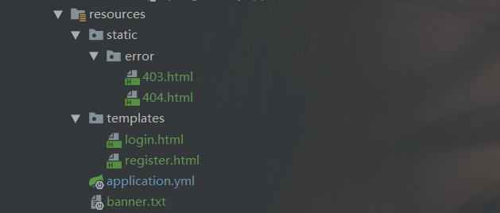
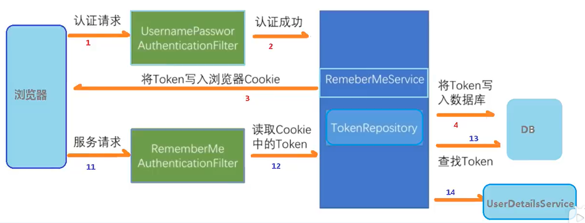
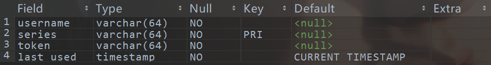

<!--title: Spring Security 基础
description: Spring Security是一个能够为基于Spring的企业应用系统提供声明式的安全访问控制解决方案的安全框架。
firstPicture: http://static-blog.top234.top/image/1.png
status: 1
priority: 6
=top234=-->


## 1 启用Spring Security

### 1.1 添加spring-boot-starter-security依赖

```xml
<!-- spring security 依赖-->
<dependency>
    <groupId>org.springframework.boot</groupId>
    <artifactId>spring-boot-starter-security</artifactId>
</dependency>
```


## 2 配置Spring Security

### 2.1 基于配置文件的用户存储

```yml
# 在配置文件中设置用户名密码
spring: 
  security:
    user:
      name: lisi
      password: lisi
```

### 2.2 基于内存的用户存储

```java
@Configuration
public class SecurityConfig extends WebSecurityConfigurerAdapter {
    @Override
    protected void configure(AuthenticationManagerBuilder auth) throws Exception {

        // 设置用户名密码到内存中
        auth.inMemoryAuthentication()
                .passwordEncoder(new BCryptPasswordEncoder())
                .withUser("zs").password(new BCryptPasswordEncoder()
                .encode("ls"))
                .roles("admin");
    }
}
```

### 2.3 自定义用户认证

1. 创建配置类，指定UserDetailsService接口实现类实例，并注入用户密码的转码方式

```java
@Configuration
public class SecurityConfig extends WebSecurityConfigurerAdapter {
    @Autowired
    private UserDetailsService myUserDetailsService;
    /**
     * 配置用户密码转码器
     */
    @Bean
    public PasswordEncoder passwordEncoder(){
        return new BCryptPasswordEncoder();
    }
    @Override
    protected void configure(AuthenticationManagerBuilder auth) throws Exception {
    	//配置自定义UserDetailsService接口实现类对象并将用户密码转码器注入到用户详情服务中
   		auth.userDetailsService(myUserDetailsService)
            .passwordEncoder(passwordEncoder());
    }
}
```

2. 编写UserDetailsService接口实现类，实现loadUserByUsername(String username)方法，自定义用户数据查询方式

```java
package top.top234.springsecurity.service;

import org.springframework.security.core.GrantedAuthority;
import org.springframework.security.core.authority.AuthorityUtils;
import org.springframework.security.core.userdetails.User;
import org.springframework.security.core.userdetails.UserDetails;
import org.springframework.security.core.userdetails.UserDetailsService;
import org.springframework.security.core.userdetails.UsernameNotFoundException;
import org.springframework.security.crypto.bcrypt.BCryptPasswordEncoder;
import org.springframework.stereotype.Service;
import java.util.List;

@Service
public class MyUserDetailsService implements UserDetailsService {

    @Override
    public UserDetails loadUserByUsername(String s) throws UsernameNotFoundException {

        List<GrantedAuthority> role = AuthorityUtils.
            commaSeparatedStringToAuthorityList("role");

        return new User("lisi", new BCryptPasswordEncoder().encode("lisi"), role);
    }
}
```

### 2.4 自定义用户认证并结合数据库

1. 实体类及数据表

```java
@Entity
@Data
@AllArgsConstructor
@NoArgsConstructor
public class User {
    @Id
    @GeneratedValue(strategy = GenerationType.AUTO)
    private Integer id;
    private String username;
    private String password;
    private String role;
}
```

2. dao 

```java
package top.top234.springsecurity.repository;

import org.springframework.data.jpa.repository.JpaRepository;
import top.top234.springsecurity.entity.User;

public interface UserRepository extends JpaRepository<User,Integer> {
    User findByUsername(String username);
}
```

3. 创建配置类,设置使用哪个UserDetailsService实现类及密码的加密方式

```java
@Configuration
public class SecurityConfig extends WebSecurityConfigurerAdapter {
    @Autowired
    private UserDetailsService myUserDetailsService;
    /**
     * 配置用户密码转码器
     */
    @Bean
    public PasswordEncoder passwordEncoder(){
        return new BCryptPasswordEncoder();
    }
    @Override
    protected void configure(AuthenticationManagerBuilder auth) throws Exception {
   		auth
            .userDetailsService(myUserDetailsService)//配置自定义UserDetailsService接口实现类实例
            .passwordEncoder(passwordEncoder());//将用户密码转码器注入到用户详情服务中
    }
}
```

4. 编写UserDetailsService接口实现类，实现loadUserByUsername(String username)方法，自定义用户数据查询方式

```java
@Service
public class MyUserDetailsService implements UserDetailsService {
    @Autowired
    private UserRepository userRepository;
    
    @Override
    public UserDetails loadUserByUsername(String s) throws UsernameNotFoundException {
		//自定义用户数据查询规则
        User user = userRepository.findByUsername(s);
        
        //用户名不存在时抛出org.springframework.security.core.userdetails.UsernameNotFoundException异常
        if (user==null){
            throw new UsernameNotFoundException("用户名不存在");
        }

        //将用户role字段转为集合，commaSeparatedStringToAuthorityList（）方法参数为字符串，会将字符串参数按照逗号分割为权限集合
        List<GrantedAuthority> role = AuthorityUtils
            .commaSeparatedStringToAuthorityList(user.getRole());
        
        //方法返回UserDetails接口的实现类对象，UserDetails对象包括有用户名 密码 及 操作权限集合
        return new org.springframework.security.core.userdetails.User(
            user.getUsername(), user.getPassword(), role);
    }
}
```


## 3 权限控制 - 保护web请求

### 3.1 使用自定义登录页面

1. 修改SecurityConfig配置类，配置自定义登录页面的路径

```java
@Configuration
public class SecurityConfig extends WebSecurityConfigurerAdapter {
    @Autowired
    private UserDetailsService myUserDetailsService;

    @Override
    protected void configure(AuthenticationManagerBuilder auth) throws Exception {
        auth.userDetailsService(myUserDetailsService)
            .passwordEncoder(new BCryptPasswordEncoder());
    }

    /**
     * 自定义登录页面配置及设置请求权限
     * @param http
     * @throws Exception
     */
    @Override
    protected void configure(HttpSecurity http) throws Exception {
        http.formLogin()
                .loginPage("/login")//自定义的登录页面
                .loginProcessingUrl("/user/login")//登录访问路径(登录页表单的提交路径)，随便填写，由springboot实现
                .defaultSuccessUrl("/index")//登录成功之后跳转的路径，当直接请求登录页面并登录时会跳转到/test路径；而当其他请求被拦截到登录页面并登录后会跳转到本来的请求路径
                .permitAll()
                .and()
                .authorizeRequests()
                .antMatchers("/login", "/test","/user/login")// 不需要登录验证的请求
                .permitAll()
                .anyRequest().authenticated()
                .and().csrf().disable();//关闭csrf防护
    }
}
```

2. 登录页面表单

```html
<!--表单提交路径为配置文件中配置的路径-->
<form class="ui large form" method="post" action="/user/login">
    <div class="ui stacked segment">
        <div class="field">
            <div class="ui left icon input">
                <i class="user icon"></i>
                <!--name必须是 username-->
                <input type="text" name="username" placeholder="Username">
            </div>
        </div>
        <div class="field">
            <div class="ui left icon input">
                <i class="lock icon"></i>
                <!--name必须是 password-->
                <input type="password" name="password" placeholder="Password">
            </div>
        </div>
        <input type="submit" value="Login" class="ui fluid large teal submit button"/>
    </div>
</form>
<!-- 登录失败提示 -->
<div th:if="${param.error}" class="ui warning message">
    <div class="header">登录失败！</div>
    <ul class="list">
        <li>请检查用户名、密码是否正确.</li>
    </ul>
</div>
```

### 3.2 权限控制 - 设置请求路径权限

1. 修改SecurityConfig配置类,配置自定义请求权限规则

```java
@Configuration
public class SecurityConfig extends WebSecurityConfigurerAdapter {
    /**
     * 自定义登录页面配置及设置请求权限
     *
     * @param http
     * @throws Exception
     */
    @Override
    protected void configure(HttpSecurity http) throws Exception {
        http.formLogin()
                .loginPage("/login")
                .loginProcessingUrl("/user/login")
                .defaultSuccessUrl("/test")
                .permitAll()
                .and()
                .authorizeRequests()
                .antMatchers("/user/re", "/user/add", "login", "/user/login")// 不需要登录验证的请求
                .permitAll()
                .antMatchers("/index")
            
                //1.hasAuthority方法
                .hasAuthority("ADMIN")//具有admin权限的用户可以访问index路径
            
                //2.hasAnyAuthority方法
                //.hasAnyAuthority("ADMIN,USER")//具有admin或user权限的用户可以访问index路径

                //3.hasRole方法,与hasAuthority方法的区别是hasRole方法内部在验证时会在参数前拼接"ROLE_",因此用户的role属性必须符合该规则
                //.hasRole("ADMIN")//具有admin权限的用户可以访问index路径
				
            	//4.hasAnyRole方法与hasAnyAuthority方法的区别同hasRole方法
            
                .anyRequest().authenticated()
                .and().csrf().disable();//关闭csrf防护
    }
}
```

### 3.3 自定义403页面

1. 方式一： 在 static | templates | public 目录下创建error/403.html页面

   优点：无须配置，springboot会自动寻找上述目录下的error/403.html文件



2. 方式二：在SecurityConfig配置类中进行配置

   优点：灵活，无须遵守springboot的约定

```java
@Configuration
public class SecurityConfig extends WebSecurityConfigurerAdapter {
    @Override
    protected void configure(HttpSecurity http) throws Exception {
        //配置自定义403页面路径
        http.exceptionHandling().accessDeniedPage("/myError/my403.html");
        
        http.formLogin()
                .loginPage("/login")//自定义的登录页面
                ....
    }
}
```

### 3.4 权限控制 - 注解方式

#### 3.4.1 @Secured注解

1. 开启spring security的注解配置，并启用 **secured**

```Java
// 在启动类或SecurityConfig配置类上添加下列注解
@EnableGlobalMethodSecurity(securedEnabled = true)//开启spring security的注解配置方式
```

2. 在控制器方法上使用**@Secured**注解

```java
@RequestMapping("/index")
@ResponseBody
@Secured({"ROLE_ADMIN", ...})//当用户具有相应权限时才可以访问该请求,权限规则必须以"ROLE_"开头,且用户属性中的权限也必须以"ROLE_"开头
public String indexPage() {
    return "Welcome";
}
```

3. 修改MyUserDetailsService，为用户role属性拼接 **“ROLE_”**

```java
@Service
public class MyUserDetailsService implements UserDetailsService {
    @Autowired
    private UsersRepository usersRepository;
    @Override
    public UserDetails loadUserByUsername(String s) throws UsernameNotFoundException {
        Users users = usersRepository.findByUsername(s);
        if (users == null) {
            throw new UsernameNotFoundException("用户名不存在");
        }

        // 为用户role属性拼接 “ROLE_”
        List<GrantedAuthority> role = AuthorityUtils.commaSeparatedStringToAuthorityList("ROLE_"+users.getRole());
        return new User(users.getUsername(), users.getPassword(), role);
    }
}
```

#### 3.4.2 @PreAuthorize 注解（在方法执行前进行验证）

1. 开启spring security的注解配置，并启用 **prePost**

```Java
// 在启动类或SecurityConfig配置类上添加下列注解
@EnableGlobalMethodSecurity(prePostEnabled = true)//开启spring security的注解配置方式
```

2. 在控制器方法上使用**@PreAuthorize**注解

```java
@PreAuthorize("hasAnyAuthority('ADMIN')")//当用户具有相应权限时才可以访问该请求,匹配规则与用户role字段直接匹配
@RequestMapping("/about")
@ResponseBody
public String about() {
    return "about page";
}
```

#### 3.4.3 @PostAuthorize 注解（在方法执行后进行验证）

1. 开启spring security的注解配置，并启用 **prePost**

```Java
// 在启动类或SecurityConfig配置类上添加下列注解
@EnableGlobalMethodSecurity(prePostEnabled = true)//开启spring security的注解配置方式
```

2. 在控制器方法上使用**@PostAuthorize**注解

```java
@PostAuthorize("hasAnyAuthority('ADMIN')")//当用户具有相应权限时才会正确响应该请求，匹配规则与用户role字段直接匹配；无论是否具有权限，该方法总是会执行
@RequestMapping("/about")
@ResponseBody
public String about() {
    return "about page";
}
```

#### 3.4.4 @PreFilter 注解

```java
@PreFilter("filterObject.color == 'red'")//对控制器请求参数进行过滤，只会接收color为red的参数
```

#### 3.4.5 @PreFilter 注解

```java
@PreFilter("filterObject.color == 'teal'")//对响应结果进行过滤，只会响应color为teal的数据
```

### 3.5 退出登录

1. 退出登录配置

```java
//在SecurityConfig配置类中添加如下配置
@Override
protected void configure(HttpSecurity http) throws Exception {
    
    //登出功能配置
    http.logout()
        .logoutUrl("/user/logout")// 退出登录的访问路径,随便填写,由springboot实现
        .logoutSuccessUrl("/login")// 退出登录后要展示内容的路径
        .permitAll();
}
```

2. 页面登出按钮

```html
a标签方式（当开启CSRF防护时不能使用a标签实现登出功能）：
<a href="/user/logout">退出当前账户</a>

表单方式（推荐）：
<form method="post" th:action="@{/user/logout}">
    <!--防止跨站请求伪造-->
    <input type="hidden" th:name="${_csrf.parameterName}" th:value="${_csrf.token}">
    <input type="submit" value="退出当前账户">
</form>
```

### 3.6 登录保持



1. 在SecurityConfig配置类中按步骤进行配置

```java
@Configuration
public class SecurityConfig extends WebSecurityConfigurerAdapter {
    @Autowired
    private UserDetailsService myUserDetailsService;
    @Bean
    public PasswordEncoder passwordEncoder(){
        return new BCryptPasswordEncoder();
    }
    
    //1.获取数据源
    @Autowired
    private DataSource dataSource;
    
    //2.配置PersistentTokenRepository实现类对象
    @Bean
    public PersistentTokenRepository persistentTokenRepository() {
        JdbcTokenRepositoryImpl jdbcTokenRepository = new JdbcTokenRepositoryImpl();
        jdbcTokenRepository.setDataSource(dataSource);

        //3.开启自动创建数据表,在数据库中没有persistent_logins数据表时可以开启自动创建表功能,但当表已存在时会报异常
        jdbcTokenRepository.setCreateTableOnStartup(true);
        return jdbcTokenRepository;
    }

    @Override
    protected void configure(AuthenticationManagerBuilder auth) throws Exception {
        auth.userDetailsService(myUserDetailsService)
            .passwordEncoder(passwordEncoder());
    }
    
    @Override
    protected void configure(HttpSecurity http) throws Exception {
        http.logout().logoutUrl("/user/logout").logoutSuccessUrl("/login").permitAll();
        http.formLogin()
                .loginPage("/login")
                .loginProcessingUrl("/user/login")
                .defaultSuccessUrl("/test")
                .permitAll()
                .and()
                .authorizeRequests()
                .antMatchers("/user/re", "/user/add", "/login", "/user/login")
                .permitAll()
                .anyRequest().authenticated()

                //4.登录保持相关配置
                .and()
                .rememberMe()
                .tokenRepository(persistentTokenRepository())
                .tokenValiditySeconds(60*60*24*365)//5.设置token的有效时间,单位为秒
                .userDetailsService(myUserDetailsService)

                .and().csrf().disable();//关闭csrf防护
    }
}
```

2. 登录页面表单

```html
<form class="ui large form" method="post" action="/user/login">
    <div class="ui stacked segment">
        <div class="field">
            <div class="ui left icon input">
                <i class="user icon"></i>
                <input type="text" name="username" placeholder="Username">
            </div>
        </div>
        <div class="field">
            <div class="ui left icon input">
                <i class="lock icon"></i>
                <input type="password" name="password" placeholder="Password">
            </div>
        </div>
        <div class="required inline field">
            <div class="ui">
                <!-- name必须是 remember-me -->
                <input type="checkbox" name="remember-me" class="hidden">
                <label>Remember me</label>
            </div>
        </div>
        <input type="submit" value="Login" class="ui fluid large teal submit button"/>
    </div>
</form>
```

3.  **persistent_logins表**

```
persistent_logins表是spring security用来存储用户token的，可以手动创建，也可以在配置文件中开启自动建表功能
```



```mysql
CREATE TABLE `persistent_logins` (
  `username` varchar(64) NOT NULL,
  `series` varchar(64) NOT NULL,
  `token` varchar(64) NOT NULL,
  `last_used` timestamp NOT NULL default CURRENT_TIMESTAMP on update CURRENT_TIMESTAMP,
  PRIMARY KEY  (`series`)
) ENGINE=InnoDB DEFAULT CHARSET=utf8
```

### 3.7 跨站请求伪造（CSRF）

1. CSRF防护

```html
跨站请求伪造（CSRF）是一种常见的安全攻击，它会让用户在一个恶意的web页面上填写信息，然后自动将表单以受害者的身份提交到另一个应用上；
spring security提供了内置的CSRF保护，默认就是启用的，不需要任何显式配置；
唯一要做的是确保应用的每个表单都有一个名为 “_csrf” 的字段。

htymeleaf表单配置：
<!--防止跨站请求伪造-->
<input type="hidden" th:name="${_csrf.parameterName}"  th:value="${_csrf.token}">

当使用 spring mvc 的 Jsp 标签库或者 spring security 的 thymeleaf方言时，无需显式书写该隐藏域，这个隐藏域会自动生成；
在 thymeleaf 中，只需要确保<form>的某个属性带有thymeleaf的属性前缀即可
```

2. 禁用CSRF防护

```java
@Override
protected void configure(HttpSecurity http) throws Exception {              			http.
    ...
    .and().csrf().disable();//关闭csrf防护,默认为开启状态
}
```

3. **注意：**当开启了CSRF防护时，3.5节的退出登录功能不能使用\<a\>标签实现，需要使用表单提交，并包含**”_csrf“**字段

```html
<form method="post" th:action="@{/user/logout}">
    <!--防止跨站请求伪造-->
    <input type="hidden" th:name="${_csrf.parameterName}" th:value="${_csrf.token}">
    <input type="submit" value="退出当前账户">
</form>
```


## 附录

### pom.xml

```xml
<!-- 当前项目整体依赖环境 -->
<parent>
    <groupId>org.springframework.boot</groupId>
    <artifactId>spring-boot-starter-parent</artifactId>
    <version>2.1.8.RELEASE</version>
    <relativePath/> <!-- lookup parent from repository -->
</parent>
<groupId>top.top234</groupId>
<artifactId>springsecurity</artifactId>
<version>0.0.1-SNAPSHOT</version>

<properties>
    <java.version>1.8</java.version>
</properties>
<dependencies>
    <dependency>
        <groupId>org.springframework.boot</groupId>
        <artifactId>spring-boot-starter-data-jpa</artifactId>
    </dependency>
    <dependency>
        <groupId>org.springframework.boot</groupId>
        <artifactId>spring-boot-starter-security</artifactId>
    </dependency>
    <dependency>
        <groupId>org.springframework.boot</groupId>
        <artifactId>spring-boot-starter-thymeleaf</artifactId>
    </dependency>
    <dependency>
        <groupId>org.springframework.boot</groupId>
        <artifactId>spring-boot-starter-web</artifactId>
    </dependency>
    <dependency>
        <groupId>org.thymeleaf.extras</groupId>
        <artifactId>thymeleaf-extras-springsecurity5</artifactId>
    </dependency>
    <dependency>
        <groupId>mysql</groupId>
        <artifactId>mysql-connector-java</artifactId>
        <version>5.1.44</version>
    </dependency>
    <dependency>
        <groupId>org.springframework.boot</groupId>
        <artifactId>spring-boot-devtools</artifactId>
        <scope>runtime</scope>
        <optional>true</optional>
    </dependency>
    <dependency>
        <groupId>org.projectlombok</groupId>
        <artifactId>lombok</artifactId>
        <optional>true</optional>
    </dependency>
    <dependency>
        <groupId>org.springframework.boot</groupId>
        <artifactId>spring-boot-starter-test</artifactId>
        <scope>test</scope>
    </dependency>
    <dependency>
        <groupId>org.springframework.security</groupId>
        <artifactId>spring-security-test</artifactId>
        <scope>test</scope>
    </dependency>
</dependencies>

<build>
    <plugins>
        <plugin>
            <groupId>org.springframework.boot</groupId>
            <artifactId>spring-boot-maven-plugin</artifactId>
            <configuration>
                <excludes>
                    <exclude>
                        <groupId>org.projectlombok</groupId>
                        <artifactId>lombok</artifactId>
                    </exclude>
                </excludes>
            </configuration>
        </plugin>
    </plugins>
</build>
```

### SpringSecurity 配置类

```java
package top.top234.springsecurity.config;
import org.springframework.beans.factory.annotation.Autowired;
import org.springframework.context.annotation.Bean;
import org.springframework.context.annotation.Configuration;
import org.springframework.security.config.annotation.authentication.builders.AuthenticationManagerBuilder;
import org.springframework.security.config.annotation.web.builders.HttpSecurity;
import org.springframework.security.config.annotation.web.configuration.WebSecurityConfigurerAdapter;
import org.springframework.security.core.userdetails.UserDetailsService;
import org.springframework.security.crypto.bcrypt.BCryptPasswordEncoder;
import org.springframework.security.crypto.password.PasswordEncoder;
import org.springframework.security.web.authentication.rememberme.JdbcTokenRepositoryImpl;
import org.springframework.security.web.authentication.rememberme.PersistentTokenRepository;
import javax.sql.DataSource;

/**
 * Don't forget to be awesome!
 *
 * Created by LEARNING on 2021/4/7 22:43.
 *
 * ********************************
 *
 * @author top234
 */
@Configuration
@EnableWebSecurity
@EnableGlobalMethodSecurity(securedEnabled = true,prePostEnabled = true)//开启spring security权限控制的注解配置方式
public class SecurityConfig extends WebSecurityConfigurerAdapter {
    //自定义的UserDetailsService实现
    @Autowired
    private UserDetailsService myUserDetailsService;
    //数据源
    @Autowired
    private DataSource dataSource;

    /**
     * 登录保持:
     * 配置PersistentTokenRepository实现类对象
     */
    @Bean
    public PersistentTokenRepository persistentTokenRepository() {
        JdbcTokenRepositoryImpl jdbcTokenRepository = new JdbcTokenRepositoryImpl();
        jdbcTokenRepository.setDataSource(dataSource);

        //开启自动创建数据表
        //jdbcTokenRepository.setCreateTableOnStartup(true);

        return jdbcTokenRepository;
    }

    /**
     * 配置用户密码转码器
     */
    @Bean
    public PasswordEncoder passwordEncoder() {
        return new BCryptPasswordEncoder();
    }

    @Override
    protected void configure(AuthenticationManagerBuilder auth) throws Exception {

        //指定用户详情服务组件及密码转码器
        auth.userDetailsService(myUserDetailsService)
                .passwordEncoder(passwordEncoder());
    }

    @Override
    protected void configure(HttpSecurity http) throws Exception {
        //自定义403页面路径
        //http.exceptionHandling().accessDeniedPage("/myError/my403.html");

        //登出功能配置
        http.logout().logoutUrl("/user/logout").logoutSuccessUrl("/login").permitAll();

        http.formLogin()
                .loginPage("/login")//自定义的登录页面
                .loginProcessingUrl("/user/login")//登录访问路径(登录页表单的提交路径),随便填写,由springboot实现
                .defaultSuccessUrl("/test")//登录成功之后跳转的路径,当直接请求登录页面并登录时会跳转到/test路径;而当其他请求被拦截到登录页面并登录后会跳转到本来的请求路径
                .and()
                .authorizeRequests()
                .antMatchers("/login", "/user/login")// 不需要登录验证的请求
                .permitAll()
                .anyRequest().authenticated()

                //登录保持相关配置:
                .and()
                .rememberMe()
                .tokenRepository(persistentTokenRepository())
                .tokenValiditySeconds(60 * 60 * 24 * 15)//设置token的有效时间,单位为秒
                .userDetailsService(myUserDetailsService);

                //.and().csrf().disable();//关闭csrf防护,默认为开启状态
    }
}
```

### UserDetailsService实现类

```java
package top.top234.springsecurity.service;
import org.springframework.beans.factory.annotation.Autowired;
import org.springframework.security.core.GrantedAuthority;
import org.springframework.security.core.authority.AuthorityUtils;
import org.springframework.security.core.userdetails.UserDetails;
import org.springframework.security.core.userdetails.UserDetailsService;
import org.springframework.security.core.userdetails.UsernameNotFoundException;
import org.springframework.stereotype.Service;
import top.top234.springsecurity.repository.UserRepository;
import top.top234.springsecurity.entity.User;
import java.util.List;

/**
 * Don't forget to be awesome!
 *
 * Created by LEARNING on 2021/4/8 9:59.
 *
 * ********************************
 *
 * @author top234
 */
@Service
public class MyUserDetailsService implements UserDetailsService {

    @Autowired
    private UserRepository userRepository;

    @Override
    public UserDetails loadUserByUsername(String s) throws UsernameNotFoundException {

        User user = userRepository.findByUsername(s);
        //用户名不存在时抛出UsernameNotFoundException异常
        if (user == null) {
            throw new UsernameNotFoundException("用户名不存在");
        }

        List<GrantedAuthority> role = AuthorityUtils.commaSeparatedStringToAuthorityList(user.getRole());

        return new org.springframework.security.core.userdetails.User(user.getUsername(), user.getPassword(), role);
    }
}
```

----

**参考资料：**

1. <https://www.bilibili.com/video/BV15a411A7kP>