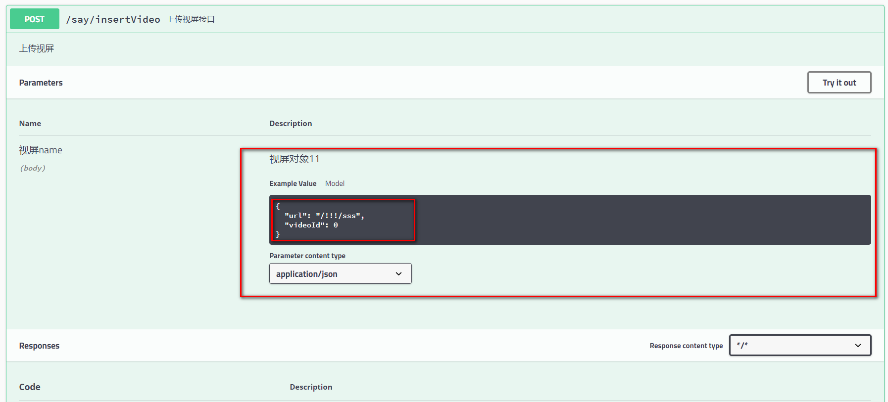

<!--title: Swagger
description: Swagger 是一个规范和完整的框架，用于生成、描述、调用和可视化 RESTful 风格的 Web 服务。
firstPicture: http://static-blog.top234.top/image/1.png
status: 1
priority: 6
=top234=-->


## 1.认识Swagger

Swagger 是一个规范和完整的框架，用于生成、描述、调用和可视化 RESTful 风格的 Web 服务。总体目标是使客户端和文件系统作为服务器以同样的速度来更新。文件的方法，参数和模型紧密集成到服务器端的代码，允许API来始终保持同步。

**作用：**

​    *1. 接口的文档在线自动生成。*

​    *2. 功能测试。*

 **Swagger是一组开源项目，其中主要要项目如下：**

1. **Swagger-tools**:提供各种与Swagger进行集成和交互的工具。例如模式检验、Swagger 1.2文档转换成Swagger 2.0文档等功能。

2. **Swagger-core**: 用于Java/Scala的的Swagger实现。与JAX-RS(Jersey、Resteasy、CXF...)、Servlets和Play框架进行集成。

3. **Swagger-js**: 用于JavaScript的Swagger实现。

4. **Swagger-node-express**: Swagger模块，用于node.js的Express web应用框架。

5. **Swagger-ui**：一个无依赖的HTML、JS和CSS集合，可以为Swagger兼容API动态生成优雅文档。

6. **Swagger-codegen**：一个模板驱动引擎，通过分析用户Swagger资源声明以各种语言生成客户端代码。


## 2.springboot 集成swagger

### 2.1 导入依赖

```xml
<dependency>
    <groupId>io.springfox</groupId>
    <artifactId>springfox-swagger2</artifactId>
    <version>2.8.0</version>
</dependency>
<dependency>
    <groupId>io.springfox</groupId>
    <artifactId>springfox-swagger-ui</artifactId>
    <version>2.8.0</version>
</dependency>
```

### 2.2 springboot配置

```java
@Configuration
@EnableSwagger2
public class Swagger2Config {

    @Bean
    public Docket api() {
        return new Docket(DocumentationType.SWAGGER_2)
                .apiInfo(apiInfo())
                .select()
                // 修改为自己的controller包路径
                .apis(RequestHandlerSelectors.basePackage("top.top234.controller"))
                .paths(PathSelectors.any())
                .build();
    }

    private ApiInfo apiInfo() {
        return new ApiInfoBuilder()
                .title("swagger-api文档")
                .description("swagger接入教程")
                //服务条款网址
                .version("1.0")
                .build();
    }
}
```

如上代码所示，通过**createRestApi**函数创建Docket的Bean之后，**apiInfo()**用来创建该Api的基本信息（这些基本信息会展现在文档页面中）。

### 2.3 添加文档内容

在完成了上述配置后，其实已经可以生产文档内容，但是这样的文档主要针对请求本身，描述的主要来源是函数的命名，对用户并不友好，我们通常需要自己增加一些说明来丰富文档内容。

**Swagger使用的注解及其说明：**

[@Api](https://my.oschina.net/u/2396174)：用在类上，说明该类的作用。

@ApiOperation：注解来给API增加方法说明。

@ApiImplicitParams : 用在方法上包含一组参数说明。

@ApiImplicitParam：用来给方法入参增加说明。

@ApiResponses：用于表示一组响应

@ApiResponse：用在@ApiResponses中，一般用于表达一个错误的响应信息

​    l   **code**：数字，例如400

​    l   **message**：信息，例如"请求参数没填好"

​    l   **response**：抛出异常的类   

@ApiModel：描述一个Model的信息（一般用在请求参数无法使用@ApiImplicitParam注解进行描述的时候）

​    l   **@ApiModelProperty**：描述一个model的属性

 

注意：@ApiImplicitParam的参数说明：

| **paramType**：指定参数放在哪个地方 | header：请求参数放置于Request Header，使用@RequestHeader获取query：请求参数放置于请求地址，使用@RequestParam获取path：（用于restful接口）-->请求参数的获取：@PathVariablebody：（不常用）form（不常用） |
| ----------------------------------- | ------------------------------------------------------------ |
| name：参数名                        |                                                              |
| dataType：参数类型                  |                                                              |
| required：参数是否必须传            | true \| false                                                |
| value：说明参数的意思               |                                                              |
| defaultValue：参数的默认值          |                                                              |

### 2.4 controller验证

#### 2.4.1传输简单类型：

```java
@Controller
@RequestMapping("/say")
public class SayController {
    
    @ResponseBody
    @RequestMapping(value ="/getUserName", method= RequestMethod.GET)
    @ApiOperation(value="根据用户编号获取用户姓名", notes="test: 仅1和2有正确返回")
    @ApiImplicitParam(paramType="query", name = "userNumber", value = "用户编号", required = true, dataType = "Int")
    public String getUserName(@RequestParam Integer userNumber){
        if(userNumber == 1){
            return "张三丰";
        }
        else if(userNumber == 2){
            return "慕容复";
        }
        else{
            return "未知";
        }
    }
    
    @ResponseBody
    @RequestMapping("/updatePassword")
    @ApiOperation(value="修改用户密码", notes="根据用户id修改密码")
    @ApiImplicitParams({
        @ApiImplicitParam(paramType="query", name = "userId", value = "用户ID", required = true, dataType = "Int"),
        @ApiImplicitParam(paramType="query", name = "password", value = "旧密码", required = true, dataType = "String"),
        @ApiImplicitParam(paramType="query", name = "newPassword", value = "新密码", required = true, dataType = "String")
    })
    public String updatePassword(@RequestParam(value="userId") Integer userId, @RequestParam(value="password") String password, 
            @RequestParam(value="newPassword") String newPassword){
      if(userId <= 0 || userId > 2){
          return "未知的用户";
      }
      if(StringUtils.isEmpty(password) || StringUtils.isEmpty(newPassword)){
          return "密码不能为空";
      }
      if(password.equals(newPassword)){
          return "新旧密码不能相同";
      }
      return "密码修改成功!";
    }
}
```

完成上述代码添加上，启动Spring Boot程序，访问：<http://localhost:8080/swagger-ui.html>

#### 2.4.2传输对象：

##### 2.4.2.1定义model类

```java
@ApiModel(value = "视频对象")
@Data //lombok注解
public class TVideo {
    private Integer videoId;
    @ApiModelProperty(value="视屏地址",example="/!!!/sss")
    private String url;
}
```

##### 2.4.2.2 编写controller层方法

```java
@RequestMapping(value = "/insertVideo", method = RequestMethod.POST)
@ResponseBody
@ApiOperation(httpMethod = "POST",value = "上传视屏接口", notes = "上传视屏")
public String insertVideo(
    @RequestBody @ApiParam(name="视屏name",value="视屏对象11") TVideo tVideo) {

    System.out.println(tVideo.getUrl());
    System.out.println(tVideo.getVideoId());

    return "添加成功";
}
```

打开http://localhost:8080/swagger-ui.html#/



#### 2.4.3 注意点

1. paramType会直接影响程序的运行期，如果paramType与方法参数获取使用的注解不一致，会直接影响到参数的接收。
2. Conntroller中定义的方法必须在@RequestMapper中显示的指定RequestMethod类型，否则SawggerUi会默认为全类型皆可访问， API列表中会生成多条项目。