<!--title: Git 基础
description: Git是一个开源的分布式版本控制系统，用于敏捷高效地处理任何或小或大的项目。Git 与常用的版本控制工具 CVS, Subversion 等不同，它采用了分布式版本库的方式，不必服务器端软件支持。
type: 笔记
firstPicture: http://static-blog.top234.top/image/1.png
status: 1
priority: 6
=top234=-->


# 第一节 简介

## 1.1 Git是什么


Git是一个开源的分布式版本控制系统，用于敏捷高效地处理任何或小或大的项目。
Git 是 Linus Torvalds 为了帮助管理 Linux 内核开发而开发的一个开放源码的版本控制软件。
Git 与常用的版本控制工具 CVS, Subversion 等不同，它采用了分布式版本库的方式，不必服务器端软件支持。

Git是目前世界上最先进的分布式版本控制系统（没有之一) 

```markdown
很多人都知道，Linus在1991年创建了开源的Linux，从此，Linux系统不断发展，已经成为最大的服务器系统软件了。

Linus虽然创建了Linux，但Linux的壮大是靠全世界热心的志愿者参与的，这么多人在世界各地为Linux编写代码，那Linux的代码是如何管理的呢？

事实是，在2002年以前，世界各地的志愿者把源代码文件通过diff的方式发给Linus，然后由Linus本人通过手工方式合并代码！

你也许会想，为什么Linus不把Linux代码放到版本控制系统里呢？不是有CVS、SVN这些免费的版本控制系统吗？因为Linus坚定地反对CVS和SVN，这些集中式的版本控制系统不但速度慢，而且必须联网才能使用。有一些商用的版本控制系统，虽然比CVS、SVN好用，但那是付费的，和Linux的开源精神不符。

不过，到了2002年，Linux系统已经发展了十年了，代码库之大让Linus很难继续通过手工方式管理了，社区的弟兄们也对这种方式表达了强烈不满，于是Linus选择了一个商业的版本控制系统BitKeeper，BitKeeper的东家BitMover公司出于人道主义精神，授权Linux社区免费使用这个版本控制系统。

安定团结的大好局面在2005年就被打破了，原因是Linux社区牛人聚集，不免沾染了一些梁山好汉的江湖习气。开发Samba的Andrew试图破解BitKeeper的协议（这么干的其实也不只他一个），被BitMover公司发现了（监控工作做得不错！），于是BitMover公司怒了，要收回Linux社区的免费使用权。

Linus可以向BitMover公司道个歉，保证以后严格管教弟兄们，嗯，这是不可能的。实际情况是这样的：

Linus花了两周时间自己用C写了一个分布式版本控制系统，这就是Git！一个月之内，Linux系统的源码已经由Git管理了！牛是怎么定义的呢？大家可以体会一下。

Git迅速成为最流行的分布式版本控制系统，尤其是2008年，GitHub网站上线了，它为开源项目免费提供Git存储，无数开源项目开始迁移至GitHub，包括jQuery，PHP，Ruby等等。

历史就是这么偶然，如果不是当年BitMover公司威胁Linux社区，可能现在我们就没有免费而超级好用的Git了
```

## 1.2 Git和SVN的区别

GIT不仅仅是个版本控制系统，它也是个内容管理系统(CMS),工作管理系统等。
如果你是一个具有使用SVN背景的人，你需要做一定的思想转换，来适应GIT提供的一些概念和特征。
Git 与 SVN 区别点：
1、GIT是分布式的，SVN不是：这是GIT和其它非分布式的版本控制系统，例如SVN，CVS等，最核心的区别。
2、GIT把内容按元数据方式存储，而SVN是按文件：所有的资源控制系统都是把文件的元信息隐藏在一个类似.svn,.cvs等的文件夹里。
3、GIT分支和SVN的分支不同：分支在SVN中一点不特别，就是版本库中的另外的一个目录。
4、GIT没有一个全局的版本号，而SVN有：目前为止这是跟SVN相比GIT缺少的最大的一个特征。
5、GIT的内容完整性要优于SVN：GIT的内容存储使用的是SHA-1哈希算法。这能确保代码内容的完整性，确保在遇到磁盘故障和网络问题时降低对版本库的破坏。

## 1.3 git涉及到的概念

工作区：就是你在电脑里能看到的目录。
暂存区：英文叫stage, 或index。一般存放在 ".git目录下" 下的index文件（.git/index）中，所以我们把暂存区有时也叫作索引（index）。
版本库：工作区有一个隐藏目录.git，这个不算工作区，而是Git的版本库

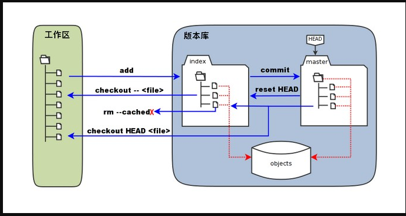

```shell
图中左侧为工作区，右侧为版本库。在版本库中标记为 "index" 的区域是暂存区（stage, index），标记为 "master" 的是 master 分支所代表的目录树。
图中我们可以看出此时 "HEAD" 实际是指向 master 分支的一个"游标"。所以图示的命令中出现 HEAD 的地方可以用 master 来替换。
图中的 objects 标识的区域为 Git 的对象库，实际位于 ".git/objects" 目录下，里面包含了创建的各种对象及内容。
当对工作区修改（或新增）的文件执行 "git add" 命令时，暂存区的目录树被更新，同时工作区修改（或新增）的文件内容被写入到对象库中的一个新的对象中，而该对象的ID被记录在暂存区的文件索引中。
当执行提交操作（git commit）时，暂存区的目录树写到版本库（对象库）中，master 分支会做相应的更新。即 master 指向的目录树就是提交时暂存区的目录树。
当执行 "git reset HEAD" 命令时，暂存区的目录树会被重写，被 master 分支指向的目录树所替换，但是工作区不受影响。
当执行 "git rm --cached <file>" 命令时，会直接从暂存区删除文件，工作区则不做出改变。
当执行 "git checkout ." 或者 "git checkout -- <file>" 命令时，会用暂存区全部或指定的文件替换工作区的文件。这个操作很危险，会清除工作区中未添加到暂存区的改动。
当执行 "git checkout HEAD ." 或者 "git checkout HEAD <file>" 命令时，会用 HEAD 指向的 master 分支中的全部或者部分文件替换暂存区和以及工作区中的文件。这个命令也是极具危险性的，因为不但会清除工作区中未提交的改动，也会清除暂存区中未提交的改动。
```

# 第二节 安装

## 2.1 Linux安装

直接使用命令进行安装

```shell
安装依赖库
apt-get install libcurl4-gnutls-dev libexpat1-dev gettext \
libz-dev libssl-dev
安装Git核心库
apt-get install git-core
查看git版本
git --version
```

## 2.2 Windows安装

下载，[官网点击下载](http://msysgit.github.io/)

在 Windows 平台上安装 Git 同样轻松，有个叫做 msysGit 的项目提供了安装包，可以到 GitHub 的页面上下载 exe 安装文件并运行：

安装图解：

第一步：双击exe文件

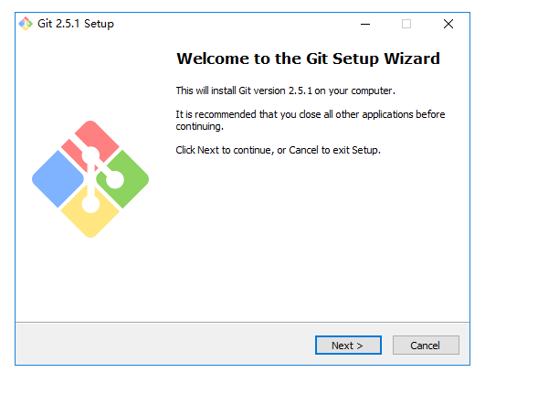

第二步：阅读须知

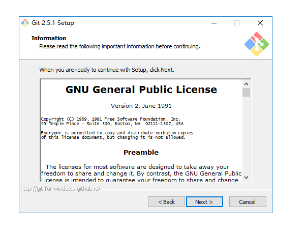

第三步：选择安装路径

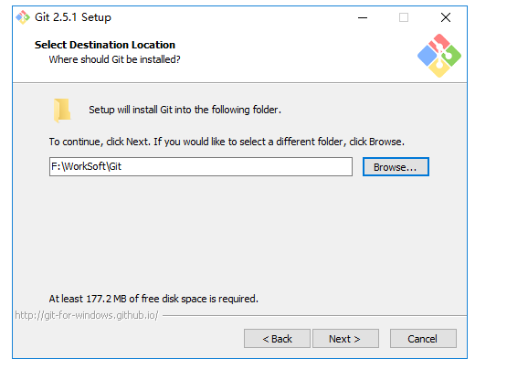

第四步：选择要安装的模块

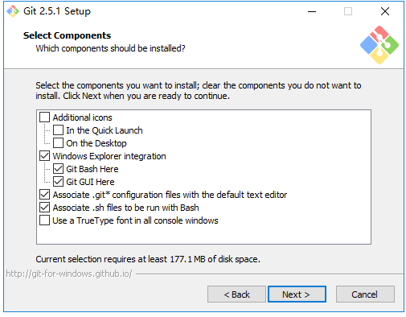

第五步：选择名称

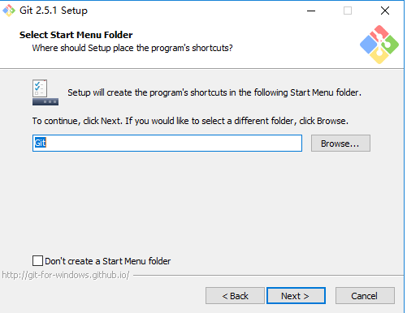

第六步：选择路径环境

```markdown
第一项：直接安装，不会配置git命令的环境变量。
第二项：会自动配置好git命令的环境变量。
第三项：git命令和unix工具命令都会添加到环境变量。
```

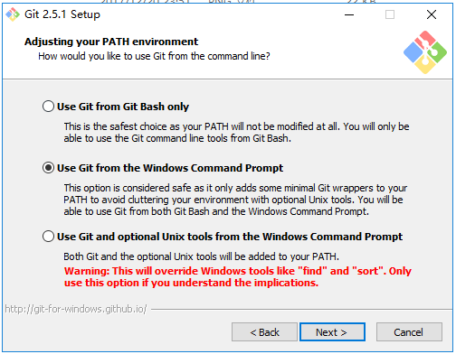

第七步：选择迁出风格

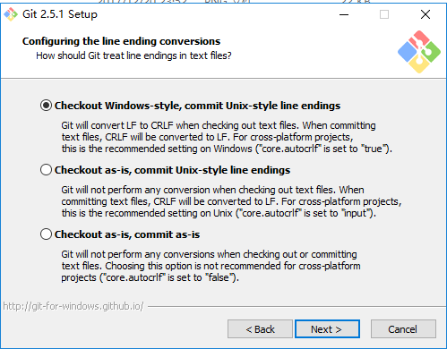

第八步：选择命令风格

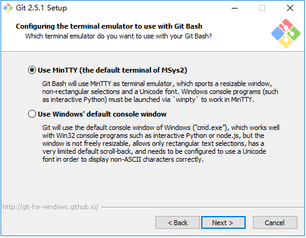

第九步：是否启用缓存

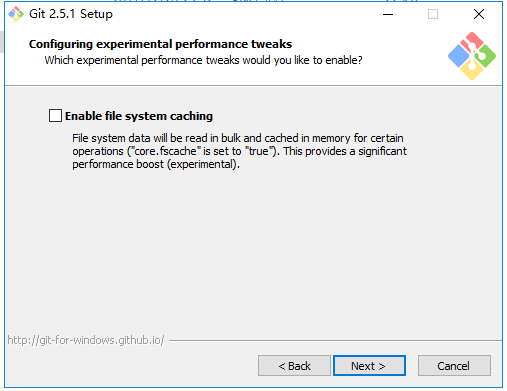

第十步：安装

安装完成后会显示：

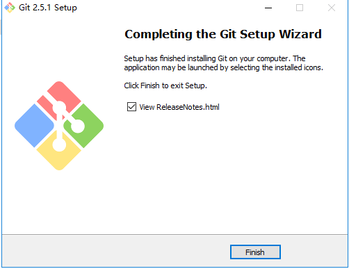

第十一步：验证Git是否安装成功

cmd 输入 git version

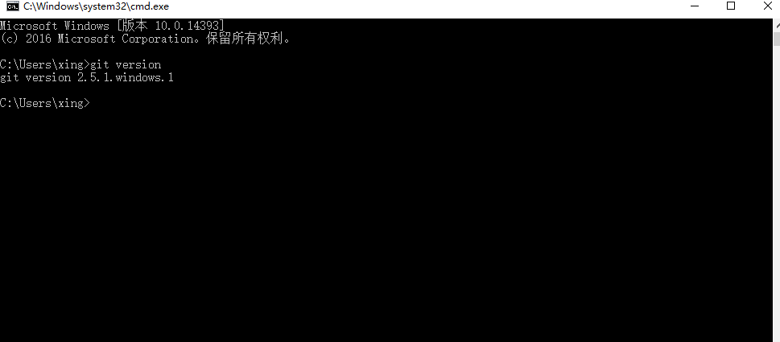

## 2.3 配置

```shell
git config --global user.name "xph"
git config --global user.email xingfei_work@163.com
```

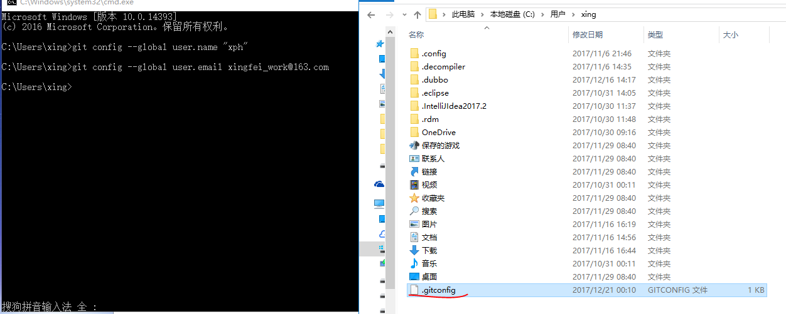

如果用了 --global 选项，那么更改的配置文件就是位于你用户主目录下的那个，以后你所有的项目都会默认使用这里配置的用户信息。
如果要在某个特定的项目中使用其他名字或者电邮，只要去掉 --global 选项重新配置即可，新的设定保存在当前项目的 .git/config 文件里。

```shell
查看配置文件
git config --list  
```

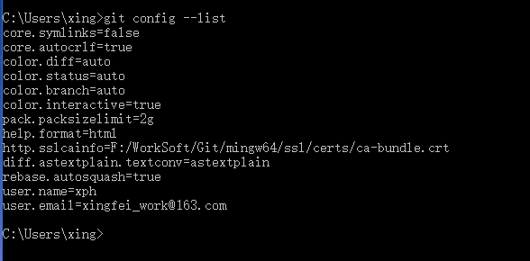

## 2.4 工作流程

克隆 Git 资源作为工作目录。
在克隆的资源上添加或修改文件。
如果其他人修改了，你可以更新资源。
在提交前查看修改。
提交修改。
在修改完成后，如果发现错误，可以撤回提交并再次修改并提交。

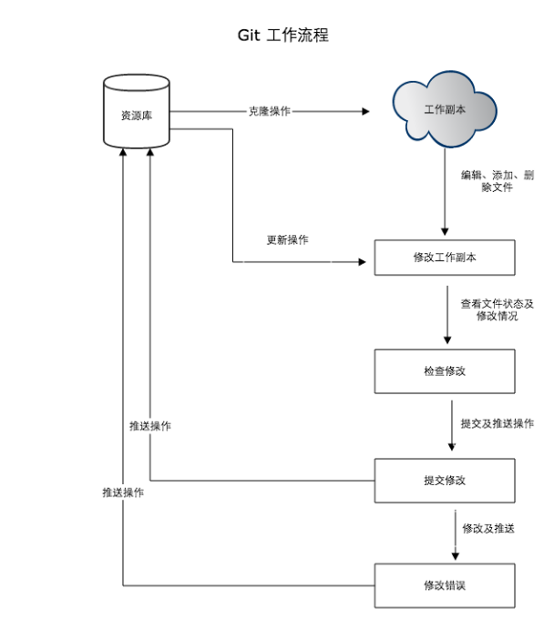

# 第三节 命令操作

## 3.1 创建仓库

Git 使用 git init 命令来初始化一个 Git 仓库，Git 的很多命令都需要在 Git 的仓库中运行，所以 git init 是使用 Git 的第一个命令。
在执行完成 git init 命令后，Git 仓库会生成一个 .git 目录，该目录包含了资源的所有元数据，其他的项目目录保持不变（不像 SVN 会在每个子目录生成 .svn 目录，Git 只在仓库的根目录生成 .git 目录）。

在指定目录使用git init命令，即可实现仓库的创建

```shell
初始化仓库
git init
```

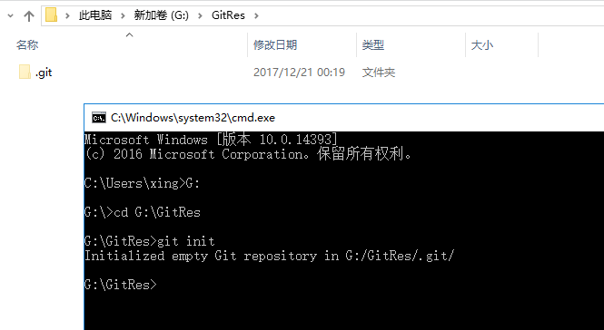

```shell
文件新增到仓库
git add test.txt
```

```shell
提交
git commit -m '提交的注释信息'
```

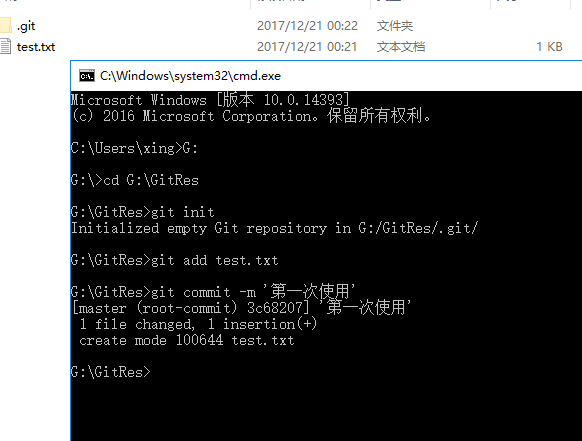

```shell
查看状态
git status -s
查看详细过程
git diff
```

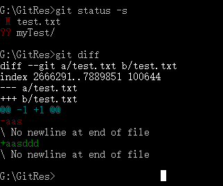


```shell
克隆项目，也就是迁出项目
git clone 远程仓库地址 本地仓库目录
git clone https://github.com/xingpenghui/Qf_Test.git myTest
```

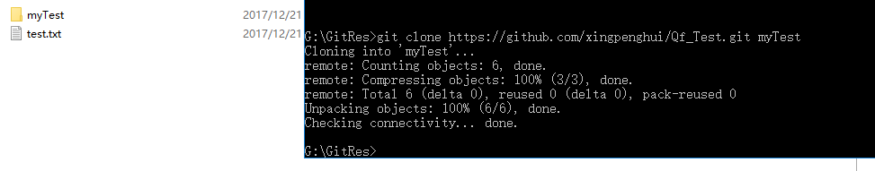

## 3.2 基本操作

#### 3.2.1 git add

git add 命令可将该文件添加到缓存

#### 3.2.2 git status

git status 以查看在你上次提交之后是否有修改。

#### 3.2.3 git diff

执行 git diff 来查看执行 git status 的结果的详细信息。
git diff 命令显示已写入缓存与已修改但尚未写入缓存的改动的区别

尚未缓存的改动：git diff
查看已缓存的改动： git diff --cached
查看已缓存的与未缓存的所有改动：git diff HEAD
显示摘要而非整个 diff：git diff --stat

git status 显示你上次提交更新后的更改或者写入缓存的改动， 而 git diff 一行一行地显示这些改动具体内容

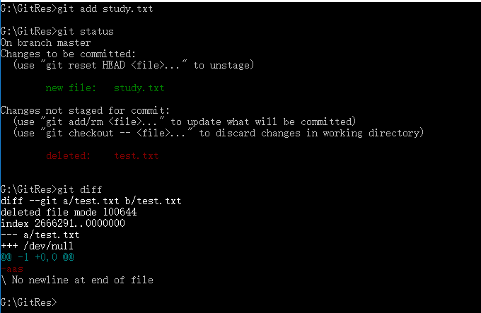


#### 3.2.4 git commit

使用 git add 命令将想要快照的内容写入缓存区， 而执行 git commit 将缓存区内容添加到仓库中。
Git 为你的每一个提交都记录你的名字与电子邮箱地址，所以第一步需要配置用户名和邮箱地址

git commit -m '注释内容'    提交到仓库

git commit -am '注释内容'  新增并提交到仓库

#### 3.2.5 git reset HEAD

git reset HEAD 命令用于取消已缓存的内容

执行 git reset HEAD 以取消之前 git add 添加，但不希望包含在下一提交快照中的缓存

#### 3.2.6 git rm

只是简单地从工作目录中手工删除文件，运行 git status 时就会在 Changes not staged for commit 的提示。
要从 Git 中移除某个文件，就必须要从已跟踪文件清单中移除，然后提交

#### 3.2.7 git mv

git mv 命令用于移动或重命名一个文件、目录、软连接。

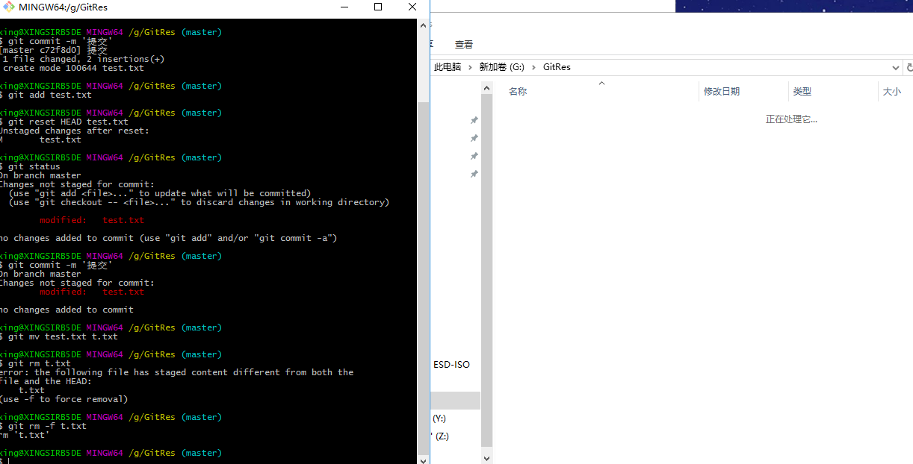


## 3.3 分支管理

版本控制系统都以某种形式支持分支。使用分支意味着你可以从开发主线上分离开来，然后在不影响主线的同时继续工作。
有人把 Git 的分支模型称为"必杀技特性"，而正是因为它，将 Git 从版本控制系统家族里区分出来。

#### 3.3.1 git branch

列出分支,没有参数时，git branch 会列出你在本地的分支

创建分支：git branch bugbran

#### 3.3.2  git checkout

切换分支

#### 3.3.3 git branch -d (branchname)

删除分支

#### 3.3.4 git merge

分支合并到主分支

#### 3.3.5 分支冲突

## 3.4 提交日志

```shell
git log

git log --oneline

git log --oneline --graph
```

## 3.5 标签

如果你达到一个重要的阶段，并希望永远记住那个特别的提交快照，你可以使用 git tag 给它打上标签。
比如说，我们想为我们的p2p项目发布一个"1.0"版本。 我们可以用 git tag -a v1.0 命令给最新一次提交打上（HEAD）"v1.0"的标签。
-a 选项意为"创建一个带注解的标签"。 不用 -a 选项也可以执行的，但它不会记录这标签是啥时候打的，谁打的，也不会让你添加个标签的注解。 推荐一直创建带注解的标签。

git tag -a v1.0  编辑模式输入版本的说明信息，:wq保存退出

 git log --oneline --decorate --graph 查看标签信息

git tag  查看历史版本

# 第四节 远程仓库

## 4.1 概述

Git 并不像 SVN 那样有个中心服务器。
目前我们使用到的 Git 命令都是在本地执行，如果你想通过 Git 分享你的代码或者与其他开发人员合作。 你就需要将数据放到一台其他开发人员能够连接的服务器上

Github 作为远程仓库或者码云都可以

## 4.2 配置远程仓库

添加远程库

生成SSH的key

ssh-keygen -t rsa -C "youremail@example.com"

一直按Enter即可

成功的话会在用户目录下生成.ssh文件夹，进去，打开 id_rsa.pub，复制里面的 key

回到 github 上，进入 Account => Settings（账户配置）

验证： ssh -T git@github.com

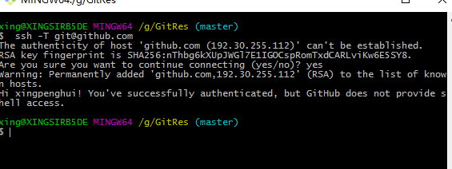

## 4.3 远程仓库交互

```shell
在Github创建仓库

本地新增文件

git remote add origin git@github.com:xingpenghui/t1.git   关联远程仓库

git push -u origin master  提交到远程仓库

git remote  查看当前的远程仓库
git remote -v  查看当前的远程仓库

git fetch 从远程仓库下载新分支与数据

git merge 远端仓库提取数据并尝试合并到当前分支

git push alias branch

git push origin master 推送到远程仓库

git remote add origin2 git@github.com:xingpenghui/t1.git  新增从远程仓库

git remote rm 删除远程仓库

从新设置远程仓库地址

git init  -->（创建我们git的本地仓库）

git remote set-url origin “项目地址”
```

