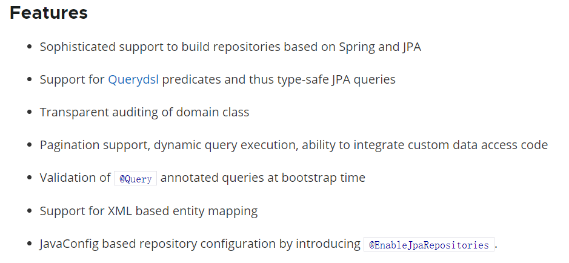

<!--title: Spring Data Jpa
description: Spring Data JPA 是 Spring 基于 ORM 框架、JPA 规范的基础上封装的一套JPA应用框架，可使开发者用极简的代码即可实现对数据库的访问和操作。它提供了包括增删改查等在内的常用功能，且易于扩展！学习并使用 Spring Data JPA 可以极大提高开发效率！
type: 笔记
firstPicture: /img/1.png
status: 1
priority: 6
=top234=-->

# 一、Spring Data Jpa 简介

## 1.1 Spring Data Jpa 概述

Spring Data JPA 是 Spring 基于 ORM 框架、JPA 规范的基础上封装的一套JPA应用框架，可使开发者用极简的代码即可实现对数据库的访问和操作。它提供了包括增删改查等在内的常用功能，且易于扩展！学习并使用 Spring Data JPA 可以极大提高开发效率！

Spring Data JPA 让我们解脱了DAO层的操作，基本上所有CRUD都可以依赖于它来实现，在实际的工作工程中，推荐使用Spring Data JPA + ORM（如：hibernate）完成操作，这样在切换不同的ORM框架时提供了极大的方便，同时也使数据库层操作更加简单，方便解耦

## 1.2 Spring Data JPA 的特性

SpringData Jpa 极大简化了数据库访问层代码。 如何简化的呢？ 使用了SpringDataJpa，我们的dao层中只需要写接口，就自动具有了增删改查、分页查询等方法。

## 1.3 Spring Data Jpa 、Jpa 、Hibernate之间的关系

JPA是一套规范，内部是由接口和抽象类组成的。Hibernate是一套成熟的ORM框架，而且Hibernate实现了JPA规范，所以也可以称hibernate为JPA的一种实现方式，我们使用JPA的API编程，意味着站在更高的角度上看待问题（面向接口编程）

Spring Data JPA 是 Spring 提供的一套对JPA操作更加高级的封装，是在JPA规范下的专门用来进行数据持久化的解决方案。

# 二、参考文档

1. [Jpa](/pdf/SpringDataJpa/SpringDataJPA-1.pdf)
2. [SpringDataJpa 基础](/pdf/SpringDataJpa/SpringDataJPA-2.pdf)
3. [SpringDataJpa 进阶](/pdf/SpringDataJpa/SpringDataJPA-3.pdf)
