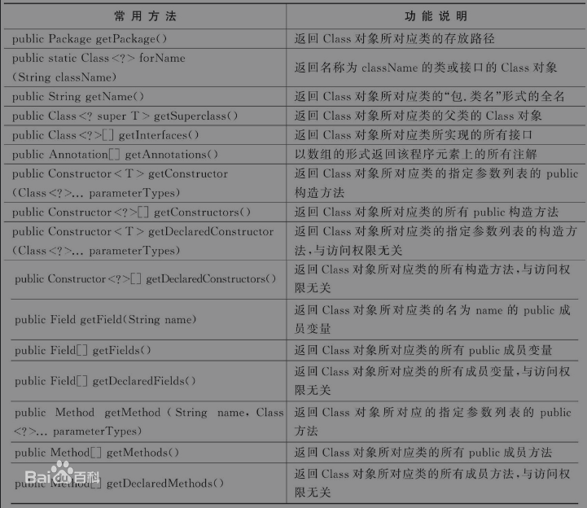

<!--title: Java 反射机制	
description: Java的反射（reflection）机制是指在程序的运行状态中，可以构造任意一个类的对象，可以了解任意一个对象所属的类，可以了解任意一个类的成员变量和方法，可以调用任意一个对象的属性和方法。这种动态获取程序信息以及动态调用对象的功能称为Java语言的反射机制。反射被视为动态语言的关键。
type: 笔记
firstPicture: http://static-blog.top234.top/image/1.png
status: 1
priority: 6
=top234=-->


## 一、概述

### 1.1 简介

Java的反射（reflection）机制是指在程序的运行状态中，可以构造任意一个类的对象，可以了解任意一个对象所属的类，可以了解任意一个类的成员变量和方法，可以调用任意一个对象的属性和方法。这种动态获取程序信息以及动态调用对象的功能称为Java语言的反射机制。反射被视为动态语言的关键。

### 1.2 功能

**Java反射机制主要提供了以下功能：** 在运行时判断任意一个对象所属的类；在运行时构造任意一个类的对象；在运行时判断任意一个类所具有的成员变量和方法；在运行时调用任意一个对象的方法；生成动态代理。

### 1.3 Class类

对于一个字节码文件.class，虽然表面上我们对该字节码文件一无所知，但该文件本身却记录了许多信息。Java在将.class字节码文件载入时，JVM将产生一个java.lang.Class对象代表该.class字节码文件，从该Class对象中可以获得类的许多基本信息，这就是反射机制。所以要想完成反射操作，就必须首先认识Class类。

反射机制所需的类主要有java.lang包中的Class类和java.lang.reflect包中的Constructor类、Field类、Method类和Parameter类。Class类是一个比较特殊的类，它是反射机制的基础，Class类的对象表示正在运行的Java程序中的类或接口，也就是任何一个类被加载时，即将类的.class文件（字节码文件）读入内存的同时，都自动为之创建一个java.lang.Class对象。Class类没有公共构造方法，其对象是JVM在加载类时通过调用类加载器中的defineClass（）方法创建的，因此不能显式地创建一个Class对象。通过这个Class对象，才可以获得该对象的其他信息。

每个类被加载之后，系统都会为该类生成一个对应的Class对象，通过Class对象就可以访问到JVM中该类的信息，一旦类被加载到JVM中，同一个类将不会被再次载入。被载入JVM的类都有一个唯一标识就是该类的全名，即包括包名和类名。

### 1.4 Class类的常用方法



**说明：** 通过getFields（）和getMethods（）方法获得权限为public成员变量和成员方法时，还包括从父类继承得到的成员变量和成员方法；而通过getDeclaredFields（）和getDeclaredMethods（）方法只是获得在本类中定义的所有成员变量和成员方法。

### 1.5 什么是反射机制

在计算机科学领域，反射是指一类能够自我描述和自控制的应用。在Java编程语言中，反射是一种强有力的工具，是面向抽象编程一种实现方式，它能使代码语句更加灵活，极大提高代码的运行时装配能力。

### 1.6 反射机制的意义

1.反射机制极大的提高了程序的灵活性和扩展性，降低模块的耦合性，提高自身的适应能力。

2.通过反射机制可以让程序创建和控制任何类的对象，无需提前硬编码目标类。

3.使用反射机制能够在运行时构造一个类的对象、判断一个类所具有的成员变量和方法、调用一个对象的方法。

4.反射机制是构建框架技术的基础所在，使用反射可以避免将代码写死在框架中。

正是反射有以上的特征，所以它能动态编译和创建对象，极大的激发了编程语言的灵活性，强化了多态的特性，进一步提升了面向对象编程的抽象能力，因而受到编程界的青睐。

### 1.7 反射机制的特点

尽管反射机制带来了极大的灵活性及方便性，但反射也有缺点。反射机制的功能非常强大，但不能滥用。在能不使用反射完成时，尽量不要使用，原因有以下几点：

1、性能问题。

Java反射机制中包含了一些动态类型，所以Java虚拟机不能够对这些动态代码进行优化。因此，反射操作的效率要比正常操作效率低很多。我们应该避免在对性能要求很高的程序或经常被执行的代码中使用反射。而且，如何使用反射决定了性能的高低。如果它作为程序中较少运行的部分，性能将不会成为一个问题。

2、安全限制。

使用反射通常需要程序的运行没有安全方面的限制。如果一个程序对安全性提出要求，则最好不要使用反射。

3、程序健壮性。

反射允许代码执行一些通常不被允许的操作，所以使用反射有可能会导致意想不到的后果。反射代码破坏了Java程序结构的抽象性，所以当程序运行的平台发生变化的时候，由于抽象的逻辑结构不能被识别，代码产生的效果与之前会产生差异。


## 二、反射机制的使用

### 2.1 获取Class类对象的三种方式

```java
/**
 * 1. 使用java.lang.Class类的静态方法 forName()
 * 	  Class.forName("String类型的全限定类名");Class
 *    静态代码块在只在类加载时执行,并且只执行一次,forName方法可以使类加载
 *    如果你只希望一个类的静态代码块执行,类的其他部分不执行,则可以使用:  Class.forName("全限定类名") 实现
 *
 * 2. 使用Object类的实例方法getClass()获取当前实例的Class类对象
 *    String s= new String(); Class StringClass = s.getClass();
 *
 * 3. java语言中任何任何一种类型(包括基本数据类型),都有.class属性
 *    Class intClass = int.class;
 */
public class PReflect1GetClassObject {
    public static void main(String[] args) {
        try {
            //1.使用java.lang.Class类的静态方法 forName()
            Class aClass = Class.forName("java.lang.String");
        } catch (ClassNotFoundException e) {
            e.printStackTrace();
        }

        //2.使用Object类的实例方法getClass()获取当前实例的Class类对象
        String s = new String();
        Class stringClass = s.getClass();

        //3.java语言中任何任何一种类型(包括基本数据类型),都有.class属性
        Class intClass = int.class;
        Class integetClass = Integer.class;
        System.out.println(intClass == integetClass);//基本数据类型与其包装类不是同一个Class类对象
    }
}
```

### 2.2 通过反射机制创建实例

```java
/**
 * 使用类的字节码文件(Class类对象)创建实例
 * Class类的实例方法: newInstance()的使用
 */
public class PReflect2newInstance {
    public static void main(String[] args) {
        try {
            Class aClass = Class.forName("top.top234.bean.User");

            //使用Class类的实例方法newInstance()创建对象,jdk9之后以过时
            //newInstance()方法调用无参构造创建实例,必须保证无参构造是存在的,否则会报异常
            Object o = aClass.newInstance();
            System.out.println(o);
        } catch (Exception e) {
            e.printStackTrace();
        }
    }
}
```

### 2.3 类路径(classpath: 字节码文件的加载路径)

```java
/**
 * 项目中文件的路径: 类路径(classpath: 字节码文件的加载路径)
 * 1. 不同IDE的默认路径可能不同,当一个项目进行了移植时就有可能获取不到在之前IDE默认路径下的文件
 * 2. 类路径是类的加载路径, 是项目的src文件夹下(编译器在编译时会将src下的文件复制到字节码文件的加载路径下)
 *
 * 1. 获取src下的文件的绝对路径
 * 2. 获取类路径下的文件的输入流
 * 3. 加载类路径下的属性配置文件
 * 4. 通过当前类的Class类对象获取类加载器实例
 */
public class PReflect3ClassPath {
    public static void main(String[] args) {
        //1. 获取src下文件的绝对路径
        //Thread thread = Thread.currentThread();//当前线程对象
        //ClassLoader contextClassLoader = thread.getContextClassLoader();//当前线程的类加载器对象
        //URL resource = contextClassLoader.getResource("info.properties");//当前线程的类加载器默认从类的根路径下加载资源
        //String path1 = resource.getPath();//资源文件的绝对路径
        String path = Thread.currentThread().getContextClassLoader()
            .getResource("info.properties").getPath();
        System.out.println(path);

        //2. 获取类路径下的文件的输入流
        InputStream resourceAsStream = Thread.currentThread()
            .getContextClassLoader().getResourceAsStream("info.properties");

        //3. 加载类路径下的属性配置文件
        InputStream resourceAsStream1 = top.top234.bean.User.class
            .getClassLoader().getResourceAsStream("info.properties");
        Properties properties = new Properties();
        try {
            properties.load(resourceAsStream1);
            String name = properties.getProperty("name");
            System.out.println(name);

            //关闭流,在属性配置文件的输入流被Properties实例加载后就可以关闭流
            resourceAsStream1.close();
        } catch (IOException e) {
            e.printStackTrace();
        }
        
        //4. 通过当前类的Class类对象获取类加载器实例
        //   只要是用在当前类路径下的类的Class类对象所获取到的类加载器实例都可以加载当前类路径下的文件
        //   当前类路径下只有一个类加载器实例

        //获取到的都是同一个类加载器实例
        ClassLoader contextClassLoader = Thread.currentThread().getContextClassLoader();
        ClassLoader classLoader = PReflect3ClassPath.class.getClassLoader();
        ClassLoader classLoader1 = User.class.getClassLoader();
        System.out.println(classLoader == contextClassLoader);
        System.out.println(classLoader1 == contextClassLoader);
        System.out.println(classLoader1 == classLoader);

        //与上面不是同一个类加载器实例
        ClassLoader classLoader2 = String.class.getClassLoader();
        System.out.println(classLoader==classLoader2);
    }
}
```

### 2.4 资源绑定器 java.util.ResourceBundle

```java
/**
 * 使用资源绑定器读取属性配置文件:
 * 1. 只能绑定 xxx.properties文件,且要读取的文件必须在类路径下
 *    在绑定时文件的扩展名不能写,只写: xxx
 * 2. java.util.ResourceBundle
 */
public class PReflect4ResourceBundle {
    public static void main(String[] args) {
        //1. 使用ResourceBundle的静态方法 getBundle("文件名")绑定属性配置文件,并返回ResourceBundle实例
        //不能写文件的扩展名,且文件扩展名必须是.properties
        ResourceBundle bundle = ResourceBundle.getBundle("info");

        //2.使用ResourceBundle的实例方法 getString("key"),通过key获value
        String name = bundle.getString("name");
        System.out.println(name);
    }
}
```

```properties
# info.properties
name=zhangsan
pass=233
```

### 2.5 根据字节码反编译类中的属性

```java
import java.lang.reflect.Field;
import java.lang.reflect.Modifier;

/**
 * 根据字节码反编译类中的属性
 */
public class PReflect5GetFieldClass {
    public static void main(String[] args) throws Exception {
        Class aClass = Class.forName("java.util.ArrayList");

        Field[] declaredFields = aClass.getDeclaredFields();

        //获取类名及访问权限修饰符
        System.out.println(Modifier.toString(aClass.getModifiers()) + " class " + aClass.getSimpleName() + "{");

        //获取方法名及访问权限修饰符
        for (Field f : declaredFields) {
            System.out.println("\t" + Modifier.toString(f.getModifiers()) + " " + f.getName() + ";");
        }

        System.out.println("}");
    }
}
```

### 2.6 通过反射机制获取、修改对象属性的值（重点）

```java
import java.lang.reflect.Field;

/**
 * 通过反射机制获取实例的属性,并修改属性的值
 */
public class PReflect6GetObjectField {
    public static void main(String[] args) {
        try {
            //根据反射获取类字节码,并使用无参构造创建实例
            Class<?> aClass = Class.forName("top.top234.bean.User");
            Object o = aClass.newInstance();

            //根据属性名称,获取类属性字节码
            Field nameField = aClass.getDeclaredField("name");
            System.out.println(nameField.getName());

            //打破属性的访问权限修饰符,在访问权限限定的范围之外也可以访问
            //反射机制的缺点：打破封装，可能给不法分子留下机会
            nameField.setAccessible(true);

            //根据Field类的实例方法set(),给对象的属性设置值
            //第一个参数为要设置值的对象,第二个参数为属性值
            nameField.set(o, "zhangsan");

            //通过反射获取属性的值
            Object o1 = nameField.get(o);
            System.out.println(o1);

        } catch (ClassNotFoundException e) {
            e.printStackTrace();
        } catch (IllegalAccessException e) {
            e.printStackTrace();
        } catch (InstantiationException e) {
            e.printStackTrace();
        } catch (NoSuchFieldException e) {
            e.printStackTrace();
        }
    }
}
```

```java
package top.top234.bean;

public class User {
    String name;
    int age;

    public User(String name, int age) {
        this.name = name;
        this.age = age;
    }

    public User() {
    }
}
```

### 2.7 可变长参数

```java
/**
 * 可变长参数:
 * 1. 参数类型... 变量名
 * 2. 可变长参数必须位于参数列表的最后一个(只能有一个可变长参数)
 * 3. 可以将可变长参数类型的数组直接传入,与同时传入多个可变长参数类型的参数效果相同
 * 4. 在传参时可以传   0-任意个  可变长参数类型的参数
 */
public class PReflect7Parameter {
    public static void main(String[] arguments) {
        m1(1,5,24,89,5);
    }

    static void m1(int... numbers) {
        for (int i : numbers) {
            System.out.println(i);
        }
    }
}
```

### 2.8 通过反射获取类中的方法

```java
import java.lang.reflect.Method;
import java.lang.reflect.Modifier;

/**
 * 通过反射获取类中的方法:
 * 根据字节码反编译类中的方法
 */
public class PReflect8GetMethodClass {
    public static void main(String[] args) throws Exception {
        //获取类字节码
        Class<?> aClass = Class.forName("java.util.Collection");

        StringBuilder stringBuilder = new StringBuilder();
        stringBuilder.append(Modifier.toString(aClass.getModifiers()) + " " + aClass.getSimpleName() + " {\n");

        //获取类中方法的字节码
        Method[] declaredMethods = aClass.getDeclaredMethods();
        
        for (Method m : declaredMethods) {
            //获取方法的修饰符
            stringBuilder.append("\t" + Modifier.toString(m.getModifiers()));
            stringBuilder.append(m.getModifiers() != 0 ? " " : "");
            
            //获取的方法的返回值类型的Class类对象
            //获取方法名
            stringBuilder.append(m.getReturnType().getSimpleName() + " " + m.getName());
            //获取方法的形参列表,Class类型的数组
            Class<?>[] parameterTypes = m.getParameterTypes();

            stringBuilder.append(" ( ");
            for (Class parameterType : parameterTypes) {
                //获取每一个形参的名称(简单名称)
                stringBuilder.append(parameterType.getSimpleName() + ",");
            }
            if (parameterTypes.length != 0) {
                stringBuilder.deleteCharAt(stringBuilder.length() - 1);
            }
            stringBuilder.append(" ) { }\n");
        }
        stringBuilder.append("}");

        System.out.println(stringBuilder);
    }
}
```

### 2.9 通过反射机制调用方法（重点）

```java
import java.lang.reflect.InvocationTargetException;
import java.lang.reflect.Method;

/**
 * 通过反射机制调用方法:
 * 1. 使用Method类的实例方法invoke()实现反射调用方法
 * 2. 方法调用四要素: 对象, 方法, 实参, 返回值
 * 3. 反射调用方法在传参时不能像正常调用时重载方法会自动匹配,在使用invoke()调用方法时只能传入与获取Method对象时相同类型的参数
 */
public class PReflect9InvokeMethod {
    public static void main(String[] args) {

        try {
            Class<?> aClass = Class.forName("java.lang.StringBuilder");
            //反射创建实例
            Object stringBuilder = aClass.newInstance();
			//通过方法名和形参列表获取方法字节码
            Method append = aClass.getDeclaredMethod("append", String.class);
            //通过Method对象的invoke方法实现反射调用方法,第一个参数为调用方法的实例,第二个参数为方法的实参
            //因为获取的是String参数的Method对象,此处只能传入String类型的参数, 不能像正常调用方法时的重载方法自动匹配
            append.invoke(stringBuilder, "don't ...");
            System.out.println(stringBuilder);

        } catch (ClassNotFoundException | NoSuchMethodException | InstantiationException | IllegalAccessException |
                InvocationTargetException e) {
            e.printStackTrace();
        }
    }
}
```

### 2.10 根据反射获取类的构造方法

```java
import java.lang.reflect.Constructor;
import java.lang.reflect.Modifier;

/**
 * 根据反射获取类的构造方法:
 * 反编译类的构造方法
 */
public class PReflect10GetConstructorClass {
    public static void main(String[] args) throws Exception {
        
        Class<StringBuilder> stringBuilderClass = StringBuilder.class;
        StringBuilder stringBuilder = stringBuilderClass.newInstance();

        stringBuilder.append(Modifier.toString(stringBuilderClass.getModifiers()));
        if (stringBuilderClass.getModifiers() != 0) stringBuilder.append(" ");

        stringBuilder.append("class ");
        stringBuilder.append(stringBuilderClass.getSimpleName());
        stringBuilder.append(" {\n");

        //通过类的Class对象获取类的构造方法
        Constructor<?>[] declaredConstructors = stringBuilderClass.getDeclaredConstructors();

        for (Constructor cons : declaredConstructors) {
            stringBuilder.append("\t");
            stringBuilder.append(Modifier.toString(cons.getModifiers()));
            if (cons.getModifiers() != 0) stringBuilder.append(" ");
            stringBuilder.append(stringBuilderClass.getSimpleName());
            stringBuilder.append(" (");
            Class[] parameterTypes = cons.getParameterTypes();
            for (Class c : parameterTypes) {
                stringBuilder.append(c.getSimpleName());
                stringBuilder.append(",");
            }
            if (parameterTypes.length != 0) stringBuilder.deleteCharAt(stringBuilder.length() - 1);
            stringBuilder.append("){ }\n");
        }
        stringBuilder.append("}");
        System.out.println(stringBuilder);
    }
}
```

### 2.11 通过反射调用构造方法创建实例

```java
import java.lang.reflect.Constructor;
import java.lang.reflect.InvocationTargetException;

/**
 * 通过反射调用构造方法创建实例:
 *
 *  Class类的newInstance()方法从JDK9开始就已经过时不建议使用了,因此应尽量使用Constructor类的newInstance()方法来反射创建实例
 */
public class PReflect11ConstructorClassNewInstance {
    public static void main(String[] args) {
        Class<StringBuilder> stringBuilderClass = StringBuilder.class;

        try {
            //反射通过参数列表获取构造方法
            Constructor<StringBuilder> declaredConstructor = stringBuilderClass.getDeclaredConstructor(String.class);

            //通过调用Constructor类的实例方法newInstance()方法创建实例,参数为构造方法实参
            StringBuilder stringBuilder = declaredConstructor
                .newInstance("awesome...");
            
            stringBuilder.append("don't");
            System.out.println(stringBuilder);
        } catch (NoSuchMethodException | InstantiationException | IllegalAccessException | InvocationTargetException e) {
            e.printStackTrace();
        }
    }
}
```

### 2.12 反射获取一个类的直接父类及实现的接口

```java
import java.lang.reflect.Field;
import java.lang.reflect.Method;

/**
 * 反射获取一个类的直接父类及实现的接口:
 * 基本数据类型没有父类和实现接口,也没有属性 方法 构造方法
 */
public class PReflect12GetSuperClassAndInterface {
    public static void main(String[] args) {
        try {
            Class<?> aClass = Class.forName("java.lang.String");
            //反射获取父类
            Class<?> superclass = aClass.getSuperclass();
            System.out.println("父类:" + superclass.getName());
            //反射获取实现接口
            Class<?>[] interfaces = aClass.getInterfaces();
            for (Class c : interfaces) {
                System.out.println(c.getName());
            }

            //基本数量类型没有父类和实现接口,也没有方法 属性 构造方法
            Class<Integer> integerClass = int.class;
            System.out.println(intClass.getSuperclass() == null);
            System.out.println(intClass.getInterfaces().length == 0);

            Field[] declaredFields = intClass.getDeclaredFields();
            System.out.println(declaredFields.length == 0);
            Method[] declaredMethods = intClass.getDeclaredMethods();
            System.out.println(declaredMethods.length == 0);
            System.out.println(intClass.getDeclaredConstructors().length == 0);
        } catch (ClassNotFoundException e) {
            e.printStackTrace();
        }
    }
}
```

------------

参考资料：

1. <https://www.bilibili.com/video/BV1Rx411876f?p=810>
2. <https://baike.baidu.com/item/JAVA反射机制>