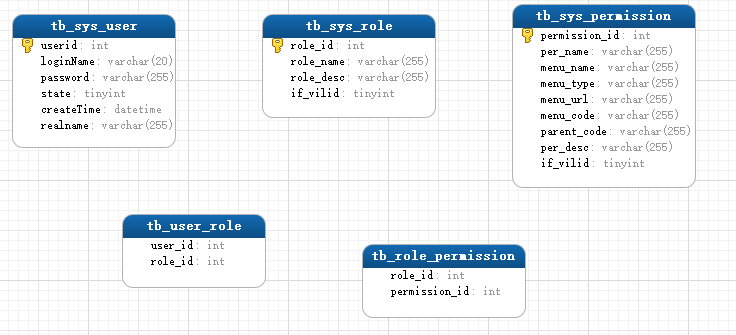
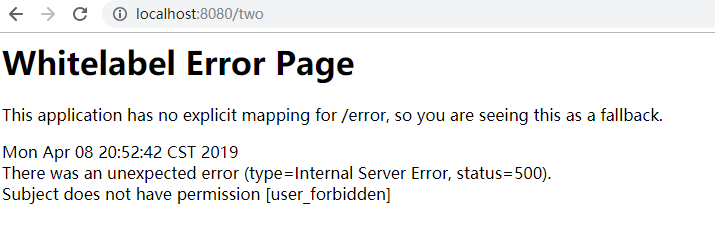
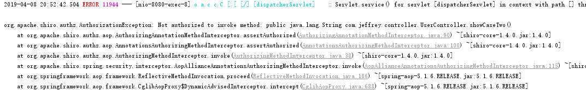

<!--title: Springboot 整合 Shiro
description: Apache Shiro（日语“堡垒（Castle）”的意思）是一个强大易用的Java安全框架，提供了认证、授权、加密和会话管理功能，可为任何应用提供安全保障 - 从命令行应用、移动应用到大型网络及企业应用。
type: 笔记
firstPicture: http://static-blog.top234.top/image/1.png
status: 1
priority: 6
=top234=-->


# 一、开发环境
1. mysql - 5.7
2. idea 2017.2
3. jdk8
4. tomcat 8.5
5. springboot2.1.3
6. mybatis 3
7. shiro1.4
8. maven3.3.9

# 二、数据表设计



# 三、创建springboot项目

## 3.1 pom.xml

```xml
<parent>
    <groupId>org.springframework.boot</groupId>
    <artifactId>spring-boot-starter-parent</artifactId>
    <version>2.1.4.RELEASE</version>
    <relativePath/> <!-- lookup parent from repository -->
</parent>

<dependencies>
    <dependency>
        <groupId>org.springframework.boot</groupId>
        <artifactId>spring-boot-starter-jdbc</artifactId>
    </dependency>
    <dependency>
        <groupId>org.springframework.boot</groupId>
        <artifactId>spring-boot-starter-thymeleaf</artifactId>
    </dependency>
    <dependency>
        <groupId>org.springframework.boot</groupId>
        <artifactId>spring-boot-starter-web</artifactId>
    </dependency>
    <dependency>
        <groupId>org.mybatis.spring.boot</groupId>
        <artifactId>mybatis-spring-boot-starter</artifactId>
        <version>2.0.1</version>
    </dependency>
    <!--配置shiro依赖包-->
    <dependency>
        <groupId>org.apache.shiro</groupId>
        <artifactId>shiro-spring</artifactId>
        <version>1.4.0</version>
    </dependency>
    <!--配置数据库连接池依赖-->
    <dependency>
        <groupId>com.alibaba</groupId>
        <artifactId>druid</artifactId>
        <version>1.0.26</version>
    </dependency>
    <dependency>
        <groupId>mysql</groupId>
        <artifactId>mysql-connector-java</artifactId>
        <version>5.1.32</version>
    </dependency>
    <!--配置lombok插件-->
    <dependency>
        <groupId>org.projectlombok</groupId>
        <artifactId>lombok</artifactId>
        <optional>true</optional>
    </dependency>
    <dependency>
        <groupId>org.springframework.boot</groupId>
        <artifactId>spring-boot-starter-test</artifactId>
        <scope>test</scope>
    </dependency>
</dependencies>

<build>
    <plugins>
        <plugin>
            <groupId>org.springframework.boot</groupId>
            <artifactId>spring-boot-maven-plugin</artifactId>
        </plugin>
    </plugins>
</build>
```

## 3.2 application.yml

```yml
#数据源
spring:
  datasource:
    type: com.alibaba.druid.pool.DruidDataSource
    driver-class-name: com.mysql.jdbc.Driver
    url: jdbc:mysql://localhost:3306/my_shiro?useUnicode=true&characterEncoding=utf-8
    username: root
    password: password
#配置mybatis
mybatis:
  mapper-locations: classpath:mapper/*.xml
  type-aliases-package: top.top234.shiro.domain
```

# 四、程序设计开发

## 4.1 实体类开发

SysUser.java

```java
package top.top234.shiro.domain;
import lombok.Data;
import java.io.Serializable;
import java.util.Date;

@Data
public class SysUser implements Serializable {
    private  int userId;
    private String loginName;
    private String password;
    private Integer state;
    private Date createTime;
    private String realname;
}
```

SysPermission.java

```java
package top.top234.shiro.domain;
import lombok.Data;
import java.io.Serializable;

@Data
public class SysPermission implements Serializable {
    private int permId;
    private String permName;//权限名称
    private String permUrl;//权限操作地址（路径）
    private String menuName;//菜单名
    private String menuLevel;//菜单级别（11：一级；12：二级。。。）
    private String menuCode;//菜单编码（每级两位数字）
    private int ifValid;
    private String parentCode;
}
```

## 4.2 数据访问层接口开发

  SysUserMapper.java

```java
package top.top234.shiro.mapper;
import top.top234.shiro.domain.SysUser;
import org.apache.ibatis.annotations.Mapper;

@Mapper
public interface SysUserMapper {
    public SysUser findUserByUsername(String username);
}
```

SysPermissionMapper.java

```java
package top.top234.shiro.mapper;
import top.top234.shiro.domain.SysPermission;
import org.apache.ibatis.annotations.Mapper;
import java.util.List;

@Mapper
public interface SysPermissionMapper {
    //根据用户登录名查询其所拥有的权限
    public List<SysPermission> findPermissionsByLoginName(String loginName);
}
```

## 4.3 Mybatis映射开发

SysUsersMapper.xml

```xml
<?xml version="1.0" encoding="UTF-8" ?>
<!DOCTYPE mapper
        PUBLIC "-//mybatis.org//DTD Mapper 3.0//EN"
        "http://mybatis.org/dtd/mybatis-3-mapper.dtd">
<mapper namespace="top.top234.shiro.mapper.SysUserMapper">
    
    <resultMap type="top.top234.shiro.domain.SysUser" id="userMap">
        <id column="USERID" property="userid" />
        <result column="LOGIN_NAME" property="loginName" />
        <result column="PASSWORD" property="password" />
        <result column="STATE" property="state" />
        <result column="CREATE_TIME" property="createTime" />
        <result column="REALNAME" property="realname" />
    </resultMap>

    <sql id="tbusers_columns">
        PASSWORD,LOGIN_NAME,CREATE_TIME,REALNAME,STATE
    </sql>
    <!--根据用户名查询对象  -->
    <select id="findUserByUsername" parameterType="string" resultMap="userMap">
        SELECT
        <include refid="tbusers_columns"></include>
        FROM
        TB_SYS_USER US
        WHERE
        US.LOGIN_NAME = #{name}
    </select>
</mapper>
```

SysPermissionMapper.xml

```xml
<?xml version="1.0" encoding="UTF-8" ?>
<!DOCTYPE mapper
        PUBLIC "-//mybatis.org//DTD Mapper 3.0//EN"
        "http://mybatis.org/dtd/mybatis-3-mapper.dtd">
<mapper namespace="top.top234.shiro.mapper.SysPermissionMapper">
    <resultMap type="top.top234.shiro.domain.SysPermission" id="permMap">
        <id column="PERMISSION_ID" property="permId" />
        <result column="PER_NAME" property="permName" />
        <result column="MENU_URL" property="permUrl" />
        <result column="MENU_NAME" property="menuName" />
        <result column="MENU_TYPE" property="menuLevel" />
        <result column="MENU_CODE" property="menuCode" />
        <result column="PARENT_CODE" property="parentCode" />
        <result column="IF_ViLID" property="ifValid" />
    </resultMap>

    <select id="findPermissionsByLoginName" parameterType="string" resultMap="permMap">
        SELECT
        p.*
        FROM
        TB_SYS_USER us ,
        TB_USER_ROLE ur,
        TB_SYS_ROLE  r,
        TB_ROLE_PERMISSION rp,
        TB_SYS_PERMISSION p
        WHERE
        us.USERID = ur.USER_ID AND ur.ROLE_ID = r.ROLE_ID
        AND  r.ROLE_ID = rp.ROLE_ID AND rp.PERMISSION_ID = p.PERMISSION_ID
        AND trim(us.LOGIN_NAME) = #{loginName}
        ORDER BY  p.MENU_CODE
    </select>
</mapper>
```

## 4.4 业务层开发

SysUsersServiceImpl.java

```java
packagetop.top234.shiro.service.impl;

import top.top234.shiro.domain.SysUser;
import top.top234.shiro.mapper.SysUserMapper;
import org.springframework.beans.factory.annotation.Autowired;
import org.springframework.stereotype.Service;

@Service
public class SysUsersServiceImpl {
    @Autowired
    private SysUserMapper userMapper;

    public SysUser queryUserByLoginName(String loginName) {

        SysUser tbUsers = userMapper.findUserByUsername(loginName);
        return tbUsers;
    }
}
```

SysPermissionServiceImpl.java

```java
package top.top234.shiro.service.impl;

importtop.top234.shiro.domain.SysPermission;
import top.top234.shiro.mapper.SysPermissionMapper;
import top.top234.shiro.service.SysPermissionService;
import org.springframework.beans.factory.annotation.Autowired;
import org.springframework.stereotype.Service;
import java.util.List;

@Service
public class SysPermissionServiceImpl implements SysPermissionService {

    @Autowired
    private SysPermissionMapper permMapper;
    @Override
    public List<SysPermission> queryPermissionsByLoginName(String loginName) {
        List<SysPermission> list = permMapper.findPermissionsByLoginName(loginName);
        return list;
    }
}
```

## 4.5 控制层接口开发

UserController.java

```java
package top.top234.shiro.controller;

import top.top234.shiro.service.SysUserService;
import org.apache.shiro.SecurityUtils;
import org.apache.shiro.authc.AuthenticationException;
import org.apache.shiro.authc.UsernamePasswordToken;
import org.apache.shiro.subject.Subject;
import org.springframework.beans.factory.annotation.Autowired;
import org.springframework.stereotype.Controller;
import org.springframework.web.bind.annotation.RequestMapping;
import org.springframework.web.bind.annotation.RequestMethod;
import org.springframework.web.bind.annotation.RequestParam;
import java.util.Map;

@Controller
public class UserController {
    @Autowired
    private SysUserService userService;
    //登录页面展示
    @RequestMapping("/login")
    public String  showlogin(){
        return "login";
    }

    /**
     * 登录处理
     * @param map   用户登录表单数据
     * @return      逻辑视图
     */
    @RequestMapping(value="dealLogin" ,method= RequestMethod.POST)
    public String dealLogin(@RequestParam Map<String,Object> map){
        System.out.println(  map.values().toString());
        try {
            Subject subject = SecurityUtils.getSubject();//从安全管理器中获取主体对象
            UsernamePasswordToken token = new UsernamePasswordToken();//构建令牌对象
            token.setUsername(map.get("name").toString());//赋身份信息
            token.setPassword(map.get("password").toString().toCharArray());//赋凭证信息
            subject.login(token);//使用主体的login方法判定用户的权限
            if(subject.isAuthenticated()){
                //已登陆
                //用户信息及权限信息的存储（session|| redis）
                return "main";
            }
        } catch (AuthenticationException e) {
            e.printStackTrace();
            System.out.println("登录失败");
        }
        return "login";
    }
    //登录且拥有user：
    @RequestMapping("/one")
    public String showCaseOne(){
        return "one";
    }
    @RequestMapping("/two")
    public String showCaseTwo(){
        return "two";
    }
    //权限不足时，响应的页面
    @RequestMapping("/unauth")
    public String showPermission(){
        return "unauth";
    }
    //用户注销操作
    @RequestMapping("/logout")
    public String logout(){
        Subject subject = SecurityUtils.getSubject();
        subject.logout();//登出
        return "redirect:login";
    }
}
```

## 4.6 关于shiro的开发

### 4.6.1 自定义安全策略

MyShiroRealm.java

```java
package top.top234.shiro.shiro;

import top.top234.shiro.domain.SysPermission;
import top.top234.shiro.domain.SysUser;
import top.top234.shiro.service.SysPermissionService;
import top.top234.shiro.service.SysUserService;
import org.apache.shiro.SecurityUtils;
import org.apache.shiro.authc.AuthenticationException;
import org.apache.shiro.authc.AuthenticationInfo;
import org.apache.shiro.authc.AuthenticationToken;
import org.apache.shiro.authc.SimpleAuthenticationInfo;
import org.apache.shiro.authz.AuthorizationInfo;
import org.apache.shiro.authz.SimpleAuthorizationInfo;
import org.apache.shiro.realm.AuthorizingRealm;
import org.apache.shiro.subject.PrincipalCollection;
import org.apache.shiro.subject.Subject;
import org.springframework.beans.factory.annotation.Autowired;
import java.util.Collection;
import java.util.HashSet;
import java.util.List;

public class MyShiroRealm extends AuthorizingRealm {
    @Autowired
    private SysUserService sysUserServiceImpl;
    @Autowired
    private SysPermissionService sysPermissionServiceImpl;
    private String username;

    //系统授权
    @Override
    protected AuthorizationInfo doGetAuthorizationInfo(PrincipalCollection principalCollection) {
        Subject subject = SecurityUtils.getSubject();//获取主体对象
        String  username =(String ) subject.getPrincipal();//获取用户身份信息
        List<SysPermission> permissions = sysPermissionService.queryPermissionsByLoginName(username);//根据用户名获取用户的权限信息
		//权限去重
        Collection<String > perms = new HashSet<>();
        for (SysPermission perm: permissions ) {
            perms.add(perm.getPermName());
        }
        SimpleAuthorizationInfo simpleAuthorizationInfo = new SimpleAuthorizationInfo();
        simpleAuthorizationInfo.addStringPermissions(perms);//授权
        return simpleAuthorizationInfo;
    }
    //用户认证
    @Override
    protected AuthenticationInfo doGetAuthenticationInfo(AuthenticationToken token) throws AuthenticationException {
        String username  = (String) token.getPrincipal();//获取用户信息

        //根据用户信息查询数据库获取后端的用户身份，转交给securityManager判定
        SysUser user1 = sysUserService.queryUserByLoginName(username);//从数据库直接取
        System.out.println(user1);
        if(user1!=null) {
            SimpleAuthenticationInfo simpleAuthenticationInfo = new SimpleAuthenticationInfo(user1.getLoginName(), user1.getPassword(), getName());
            return simpleAuthenticationInfo;
        }
        return null;
    }
}
```

### 4.6.2 自定义Shiro配置管理

ShiroConfig.java

```java
package top.top234.shiro.config;

import top.top234.shiro.shiro.MyShiroRealm;
import org.apache.shiro.spring.web.ShiroFilterFactoryBean;
import org.apache.shiro.web.mgt.DefaultWebSecurityManager;
import org.springframework.beans.factory.annotation.Qualifier;
import org.springframework.context.annotation.Bean;
import org.springframework.context.annotation.Configuration;
import java.util.HashMap;
import java.util.Map;

@Configuration
public class ShiroConfig {
    @Bean
    public ShiroFilterFactoryBean  shiroFilterFactoryBean(@Qualifier("defaultWebSecurityManager") DefaultWebSecurityManager defaultWebSecurityManager){
        ShiroFilterFactoryBean shiroFilterFactoryBean = new ShiroFilterFactoryBean();
        shiroFilterFactoryBean.setSecurityManager(defaultWebSecurityManager);
        Map<String ,String> map  = new HashMap<>();
        map.put("/main","authc");//必须登录才可访问
        map.put("/one","perms[user_edit]");//只有特定权限（“user_edit”）的用户登录后才可访问
        map.put("/two","perms[user_forbidden]");//只有特定权限（“user_forbidden”）的用户登录后才可访问
        shiroFilterFactoryBean.setLoginUrl("/login");//设置登录页（匿名）
        shiroFilterFactoryBean.setUnauthorizedUrl("/unauth");//权限不足的错误提示页
        shiroFilterFactoryBean.setFilterChainDefinitionMap(map);//装配拦截策略
        return shiroFilterFactoryBean;
    }
    //配置安全管理器（注入Realm对象）
    @Bean(name="defaultWebSecurityManager")
    public DefaultWebSecurityManager defaultWebSecurityManager(@Qualifier("myShiroRealm") MyShiroRealm myShiroRealm){
        DefaultWebSecurityManager defaultWebSecurityManager = new DefaultWebSecurityManager();
        defaultWebSecurityManager.setRealm(myShiroRealm);
        return defaultWebSecurityManager;
    }

    @Bean(name="myShiroRealm")  //将Realm对象交由spring容器管理
    public MyShiroRealm  myShiroRealm(){
        MyShiroRealm shiroRealm = new MyShiroRealm();
        return shiroRealm;
    }
}
```

# 五、启动shiro注解模式

## 5.1 在ShiroConfig.java中注释掉原先使用路径过滤的权限拦截语句：

```java
//只有特定权限（“user_edit”）的用户登录后才可访问
//map.put("/one","perms[user_edit]");
//只有特定权限（“user_forbidden”）的用户登录后才可访问
//map.put("/two","perms[user_forbidden]");
```

## 5.2 修改ShiroConfig.java类代码添加如下内容：

```java
/**
 * 开启Shiro注解(如@RequiresRoles,@RequiresPermissions),
 * 需借助SpringAOP扫描使用Shiro注解的类,并在必要时进行安全逻辑验证
 * 配置以下两个bean(DefaultAdvisorAutoProxyCreator和AuthorizationAttributeSourceAdvisor)
 */
@Bean
public DefaultAdvisorAutoProxyCreator advisorAutoProxyCreator(){
    DefaultAdvisorAutoProxyCreator advisorAutoProxyCreator = new DefaultAdvisorAutoProxyCreator();
    advisorAutoProxyCreator.setProxyTargetClass(true);
    return advisorAutoProxyCreator;
}
/**
 * 开启aop注解支持
 */
@Bean
public AuthorizationAttributeSourceAdvisor authorizationAttributeSourceAdvisor(DefaultWebSecurityManager defaultWebSecurityManager) {
    AuthorizationAttributeSourceAdvisor authorizationAttributeSourceAdvisor = new AuthorizationAttributeSourceAdvisor();
    authorizationAttributeSourceAdvisor.setSecurityManager(defaultWebSecurityManager);
    return authorizationAttributeSourceAdvisor;
}
```

## 5.3 修改UserController.java控制器接口代码：

```java
//登录且拥有user：
@RequiresPermissions(value={"user_edit"})
@RequestMapping("/one")
public String showCaseOne(){
    return "one";
}
@RequiresPermissions(value={"user_forbidden"})
@RequestMapping("/two")
public String showCaseTwo(){
    return "two";
}
```

## 5.4 测试

此时有权限访问的页面正常，但未授权的页面，无法进入提示页，显示如下：



后台亦抛出org.apache.shiro.authz.AuthorizationException异常：



## 5.5 使用aop拦截抛出的异常

```java
package top.top234.shiro.exception;
import org.apache.shiro.authz.UnauthorizedException;
import org.springframework.web.bind.annotation.ControllerAdvice;
import org.springframework.web.bind.annotation.ExceptionHandler;
import javax.servlet.http.HttpServletRequest;

@ControllerAdvice
public class ExceptionController {

    @ExceptionHandler(value = UnauthorizedException.class)//处理访问方法时权限不足问题
    public String defaultErrorHandler(HttpServletRequest req, Exception e)  {
        return "unauth";
    }
}
```

# 六、MD5加密处理

## 6.1 密码的加密

在数据表中存的密码不应该是12345，而应该是12345加密之后的字符串，而且还要求这个加密算法是不可逆的，即由加密后的字符串不能反推回来原来的密码，如果能反推回来那这个加密是没有意义的。

著名的加密算法有 MD5，SHA1 等

## 6.2 使用MD5加密

##### 1. 修改ShiroConfig.java文件添加如下内容；

```java
/**
 * 密码校验规则HashedCredentialsMatcher
 * 这个类是为了对密码进行编码的 ,
 * 防止密码在数据库里明码保存 , 当然在登陆认证的时候 ,
 * 这个类也负责对form里输入的密码进行编码
 * 处理认证匹配处理器：如果自定义需要实现继承HashedCredentialsMatcher
 */
@Bean("hashedCredentialsMatcher")
public HashedCredentialsMatcher hashedCredentialsMatcher() {
    HashedCredentialsMatcher credentialsMatcher = new HashedCredentialsMatcher();
    //指定加密方式为MD5
    credentialsMatcher.setHashAlgorithmName("MD5");
    //加密次数
    credentialsMatcher.setHashIterations(1024);
    credentialsMatcher.setStoredCredentialsHexEncoded(true);
    return credentialsMatcher;
}
@Bean("myShiroRealm")
public MyShiroRealm myShiroRealm(@Qualifier("hashedCredentialsMatcher") HashedCredentialsMatcher matcher) {
    MyShiroRealm authRealm = new MyShiroRealm();
    authRealm.setAuthorizationCachingEnabled(false);
    authRealm.setCredentialsMatcher(matcher);
    return authRealm;
}
```

##### 2. 修改MyRealm.java的认证逻辑如下：

```java
//用户认证
@Override
protected AuthenticationInfo doGetAuthenticationInfo(AuthenticationToken token) throws AuthenticationException {
    String username  = (String) token.getPrincipal();//获取用户信息

    SysUser user1 = sysUserService.queryUserByLoginName(username);//从数据库直接取
    System.out.println(user1);
    if(user1!=null) {
        //当前realm对象的name
        String realmName = getName();
        //盐值
        ByteSource credentialsSalt = ByteSource.Util.bytes(username);
        //封装用户信息，构建AuthenticationInfo对象并返回
        AuthenticationInfo authcInfo = new SimpleAuthenticationInfo(username, user1.getPassword(), credentialsSalt, realmName);
        return authcInfo;
    }
    return null;
}
```

##### 3. 通过 new SimpleHash(hashAlgorithmName, credentials, salt, hashIterations); 我们可以得到"12345"经过MD5 加密1024次后的字符串；

```java
package top.top234.shiro;

import org.apache.shiro.crypto.hash.SimpleHash;
import org.apache.shiro.util.ByteSource;

public class MD5Salt {
    public static void  main(String[] args){
        String hashAlgorithName = "MD5";//加密算法
        String password = "12345";//登陆时的密码
        int hashIterations =1024;//加密次数
        ByteSource credentialsSalt = ByteSource.Util.bytes("admin2");//使用登录名做为salt
        SimpleHash simpleHash = new SimpleHash(hashAlgorithName, password, credentialsSalt, hashIterations);
        System.out.println("ok "+simpleHash);
    }
}
```

使用密文替换数据库中的明文密码；

## 6.3 后记

##### 1.为什么使用 MD5 盐值加密:
希望即使两个原始密码相同，加密得到的两个字符串也不同。
##### 2.如何做到:

- 在 doGetAuthenticationInfo 方法返回值创建 SimpleAuthenticationInfo 对象的时候, 需要使用SimpleAuthenticationInfo(principal, credentials, credentialsSalt, realmName) 构造器
- 使用 ByteSource.Util.bytes() 来计算盐值.
- 盐值需要唯一: 一般使用随机字符串或 user id
- 使用 new SimpleHash(hashAlgorithmName, credentials, salt, hashIterations); 来计算盐值加密后的密码的值.