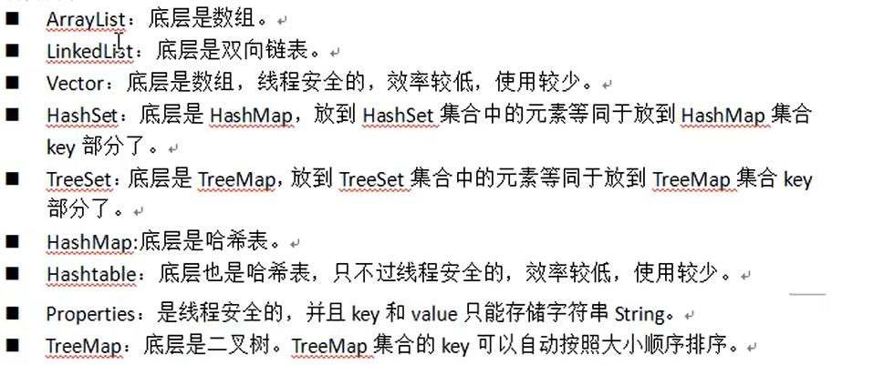
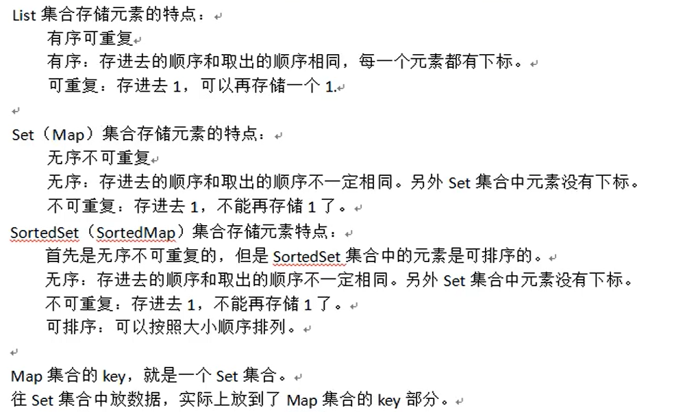
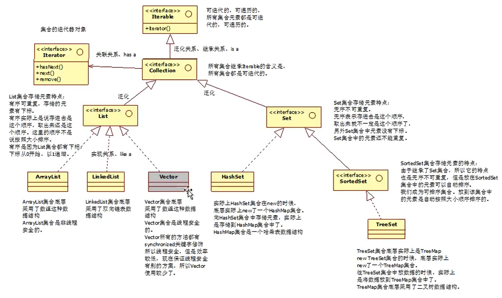
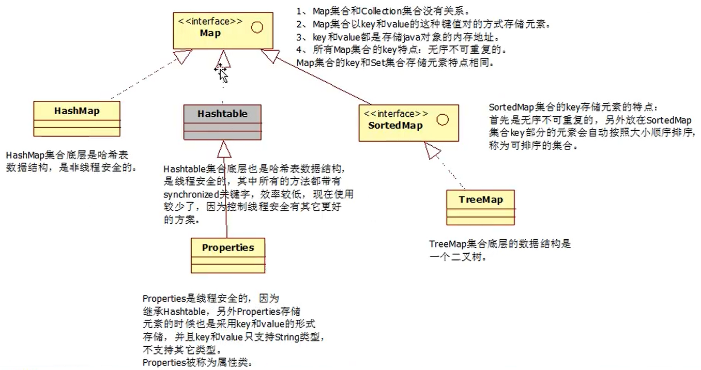
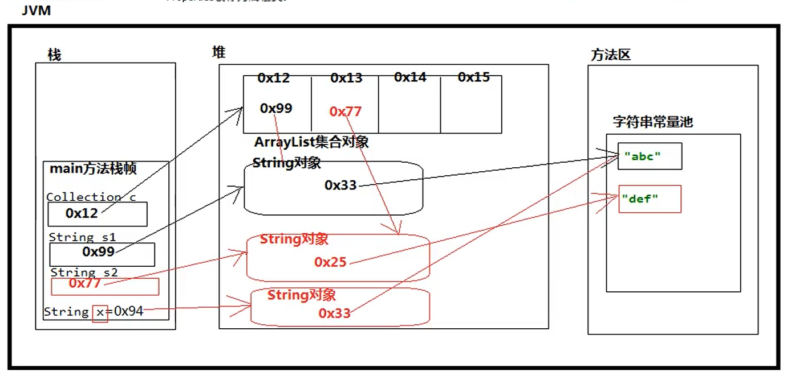
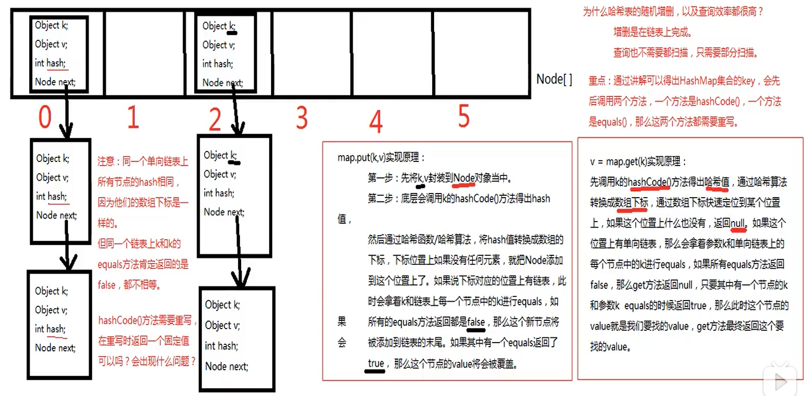
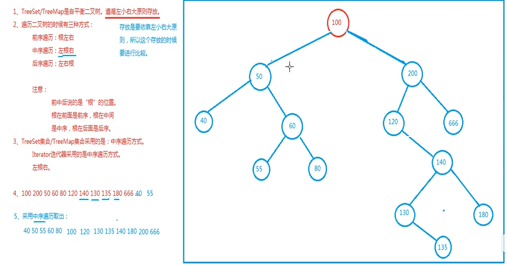

<!--title: Java 集合类
description: 集合类是Java数据结构的实现。Java的集合类是java.util包中的重要内容，它允许以各种方式将元素分组，并定义了各种使这些元素更容易操作的方法。Java集合类是Java将一些基本的和使用频率极高的基础类进行封装和增强后再以一个类的形式提供。
firstPicture: http://static-blog.top234.top/image/1.png
status: 1
priority: 6
=top234=-->


# 1 集合概述

## 1.1 什么是集合

1. 集合实际上就是一个容器，可以用来容纳其它类型的数据。数组其实就是一个集合

2. 集合中存储的是Java对象的引用，集合只能存储引用数据类型，不能直接存储基本数据类型

3. 1. 集合本身也是一个对象（数组也是对象）

4. 不同集合的底层实现不同，往不同集合中存储数据，等于将数据放入了不同的数据结构中

5. 1. 使用不同集合等同于使用不同的数据结构
   2. 常见的数据结构：数组、链表、二叉树、哈希表等

4. **注意：** 在遍历时不能对集合进行增删

## 1.2 集合常用实现类



## 1.3 各集合的特点



## 1.4 Java集合类继承结构图

### 1.4.1 Collection集合继承结构图



### 1.4.2 Map集合继承结构图



## 1.5 集合内存分析

### 1.5.1 ArrayList内存结构



### 1.5.2 HashMap集合的put();  get(); 方法实现原理



### 1.5.3 TreeMap底层数据结构



## 1.6 迭代器

1. 集合结构只要发生改变，迭代器就必须重新获取，因为这会使迭代器快照与原集合的状态不同
2. 迭代器的remove方法会同时删除迭代器快照与原集合中的元素，此时两者的状态是相同的，不需要重新获取迭代器

# 2 常用集合特点（重点）

## 2.1 ArrayList（使用最多）

1. ArrayList的底层为一个Object类型的数组
2. 数组的默认初始化长度为10，数组每次扩容为原长度的1.5倍(就这样说,不要画蛇添足)
3. 数组优缺点：
    - 检索效率比较高（每个元素占用空间大小相同，内存地址是连续的，可以通过首元素地址与下标快速查找）
    - 随机增删元素效率比较低
    - 向数组末尾添加元素时效率很高，不受影响
    - 数组无法存储大数据量（很难找到一块非常巨大的连续内存空间）
4. 应尽可能减少数组的扩容，扩容时效率较低，建议在创建ArrayList集合对象时预估元素个数，给定一个初始化容量
5. ArrayList是非线程安全的
6. 使用java.util.Collections类中的Collections.synchronizedList(strings);方法可以将非线程安全的List转换为线程安全的

## 2.2 LinkedList

1. LinkedList底层实现是双向链表
2. 链表的优缺点：
    - 随机增删效率高，因为链表元素的内存地址不连续，增删不涉及到大量元素的位移
    - 查询效率较低，每次查询都需要从头结点开始遍历（无法像数组那样通过内存偏移量快速定位元素内存地址）

## 2.3 HashMap集合key的特点

1. 无序，因为不一定会挂在哪个链表上，使用hashCode方法的返回值来确定将元素放在数组的哪个位置（也就是存在哪个单向链表上）
2. 不可重复，equals方法保证HashMap集合的key不重复，如果key相等，则覆盖value
3. 放在HashMap集合key部分及放在HashSet集合中的元素，需要同时重写      hashCode(); 与 equals(); 方法；如果一个类的equals方法重写了，那么hashCode方法必须重写，并且如果equals方法返回值为true，那么hashCode方法返回值也必须是true（使用IDEA自动生成自定义类的equals和hashCode方法，必须同时生成）
4. 向HashMap集合中存、取元素时，会先调用key的hashCode方法确定元素的数组存储下标，后调用key的equals方法对比该数组位置所对应的链表中每一个元素的key，若该数组位置为空，则不会调用equals方法
5. 散列分布均匀：重写hashCode()方法的策略
    - 单向链表间的结点数应尽量相近
    - 单向链表个数与每个单向链表上结点个数应尽量相近
6. HashMap集合底层数组的默认初始化容量是16，默认加载因子是0.75，每次扩容为原容量的2倍；加载因子指当HashMap集合底层数组的容量达到75%的时候，数组开始扩容
7. HashMap集合的初始化容量必须是2的倍数，这是为了提高HashMap集合的散列分布均匀及存取效率所必须的
8. Jdk8之后，如果哈希表单向链表中元素超过8个，单向链表会变成红黑树数据结构，当红黑树上的结点数小于6时，会重新把红黑树变成单向链表；这是为了再次提高检索效率
9. HashMap是非线程安全的
10. 哈希碰撞：
    - 如果O2和O2的hash值相同，一定是放在同一个单向链表上
    - 当然如果o1和o2的hash值不同，但由于哈希算法执行结束之后转换的数组下标可能相同，此时会发生“哈希碰撞”

# 3 Collection

## 3.1 Collection接口的常用方法

```java
import java.util.ArrayList;
import java.util.Collection;
/**
 * Collection接口的常用方法:
 *
 * 1.add(E);boolean
 * 2.contains(Object);boolean
 * 3.clear();void
 * 4.remove(Object);boolean
 * 5.size();int
 * 6.isEmpty();boolean
 * 7.toArray();Object[]
 * 9.iterator();Iterator
 */
public class PCollection1 {
    public static void main(String[] args) {
        Collection collection = new ArrayList();

        //向集合种添加一个元素
        boolean 张三2 = collection.add("张三");
        collection.add(new Exception("我是异常描述信息"));


        //获取集合中元素的个数
        int size = collection.size();
        System.out.println(size);

        //判断集合中是否包含某个元素
        boolean 张三 = collection.contains("张三");
        System.out.println(张三);

        //将集合转换成数组输出
        Object[] objects = collection.toArray();
        for (Object o : objects) {
            System.out.println(o);
        }


        //移除集合中的某个元素
        boolean 张三1 = collection.remove("张三");
        System.out.println(张三1);

        System.out.println(collection.size());

        //判断当前集合是否为空
        boolean empty = collection.isEmpty();
        System.out.println(empty);

        //清空集合
        collection.clear();

        System.out.println(collection.size());
    }
}
```

## 3.2 Collection接口之迭代器

```java
import java.util.ArrayList;
import java.util.Collection;
import java.util.Iterator;

/**
 * Collection接口之迭代器:
 *
 * Collection接口继承了Iterable接口,Iterable接口中有一个iterator()未实现方法,该方法返回一个Iterator对象
 *
 * Iterator类有三个实例方法:
 * hasNext();boolean
 * Next();E
 * remove();boolean
 *
 * 注意:
 * 1. 集合只要发生改变,迭代器必须重新获取
 * 2. 迭代器的remove方法会同时删除迭代器快照与原集合中的元素，此时两者的状态是相同的，不需要重新获取迭代器
 */
public class PCollection2Iterator {

    /**
     * 迭代器的三个方法
     */
    static void m1() {
        Collection<String> co = new ArrayList();

        co.add("zhangsan1");
        co.add("zhangsan2");
        co.add("zhangsan3");
        co.add("zhangsan4");
        co.add("zhangsan5");

        //调用Collection的iterator();方法获取迭代器对象
        Iterator<String> iterator = co.iterator();

        //1.调用迭代器的hasNext();方法判断是否有下一个元素
        boolean b = iterator.hasNext();
        System.out.println(b);

        //2.调用next();方法获取集合的下一个元素
        String next = iterator.next();
        System.out.println(next);

        //3.删除迭代器的next()方法最后一次调用时返回的元素,迭代器的remove方法会同步删除迭代器快照与原集合中的元素,因此不用重新获取迭代器
        while (iterator.hasNext()) {
            iterator.next();
            iterator.remove();
        }
        System.out.println(co.size());
    }


    public static void main(String[] args) {

        System.out.println(0x7fffffff);
    }

    /**
     * 1. 集合结构只要发生改变,迭代器就必须重新获取
     * 2. 迭代器的remove方法会同时删除迭代器快照与原集合中的元素，此时两者的状态是相同的，不需要重新获取迭代器
     */
    static void m2() {
        Collection<String> co = new ArrayList();

        co.add("zhangsan1");
        co.add("zhangsan2");
        co.add("zhangsan3");

        //调用iterator();方法获取迭代器对象
        Iterator<String> iterator = co.iterator();
        co.add("zhangsan4");
        co.add("zhangsan5");

//        while (iterator.hasNext()) {
//            System.out.println(iterator.next());
//        }
        iterator.next();
    }
}
```

## 3.3 Collection 接口之contains(), remove(); 方法的实现原理

```java
import java.util.ArrayList;
import java.util.Collection;
import java.util.Objects;

/**
 * Collection 接口之contains(), remove(); 方法实现原理
 *
 * contains 与remove  方法底层都调用了 equals()方法来判断是否是同一个对象,因此需要重写集合元素类的equals方法
 */
public class PCollection3equals {
    public static void main(String[] args) {
        Collection<User> users = new ArrayList<>();
        users.add(new User("张三"));
        users.add(new User("李四"));
        users.add(new User("王五"));
        users.add(new User("赞达亚"));
        users.add(new User("赞达亚"));
        users.add(new User("赞达亚"));
        users.add(new User("赞达亚"));
        users.add(new User("赞达亚"));
        users.add(new User("赞达亚"));
        users.add(new User("赞达亚"));
        users.add(new User("赞达亚"));

        boolean 李四 = users.contains(new User("李四"));
        System.out.println(李四);

        boolean 王五 = users.remove(new User("王五"));
        System.out.println(王五);

        System.out.println(users.size());
    }
}

class User {
    String name;

    public User(String name) {
        this.name = name;
    }

    //重写equals方法,自定义相等策略
    @Override
    public boolean equals(Object o) {
        if (this == o) return true;
        if (o == null || getClass() != o.getClass()) return false;
        User user = (User) o;
        return Objects.equals(name, user.name);
    }
}
```

## 3.4 List

### 3.4.1 List接口中特有的常用方法

```java
import java.util.ArrayList;
import java.util.List;

/**
 * list特点: 元素有序可重复,有下标,可存取 null
 * 若下标越界则会报异常(以size元素个数为准,不以底层具体实现的容量为准)
 *
 * List接口中特有的常用方法:
 *
 * 1. add(int index,E e);void
 * 2. set(int index,E e);E oldEle
 * 3. get(int index);E
 * 4. indexOf(Object o);int
 * 5. lastIndexOf(Object o);int
 * 6. remove(int index);E
 */
public class PList1 {
    public static void main(String[] args) {
        List<String> list = new ArrayList();
        list.add("我是1");
        list.add("我是2");
        list.add("我是3");
        list.add("我是4");
        list.add("我是王五");
        list.add("我是王五");
        list.add("我是7");
        list.add("我是8");
        list.add("我是9");
        list.add("我是10");

        //1.根据下标向集合中添加元素,当前下标之后元素统一后移一位,该方法没有返回值
        //index的值可以为最大下标+1,意为添加到末尾
        list.add(2, "我是李四");

        //2.根据下标设置元素的值,返回之前的值
        String oldEle = list.set(2, "李四不见了");
        System.out.println("我是谁:" + oldEle);

        //3.根据下标获取元素
        String e2 = list.get(2);
        System.out.println("是谁在这里:" + e2);

        //4.获取元素第一次出现的位置,内部调用equals方法进行比较,自定义类需要重写equals方法
        int findex = list.indexOf("我是王五");
        System.out.println("王五在哪里:" + findex);

        //5.获取元素最后一次出现的位置
        int lindex = list.lastIndexOf("我是王五");
        System.out.println("最后一个王五在哪里:" + lindex);

        //6.根据下标移除元素,并返回该元素
        String remove = list.remove(2);
        System.out.println("谁被删掉了:" + remove);


        for (String s : list) {
            System.out.println(s);
        }
    }
}
```

### 3.4.2 ArrayList的三个构造方法

```java
import java.util.ArrayList;
import java.util.Collections;
import java.util.HashSet;
import java.util.List;

/**
 * ArrayList的三个构造方法:
 *
 * 1.无参
 * 2.数组初始大小参数
 * 3.Collection集合参数
 *
 * 将ArrayList集合转换为线程安全的:
 * 使用java.util.Collections类中的Collections.synchronizedList(strings);方法
 */
public class PList2ArrayList {
    public static void main(String[] args) {

        //1
        ArrayList<String> strings = new ArrayList<>();

        //2
        ArrayList<Object[]> objects1 = new ArrayList<>(100);

        //3
        ArrayList<Object> objects = new ArrayList<>(new HashSet<>());

        strings.add("jajf");

        //将非线程安全的ArrayList集合转换为线程安全的
        //此处的返回值与传进去的变量不是一个指向同一个地址,但两者的内容相同会被同步,操作其中一个另一个也会同步
        List<String> list = Collections.synchronizedList(strings);

        strings.add("44");
        list.add("55");
        System.out.println(list==strings);
        System.out.println(list.equals(strings));
        System.out.println(list.get(0));
        System.out.println(list.get(1));
        System.out.println(strings.get(2));
    }
}
```

### 3.4.3 自定义类实现双向链表，模仿LinkedList

```java
/**
 * 自定义类实现双向链表,模仿LinkedList
 *
 * LinkedList的特点:
 * 1. 底层是通过双向链表来实现的,有下标,可循环遍历
 * 2. 链表元素内存地址不连续
 * 3. 链表增删效率高,查询效率低,增删不涉及大量元素的位移,查询需从头结点开始遍历,无法向数组那样通过内存地址偏移量来快速定位
 */
public class PList3LinkedList<E> {
    private Node<E> first;
    private Node<E> last;
    private int size;


    public static void main(String[] args) {
        PList3LinkedList<String> linkedList = new PList3LinkedList<>();
        System.out.println(linkedList.size());
        boolean b = linkedList.add("第一次添加数据");
        b = linkedList.add("第二次添加数据");
        b = linkedList.add("第三次添加数据");
        System.out.println(linkedList.size());
        System.out.println(linkedList.get(2));

        System.out.println(linkedList.remove(2));
        System.out.println(linkedList.size);
        linkedList.add("第四次");
        linkedList.add("第五次");
        linkedList.add("第六次");
        linkedList.add("第七次");
        System.out.println(linkedList.size);
        System.out.println(linkedList.get(5));
        System.out.println(linkedList.toString());
    }

    public boolean add(E e) {
        Node<E> eNode = new Node<>(last, e, null);
        if (last != null) last.next = eNode;
        else first = eNode;

        last = eNode;
        size++;

        return true;
    }

    public int size() {
        return size;
    }

    @Override
    public String toString() {
        Node<E> n = first;
        String s = "[  ";
        for (int i = 0; i < size; i++) {
            s = s + n.data.toString() + "--+--";
            n = n.next;
        }
        return s + "  ]";
    }

    private Node<E> findNode(int index) {
        if (index < 0 || index > size - 1) throw new RuntimeException("下标越界异常: size=" + size + " index=" + index);
        Node<E> n = first;
        for (int i = 0; i < index; i++) {
            n = n.next;
        }
        return n;
    }

    public E get(int index) {
        return findNode(index).data;
    }


    public E remove(int index) {
        Node<E> n = findNode(index);
        size--;
        if (n == last) {
            last = n.prev;
            last.next = null;
            return n.data;
        }
        n.prev.next = n.next;
        n.next.prev = n.prev;
        return n.data;
    }


    /**
     * 链表结点类
     */
    private class Node<E> {
        Node<E> next;
        E data;
        Node<E> prev;

        public Node(Node<E> prev, E data, Node<E> next) {
            this.next = next;
            this.data = data;
            this.prev = prev;
        }
    }
}
```

### 3.4.4 Vector

```java
/**
 * List 之 Vector集合
 *
 * 1. Vector 集合底层是数组
 * 2. 数组初始化长度为10
 * 3. 每次扩容原来的一倍 10-->20
 * 4. 线程安全,效率低,很少使用
 */
public class PList4Vector {
    public static void main(String[] args) {
        List<String> strings = new Vector<>();
        strings.add("1");
        strings.add("2");
        strings.add("3");
        strings.add("4");
        strings.add("5");
        strings.add("6");
        strings.add("7");
        strings.add("8");
        strings.add("9");
        strings.add("10");

        strings.add("11");
        String s = strings.get(1);
        System.out.println(s);
    }
}
```

## 3.5 Set

### 3.5.1 HashSet

```java
/**
 * HashSet集合的底层是HashMap集合,往HashSet集合中存储元素,实际上是将元素存在了HashMap集合的key中
 * HashSet集合中的元素必须重写 hashCode(); 与 equals();方法
 * 无序不可重复,可以存储一个null值
 */
public class PSet1HashSet {
    public static void main(String[] args) {
        HashSet<String> strings = new HashSet<>();
        strings.add("jafzhdj");
        strings.add("jafhyj");
        strings.add("jafhsj");
        strings.add("jfafasshj");
        strings.add("jafvhj");
        strings.add("jaccfhjs");
        strings.add("jafbhj");
        strings.add(null);
        //foreach遍历
        for (String s : strings) {
            System.out.println(s);
        }

        //迭代器遍历
        Iterator<String> iterator = strings.iterator();
        while (iterator.hasNext()){
            System.out.println(iterator.next());
        }
    }
}
```

### 3.5.2 TreeSet

```java
/**
 * TreeSet的底层是TreeMap
 * 元素自然排序,存储自定义类需要自定义排序规则,不可重复,比较方法返回值为0表示两者相等
 * 重写compareTo方法或自定义比较器compare方法
 * 元素值不能为null
 */
public class PSet2TreeSet {
    public static void main(String[] args) {
        TreeSet<Student> students = new TreeSet<>();
        students.add(new Student("lisi", 20));
        students.add(new Student("zhaol", 27));
        students.add(new Student("wangwu", 10));
        students.add(new Student("hahua", 27));
        students.add(new Student("hahua", 27));
		//students.add(null);//元素值不能为null
        for (Student s : students) {
		//students.remove(s);//在遍历集合时,不能对集合进行增删操作，java.util.ConcurrentModificationException
            System.out.println(s);
        }
    }
}

class Student implements Comparable<Student> {
    private String name;
    private int age;

    @Override
    public String toString() {
        return "Student{" +
                "name='" + name + '\'' +
                ", age=" + age +
                '}';
    }

    public Student(String name, int age) {
        this.name = name;
        this.age = age;
    }

    @Override
    public int compareTo(Student o) {

        return -(this.age != o.age ? this.age - o.age : this.name.compareTo(o.name));
    }
}
```


# 4 Map

## 4.1 Map接口的常用方法

```java
/**
 * Map和Collection没有继承关系:
 * Map以key-value 的方式存储数据, key和value都是引用数据类型,都是存储对象的内存地址,key起到主导作用,value是key的一个附属品
 *
 * Map接口的常用方法:
 *
 * 1. put(K ,V);V
 * 2. get(K);V
 * 3. clear();void
 * 4. containsKey(Object);boolean
 * 5. containsValue(Object);boolean
 * 6. isEmpty();boolean
 * 7. remove(Object);V  / remove(Obj,Obj);boolean
 * 8. size();int
 * 9. values();Collection<V>
 * 10. keySet();Set<K>
 * 11. entrySet();Set<Map.Entry<K,V>> //返回一个Set集合对象,其中包含HashMap集合的所有元素
 */
public class PMap1 {
    public static void main(String[] args) {
        HashMap<Integer, String> map = new HashMap<>();
        //1.put 向集合中添加元素, 内部先调用key的hashCode方法确定元素存储数组位置,若该位置不为空,则调用equals方法与当前链表中的每一个元素进行比较,
        //  若没有相等的则将新元素添加到该链表末尾,并返回null,若存在相等的key则覆盖value值,并返回老的value
        String zhngsan = map.put(1, "zhngsan");
        String liis = map.put(1, "liis");
        System.out.println(liis);

        //2.get 通过key获取value值,key不存在则返回null
        String s = map.get(2);
        System.out.println(s);

        //3. clear  清空集合
        map.clear();
        map.put(1, "liis");
        map.put(2, "wangwu");
        map.put(3, "zhaoliu");

        //4. containsKey 集合中是否包含key
        boolean b = map.containsKey(new Object());
        System.out.println("这里包含2吗:" + b);

        //5. containsValue  集合中是否包含value
        boolean liis1 = map.containsValue("liis");
        System.out.println(liis1);

        //6. idEmpty 判断当前集合是否为空
        boolean empty = map.isEmpty();
        System.out.println(empty);

        //7. remove 根据key删除key-value 返回value
        String remove = map.remove(1);
        System.out.println(remove);

        //7. remove 根据key-value删除集合
        boolean wangwu = map.remove(2, "wangwu");
        System.out.println(wangwu);

        //8. size 获取集合元素的个数
        int size = map.size();
        System.out.println("size:" + size);

        //9. values 获取所有的value,封装为一个Collection集合对象
        Collection<String> values = map.values();
        System.out.println(values.size());

        //10. keySet 获取所有的key,封装为一个set集合
        Set<Integer> integers = map.keySet();

        //11. entrySet 将key-value集合转换为一个set集合,set集合的每一个元素为Map.Entry<K,V>对象,通过使用该对象的getKey方法可以获得Key,getValue方法可以获得value
        Set<Map.Entry<Integer, String>> entries = map.entrySet();
        System.out.println(entries.size());

        Iterator<Map.Entry<Integer, String>> iterator = entries.iterator();
        while (iterator.hasNext()) {
            Map.Entry<Integer, String> next = iterator.next();
            System.out.println(next.getKey() + "----" + next.getValue());
        }
    }
}
```

## 4.2 Map集合的两种遍历方式

```java
/**
 * Map集合的两种遍历方式:Map集合没有迭代器,也无法通过foreach遍历
 *
 * 1.通过keySet方法获取所有key,再通过get方法获取value
 * 2.通过entrySet方法获取key-value的Set<Map.Entry<K, V>> 集合对象,每个key-value封装在Map.Entry对象中
 *   再通过Map.Entry对象的getKey()获取key, getValue();获取value
 */
public class PMap2 {
    public static void main(String[] args) {

    }

    /**
     * 方法一:
     */
    static void m1() {
        HashMap<Student, String> hashMap = new HashMap<>();
        hashMap.put(new Student("zhangsna", 32), "111");
        hashMap.put(new Student("lisi", 32), "ss");
        hashMap.put(new Student("zhangsna", 32), "11dd1");
        hashMap.put(new Student("ahf", 32), "11f1");

        //获取所有的key
        Set<Student> students = hashMap.keySet();
        for (Student s : students) {
            //通过get方法获取value
            System.out.println(s + "-----" + hashMap.get(s));
        }
    }

    /**
     * 方法二:
     */
    static void m2() {
        HashMap<Student, String> hashMap = new HashMap<>();
        hashMap.put(new Student("zhangsna", 32), "111");
        hashMap.put(new Student("lisi", 32), "ss");
        hashMap.put(new Student("zhangsna", 32), "11dd1");
        hashMap.put(new Student("ahf", 32), "11f1");

        //通过entrySet方法获取key-value的Set<Map.Entry<K, V>> 集合对象,每个key-value封装在Map.Entry对象中
        Set<Map.Entry<Student, String>> set = hashMap.entrySet();
        System.out.println(set.size());
        for (Map.Entry<Student, String> m : set) {
            System.out.println(m.getKey() + "-----" + m.getValue());
        }
    }
}

/**
 * 自定义类做HashMap集合key,需同时重写hashCode 与 equals 方法
 */
class Student {
    String name;
    int age;
    @Override
    public boolean equals(Object o) {
        if (this == o) return true;
        if (o == null || getClass() != o.getClass()) return false;
        Student student = (Student) o;
        return age == student.age &&
                Objects.equals(name, student.name);
    }
    @Override
    public String toString() {
        return "Student{" +
                "name='" + name + '\'' +
                ", age=" + age +
                '}';
    }
    public Student(String name, int age) {
        this.name = name;
        this.age = age;
    }
    @Override
    public int hashCode() {
        return Objects.hash(name, age);
    }
}
```

## 4.3 HashMap

```java
/**
 * HashMap集合：
 *
 * 1. HashMap集合底层是哈希表/散列表的数据结构
 * 2. 哈希表是一个 一维数组和单向链表 的结合体,融合了两者的优点
 * 3. 放在HashMap集合key部分及放在HashSet集合中的元素，需要同时重写 hashCode(); 与 equals(); 方法
 * 4. 向HashMap集合中存/取元素时,会先调用key的hashCode 方法确定元素的数组存储下标,后调用key的equals方法对比该数组位置所对应的链表中每一个元素的key
 * 5. HashMap集合的key value 值都可以为null,但key中只能有一个null,key无序不可重复
 * 6. HashMap是非线程安全的
 * 7. jdk8之后,当链表中元素数超过8时会自动转为红黑树,当红黑树元素少于6时,会转回单向链表
 */
public class PMap3HashMap {
    public static void main(String[] args) {
    }
}

/**
 * 自定义类,并重写hashCode 与 equals方法
 * 重写equals实现自定义比较规则,重写hashCode保证equals方法的准确性及散列分布策略
 */
class User {
}
```

## 4.4 Hashtable

```java
import java.util.Properties;

/**
 * Hashtable 集合:
 * 1. 底层同样是哈希表
 * 2. key 与 value 值都不能为null
 * 3. 线程安全,效率低,不建议使用
 * 4. 初始化容量是 11 ,默认加载因子是0.75, 扩容为 原容量*2+1(原容量左移一位并加一)
 *
 * Properties属性类:
 * 1. 继承了HashTable
 * 2. 线程安全
 * 3. key 和 value 都只能是String类型
 */
public class PMap4Hashtable {
    public static void main(String[] args) {
        Properties properties = new Properties();
        //强烈不建议使用继承来的put();putAll();get()方法
        /*Object o = new Object();
        properties.put(o,new Object());
        Object o1 = properties.get(o);
        System.out.println(o1);*/

        //使用setProperty来存储String类型的  key-value ,key存在则覆盖,并返回之前的value,不存在则添加元素,并返回null
        properties.setProperty("url", "jdbc:mysql://localhost:3306/study");
        Object url = properties.setProperty("url", "jdbc:mysql://localhost:3306/study1");
        System.out.println(url);
        //使用getProperty方法来通过key获取value
        String url1 = properties.getProperty("url");
        System.out.println(url1);
    }
}
```

## 4.5 TreeMap

```java
/**
 * TreeMap的key底层为桶+红黑树数据结构
 *
 * 自定义TreeMap key中元素的排序比较规则:(两种方式必须实现一种,否则无法使用TreeSet,TreeMap的key存储自定义类)
 *
 * 方式一:元素类实现比较规则
 * 1. 元素类实现java.lang.Comparable接口,并重写compareTo方法自定义比较规则
 * 2. compareTo方法返回值为负数表示调用者在前(二叉树左侧),为零表示两者相等(覆盖value),大于零表示调用者在后(二叉树右侧)
 *
 * 方式二:自定义比较器,(当比较器存在时以比较器为准)
 * 1. 自定义比较器类实现java.util.Comparator接口,并重写compare未实现方法
 * 2. 将比较器对象以构造参数的形式传入集合中
 *
 * Comparable 与 Comparator 怎么选择:
 * 1. 当比较规则不会发生改变时,或者说当比较规则只有一个时,建议使用Comparable接口
 * 2. 如果比较规则有多个,并且需要规则之间频繁切换时,建议选择Comparator自定义比较器
 * 3. 当需要对jdk自带类进行排序且比较规则与其compareTo不同时,可以自定义比较器来使用自定义比较规则
 */
public class PMap5TreeMap {
    public static void main(String[] args) {
        TreeSet<String> strings = new TreeSet<>(new Comparator<String>() {
            @Override
            public int compare(String o1, String o2) {
                return -o1.compareTo(o2);
            }
        });
        strings.add("zhangsan");
        strings.add("zhangsn");
        strings.add("lisi");
        strings.add("aliyun");
        for (String s:strings){
            System.out.println(s);
        }
    }
}

/**
 * 自定义类,实现Comparable接口.重写compareTo未实现方法
 */
class Customer implements Comparable {

    @Override
    public int compareTo(Object o) {
        return 0;
    }
}
```


#  5 java.util.Collections工具类

```java
import java.util.ArrayList;
import java.util.Collections;
import java.util.Comparator;
import java.util.Iterator;

/**
 * java.util.Collections工具类,方便对集合进行操作
 * 1. synchronized 将非线程安全集合转换为线程安全的,不需要接收返回值,直接操作原集合
 * 2. sort 对List集合本身进行排序,可以传入比较器参数,自定义类需指定排序规则,set集合可先转换list集合再使用sort方法排序
 */
public class PCollections {
    public static void main(String[] args) {
        ArrayList<Teacher> teachers = new ArrayList<>();

        //1. 将非线程安全的集合转换为线程安全的
        Collections.synchronizedList(teachers);
        teachers.add(new Teacher("老杜", 23));
        teachers.add(new Teacher("老李", 13));
        teachers.add(null);
        teachers.add(new Teacher("川普", 32));
        teachers.add(new Teacher("小弟", 3));
        teachers.add(null);
        teachers.add(new Teacher("拜登", 32));


        //2. 排序集合 自定义类需重写compareTo方法 或 sort方法同时传入比较器对象
        Collections.sort(teachers, new Comparator<Teacher>() {
            @Override
            public int compare(Teacher o1, Teacher o2) {
                if (o1 == o2) return 0;
                return o1 == null ? 1 : (o2 == null ? -1 : ((o1.age - o2.age) != 0 ? o1.age - o2.age : o1.name.compareTo(o2.name)));
            }
        });

        Iterator<Teacher> iterator = teachers.iterator();
        while (iterator.hasNext()) {
            System.out.println(iterator.next());
        }
    }
}

class Teacher {
    String name;
    int age;

    @Override
    public String toString() {
        return "Teacher{" +
                "name='" + name + '\'' +
                ", age=" + age +
                '}';
    }

    public Teacher(String name, int age) {
        this.name = name;
        this.age = age;
    }
}
```