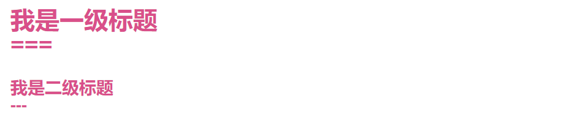
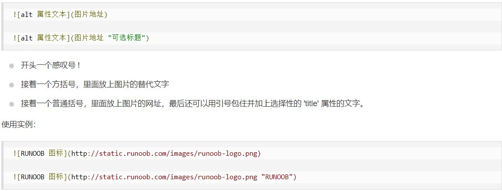

Markdown
=========

### 1. 标题

#### 1.1 第一种格式  使用3个及以上的 = 和 - 标记一级和二级标题



#### 1.2 第二种格式  使用 # 号标记

```
1-6个#号分别代表1-6级标题，标记与内容之间使用空格隔开
```

### 2. 段落

#### 2.1 格式

没有格式的文字就是段落  
段落使用两个空格及以上空格加回车的方式来换行

也可以使用空行分割段落

### 3. 字体

```
*斜体文字*
_斜体文字_
**粗体文字**
__粗体文字__
***粗斜体文字***
___粗斜体文字___
```

*斜体文字h*
_斜体文字_
**粗体文字**
__粗体文字__
***粗斜体文字***
___粗斜体文字___

### 4. 分割线

使用3个及以上 * 或  -  或 _ 生成分割线，同行不能不能有其他内容，  * 或  -  或 _ 中可以插入空格

*** **             **
- -- -
_         ____

### 5. 删除线

前后各两个”~\~“包围的内容表示删除 ~~我被删除啦~~

### 6. 下划线

```
使用html的<u>标签可以实现下划线
```

<u>我是带下划线的内容</u>

### 7. 脚注


脚注是对文本的补充说明[^我是一个脚注]

[^我是一个脚注]: don't forget to be awesome!

### 8. 列表

#### 8.1 有序列表

```
使用数字加 . 表示有序列表
```
1. 第一项
2. 第二项
3. 第三项

#### 8.2 无序列表

```
使用星号(*)、加号(+)或是减号(-)表示无序列表，标记与内容之间使用空格隔开
```
* 第一项
* 第二项
* 第三项

#### 8.3 列表嵌套

```
在子列表前添加一个table或四个空格表示子列表
```

1. 第一项
	- 第一子项
		- 子项的子项
	- 第二子项
2. 第二项
3. 第三项

### 9. 区块

```
> 在段落开头使用 > 表示区块
> awesome
> top
```

> 在段落开头使用 > 表示区块
> awesome
> top

#### 9.1 区块嵌套

```
> 在段落开头使用 > 表示区块
>> awesome
>>> top
```

> 在段落开头使用 > 表示区块
> > awesome
> >
> > > top

#### 9.2 在区块中使用列表

```
> 在区块中使用列表 
> 1. 在段落开头使用 > 表示区块
> 2. awesome
> + top
```

> 在区块中使用列表 
> 1. 在段落开头使用 > 表示区块
> 2. awesome
>
> + top
> + 234

#### 9.3 在列表中使用区块

```
1. top
	> top234
	> top
2. aspect
```

1. top
  > top234
  >
  > > top
2. aspect

### 10. 代码

#### 10.1 对于段落上的代码可以用反引号把它包起来（`）

```
`toString()`
```

关于Java的`toString()`方法

#### 10.2 代码区块

```
代码区块使用 4 个空格或者一个制表符（Tab 键）
```

```java
@Override
public String toString() {
    return "Student{" +
            "id=" + id +
            ", name='" + name + '\'' +
            ", school=" + school +
            '}';
}
```

```
可以用 ``` 包裹一段代码，并指定一种语言
```

```xml
<dependencies>
    <!--spring依赖-->
    <dependency>
      <groupId>org.springframework</groupId>
      <artifactId>spring-context</artifactId>
      <version>5.2.13.RELEASE</version>
    </dependency>
</dependencies>
```

### 11. 链接

```
[top234首页](http://www.top234.top)

<http://www.top234.top>

http://www.top234.top
```

[top234首页](http://www.top234.top)

<http://www.top234.top>

http://www.top234.top

**高级链接**

通过变量来设置一个链接，并在其他位置为链接赋值

```
[top234][url1]

[url1]: http://www.top234.top
```

[top234][url1]

[url1]: http://www.top234.top

### 12. 图片



**图片也可使用链接的高级赋值方式**

**markdown支持html的``标签**

### 13. 表格

```
|  表头   | 表头  |
|  ----  | ----  |
| 单元格  | 单元格 |
| 单元格  | 单元格 |
```

|  表头   | 表头  |
|  ----  | ----  |
| 单元格  | 单元格 |
| 单元格  | 单元格 |

### 14. 高级技巧

#### 14.1 html标签

```
<kbd> <b> <i> <em> <sup> <sub> <br> 
```

#### 14.2 转义

```
使用反斜杠 \ 可显示原始字符
```

#### 14.3 markdown支持数学公式

```
当你需要在编辑器中插入数学公式时，可以使用两个美元符 $$ 包裹 TeX 或 LaTeX 格式的数学公式来实现
$$
\mathbf{V}_1 \times \mathbf{V}_2 =  \begin{vmatrix} 
\mathbf{i} & \mathbf{j} & \mathbf{k} \\
\frac{\partial X}{\partial u} &  \frac{\partial Y}{\partial u} & 0 \\
\frac{\partial X}{\partial v} &  \frac{\partial Y}{\partial v} & 0 \\
\end{vmatrix}
${$tep1}{\style{visibility:hidden}{(x+1)(x+1)}}
$$
```

$$
\mathbf{V}_1 \times \mathbf{V}_2 =  \begin{vmatrix} 
\mathbf{i} & \mathbf{j} & \mathbf{k} \\
\frac{\partial X}{\partial u} &  \frac{\partial Y}{\partial u} & 0 \\
\frac{\partial X}{\partial v} &  \frac{\partial Y}{\partial v} & 0 \\
\end{vmatrix}
${$tep1}{\style{visibility:hidden}{(x+1)(x+1)}}
$$


----